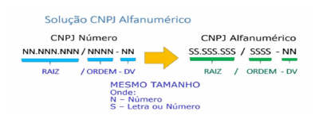

<!-- p.4 -->
# 2. Nova lei de formação do número do CNPJ:

O novo número de identificação - CNPJ alfanumérico - terá o mesmo tamanho que o número atual, com 14 posições. As oito primeiras posições terão caracteres alfanuméricos (letras e números) e identificarão a raiz do novo número. As quatro posições seguintes à raiz também terão caracteres alfanuméricos (letras e números) e identificarão a ordem do estabelecimento a ser inscrito. As duas últimas posições serão numéricas e identificam os dígitos verificadores deste CNPJ alfanumérico. O desenho abaixo identifica a transição da identificação numérica para alfanumérica:

*Figura 1 – Solução CNPJ Alfanumérico: formato numérico (NN.NNN.NNN/NNNN-NN) e alfanumérico (SS.SSS.SSS/SSSS-NN), de mesmo tamanho.*

A fórmula de cálculo do dígito verificador do CNPJ Alfanumérico não muda: foi mantido o cálculo pelo módulo 11. Porém, para garantir a utilização dos atuais números do CNPJ (tipo numérico), será necessária a alteração do modo como se calcula o dígito verificador pelo módulo 11. Serão utilizados, no cálculo do módulo 11, os valores relativos a letras maiúsculas lastreadas na tabela denominada código ASCII, como solução para unificar a representação de caracteres alfanuméricos;

Na rotina de cálculo do Dígito Verificador (DV) no CNPJ, serão substituídos os valores numéricos e alfanuméricos pelo valor decimal correspondente ao código constante na tabela ASCII e dele subtraído o valor 48. Desta forma os caracteres numéricos continuarão com os mesmos montantes, e os caracteres alfanuméricos terão os seguintes valores: A=17, B=18, C=19… e assim sucessivamente. Esta definição permitirá que o atual número do CNPJ tenha o mesmo cálculo do seu dígito verificador quando os sistemas iniciarem a identificação alfanumérica.

<!-- p.5 -->
## Cálculo do primeiro dígito verificador

Para cada um dos caracteres do CNPJ, atribuir o valor da coluna “Valor para cálculo do DV”, conforme a tabela abaixo (ou subtrair 48 do “Valor ASCII”):

| CNPJ Alfanumérico (números e letras) | Valor ASCII | Valor para cálculo do DV |
|---|---|---|
| 0 | 48 | 0 |
| 1 | 49 | 1 |
| 2 | 50 | 2 |
| 3 | 51 | 3 |
| 4 | 52 | 4 |
| 5 | 53 | 5 |
| 6 | 54 | 6 |
| 7 | 55 | 7 |
| 8 | 56 | 8 |
| 9 | 57 | 9 |
| A | 65 | 17 |
| B | 66 | 18 |
| C | 67 | 19 |
| D | 68 | 20 |
| E | 69 | 21 |
| F | 70 | 22 |
| G | 71 | 23 |
| H | 72 | 24 |
| I | 73 | 25 |
| J | 74 | 26 |
| K | 75 | 27 |
| L | 76 | 28 |
| M | 77 | 29 |
| N | 78 | 30 |
| O | 79 | 31 |
| P | 80 | 32 |
| Q | 81 | 33 |
| R | 82 | 34 |
| S | 83 | 35 |
| T | 84 | 36 |
| U | 85 | 37 |
| V | 86 | 38 |
| W | 87 | 39 |
| X | 88 | 40 |
| Y | 89 | 41 |
| Z | 90 | 42 |

Exemplo:

| CNPJ | 1 | 2 | A | B | C | 3 | 4 | 5 | 0 | 1 | D | E |
|---|---|---|---|---|---|---|---|---|---|---|---|---|
| Valor | 1 | 2 | 17 | 18 | 19 | 3 | 4 | 5 | 0 | 1 | 20 | 21 |

<!-- p.6 -->
Distribuir os pesos de 2 a 9 da direita para a esquerda (recomeçando depois do oitavo caractere), conforme o exemplo:

| CNPJ | 1 | 2 | A | B | C | 3 | 4 | 5 | 0 | 1 | D | E |
|---|---|---|---|---|---|---|---|---|---|---|---|---|
| Valor | 1 | 2 | 17 | 18 | 19 | 3 | 4 | 5 | 0 | 1 | 20 | 21 |
| Peso | 5 | 4 | 3 | 2 | 9 | 8 | 7 | 6 | 5 | 4 | 3 | 2 |

Multiplicar valor e peso de cada coluna e somar todos os resultados:

| CNPJ | 1 | 2 | A | B | C | 3 | 4 | 5 | 0 | 1 | D | E |
|---|---|---|---|---|---|---|---|---|---|---|---|---|
| Valor | 1 | 2 | 17 | 18 | 19 | 3 | 4 | 5 | 0 | 1 | 20 | 21 |
| Peso | 5 | 4 | 3 | 2 | 9 | 8 | 7 | 6 | 5 | 4 | 3 | 2 |
| Multiplicação | 5 | 8 | 51 | 36 | 171 | 24 | 28 | 30 | 0 | 4 | 60 | 42 |

**Somatório (5+8+...+42) = 459**

Obter o resto da divisão do somatório por 11.
Se o resto da divisão for igual a 1 ou 0, o primeiro dígito será igual a 0 (zero).
Senão, o primeiro dígito será igual ao resultado de 11 – resto.

No exemplo:

**Resto da divisão 459/11 = 8.**

**⇒ 1° DV = 3** (resultado de 11-8)

## Cálculo do segundo dígito verificador

Para o cálculo do segundo dígito é necessário acrescentar o primeiro DV ao final do CNPJ, formando assim treze caracteres, e repetir os passos realizados para o primeiro dígito.

Assim, no exemplo, temos:

| CNPJ | 1 | 2 | A | B | C | 3 | 4 | 5 | 0 | 1 | D | E | 3 |
|---|---|---|---|---|---|---|---|---|---|---|---|---|---|
| Atribuição de Valor | 1 | 2 | 17 | 18 | 19 | 3 | 4 | 5 | 0 | 1 | 20 | 21 | 3 |
| Atribuição de Peso | 6 | 5 | 4 | 3 | 2 | 9 | 8 | 7 | 6 | 5 | 4 | 3 | 2 |
| Multiplicação | 6 | 10 | 68 | 54 | 38 | 27 | 32 | 35 | 0 | 5 | 80 | 63 | 6 |

**Somatório (6+10+...+6) = 424**

**Resto da divisão 424/11 = 6**

**⇒ 2° DV = 5** (resultado de 11-6)

**⇒ Resultado final: 12.ABC.345/01DE-35**
