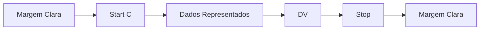

<!-- p.9 -->
# 6. Padrão do Código de Barras dos Documentos Auxiliares

O padrão de código de barras a ser impresso no documento auxiliar (DACTE, DANFE, DABPE etc.) é o CODE-128C e deverá representar a chave de acesso do DFe em emissão normal ou contingência.

O CODE-128C tem como característica suportar somente números, portanto, não é compatível com uma chave de acesso que venha possuir caracteres alfanuméricos nas posições do CNPJ.

O CODE-128C também possui um dígito verificador baseado em um cálculo do módulo 103 considerando a soma ponderada dos valores de cada um dos dígitos na mensagem que está sendo codificada, incluindo o valor do caractere de início (start).

Para suportar as alterações do CNPJ Alfa será necessário adaptar o padrão de código para geração dos documentos auxiliares.

O padrão sugerido a ser adotado é o modelo híbrido, utilizando o CODE 128-C, e na ocorrência de caracteres não numéricos, alternando para o CODE-128A que aceita além de números, letras maiúsculas. Esta alteração é feita usando o código 100 para alternar os subtipos A e C.

- **128A (Code Set A)** – ASCII characters 00 a 95 (0–9, A–Z e códigos de controle)
- **128C (Code Set C)** – 00–99 (codifica pares de números para cada item representado)

O conjunto de caracteres representativos do Código de Barras CODE-128A e CODE-128C encontra-se referenciado baixo. Para a sua impressão será considerada a seguinte estrutura de simbolização:

<!-- p.10 -->

- **Margem Clara:** espaço claro que não contém nenhuma marca legível por máquina, localizado à esquerda e à direita do código, a fim de evitar interferência na decodificação da simbologia. A margem clara é chamada também de "área livre", "zona de silêncio" ou "margem de silêncio".
- **Start C:** inicia a codificação dos dados CODE-128C de acordo com o conjunto de caracteres. O Start C não representa nenhum caractere.
- **Dados representados:** caracteres representados no código de barras.
- **DV:** dígito verificador da simbologia.
- **Stop:** caractere de parada que indica o final do código ao leitor óptico.

O código de barras deverá ser impresso com os padrões próprios residentes das impressoras de não impacto (laser ou deskjet) e de impacto (matriciais ou de linhas) a fim de respeitarem os padrões dos referidos códigos:

- A área reservada no Documento Auxiliar;
- Largura mínima total do código de barras (considerando o código de barras da chave de acesso, com 44 posições):
  - o 11,5 cm para impressoras de Não Impacto (Laser de Jato de Tinta);
  - o 11,5 cm para impressora de impacto (Matricial e de linha)
- Altura mínima da barra: 0,8 cm;
- Largura mínima da barra: 0,02 cm, conforme explicado a seguir:

Por conta da mudança para o CNPJ Alfa, o novo padrão de código de barras – combinação do 128-A com 128-C poderá apresentar maior volume de dados para suportar os caracteres não numéricos, por isso teremos mais barras e necessitando de mais espaço para acomodar essa informação e manter o código com leitura eficiente nos diversos leitores encontrados no mercado.

Considerando que para cada símbolo da barra são codificados dois caracteres, então teremos:

- Tamanho do campo = 44 (caracteres) = 44 (símbolos)
- Considerando que cada símbolo possui 11 (módulos) * 44 (símbolos) = 484 posições
- Margem clara = deve ter no mínimo a dimensão de 10 (módulos) * 2 = 20 posições
- Start A = 11 (módulos) = 11 posições
- DV = 11 (módulos) = 11 posições
- Stop = 13 (módulos) = 13 posições
- Tamanho total da simbologia = 484 + 20 + 11 + 11 + 13 = 539 (posições)
- Largura mínima de cada módulo da barra = 11,5 cm / 539 (posições) = 0,02 cm

## Cálculo do Dígito Verificador do CODE-128C

O dígito verificador é baseado em um cálculo do módulo 103 considerando a soma ponderada dos valores de cada um dos dígitos na mensagem que está sendo codificada, incluindo o valor do caractere de início (start).

O Code-128-C, que sempre será usado no início do código de barras utiliza o 105 como “Start”.

Exemplo: consideremos que a chave de acesso fosse apenas de oito caracteres e contivesse o seguinte termo: 5225AB83

| Código | Valor do Código | Peso | Valor × Peso |
|---|---|---|---|
| START C | 105 | (1) | 105 |
| 52 | 52 | 1 | 52 |
| 25 | 25 | 2 | 50 |
| CODE A | 101 | 3 | 303 |
| 'A' (ASCII) | 33 | 4 | 132 |
| 'B' (ASCII) | 34 | 5 | 170 |
| CODE C | 99 | 6 | 594 |
| 83 | 83 | 7 | 581 |
| **Soma** | | | **1987** |
| **Resto da divisão por 103** | | | **1987 mod 103 = 30** |

Então 30 corresponde a “30” conforme tabela de composição dos caracteres do código de barras 128.

Na linha valor do caractere foi incluso o valor 103 que corresponde ao valor do caractere de início (start) para o padrão Code C.
<!-- REVISAR p.11: o texto menciona o valor 103 para o caractere Start C, mas a tabela e a fórmula usam 105 -->

O dígito verificador do código será o resto da divisão da somatória dos valores ponderados dividido por 103 (módulo 103).

Assim o dígito verificador será:

Valor da soma ponderada = (1×105)+(1×52)+(2×25)+(3×101)+(4×33)+(5×34)+(6×99)+(7×83) = 1987

1987/103 = 19, e resta 30, assim o DV é o código correspondente ao valor 30.

<!-- p.12 -->
## Representação Simbólica do Código

Combinação de barras: B=barra preta e S=espaço (barra branca)

| Símbolo | Código | Padrão (B/S) | Larguras |
|---|---|---|---|
| START C | 105 | B S B S B S | 2 1 4 1 1 1 |
| 52 | 52 | B S B S B S | 2 3 2 1 1 1 |
| 25 | 25 | B S B S B S | 1 1 2 2 3 1 |
| CODE A | 101 | B S B S B S | 2 1 1 1 3 2 |
| A | 33 | B S B S B S | 2 1 2 1 2 2 |
| B | 34 | B S B S B S | 2 2 2 1 2 1 |
| CODE C | 99 | B S B S B S | 2 1 1 2 2 2 |
| 83 | 83 | B S B S B S | 1 3 3 1 1 1 |
| DV (30) | 30 | B S B S B S | 2 2 2 1 1 2 |
| STOP | 106 | B S B S B S B | 2 3 3 1 1 1 2 |

### Orientações para o uso dos caracteres START, CODE e SHIFT

As seguintes orientações devem ser seguidas para minimizar o comprimento do código de barras. Começando da esquerda:

1. Use o caractere de início 'C' pois os a chave de acesso dos DFe começarem com quatro ou mais dígitos.
2. Considerando que começamos com o 'C' e os dados começarem com um número ímpar de dígitos: Insira o código de mudança para o conjunto 'A' (Code A) antes do último dígito ímpar.
3. Se quatro ou mais dígitos ocorrerem em sequência enquanto se estiver no conjunto de caracteres 'A':
   - Se houver um número par de dígitos no grupo, insira o código de mudança para o conjunto 'C' (Code C) antes do primeiro dígito do grupo.
   - Se houver um número ímpar de dígitos no grupo, insira o código de mudança para o conjunto 'C' (Code C) imediatamente após o primeiro dígito do grupo. O primeiro dígito permanecerá codificado no conjunto 'A'.
4. Quando estiver no conjunto de caracteres 'C' e um caractere não numérico ocorrer nos dados, insira o código de mudança para o conjunto 'A' (Code A) antes do caractere não numérico.

Exemplo para o caso de número ímpar antes de um caractere (começando em 'C'):

Suponha que você esteja codificando "123A" e começou com o modo 'C'.

- Você codificaria "12" no modo 'C'.
- Ao encontrar o "3" (ímpar antes de um caractere não numérico), você inseriria o código "Code A".
- Então, você codificaria "3" no modo 'A'.
- Finalmente, você codificaria "A" no modo 'A'.

O objetivo é sempre otimizar a densidade do código de barras, utilizando o conjunto de caracteres mais adequado para o tipo de dado que está sendo codificado em cada momento.

## Conjunto de Caracteres Código de Barras CODE-128

Conjunto de caracteres representativos do Código de Barras pode ser obtido em:

- https://en.wikipedia.org/wiki/Code_128
- https://www.barcodesinc.com/articles/code128.htm
