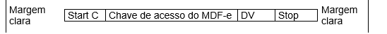

# 2.2. Código de Barras

O padrão de código de barras a ser impresso no DAMDFE é o CODE-128C. O código de barras deverá representar a chave de acesso do MDF-e em emissão normal ou contingência.

A impressão do código de barras no DAMDFE tem a finalidade de facilitar e agilizar a captura de dados para consulta nos portais estaduais e no portal nacional do MDF-e disponibilizado na SVRS. Com a chave de acesso é possível realizar a consulta resumida de um MDF-e e sua situação, bem como visualizar a autorização de uso do mesmo.

Dentre outras finalidades do código, destacam-se o registro do trânsito de mercadorias nos Postos Fiscais e, a critério de cada unidade federada, a disponibilização do arquivo do MDF-e consultado.

O conjunto de caracteres representativos do Código de Barras CODE-128C segue ao final deste manual.

O código de barras deverá representar apenas a chave de acesso do MDF-e de 44 posições. Para a impressão do mesmo será considerada a seguinte estrutura de simbolização:

- **Margem Clara**: Espaço claro, que não contém nenhuma marca legível por máquina, existente à esquerda e à direita do código para evitar interferência na decodificação da simbologia. A margem clara também é chamada de "área livre", "zona de silêncio" ou "margem de silêncio".
- **Start C:** inicia a codificação dos dados CODE-128C de acordo com o conjunto de caracteres. O Start C não representa nenhum caractere.
- **Chave de acesso do MDF-e:** representa conjunto de 44 caracteres da chave de acesso do MDF-e.
- **DV:** dígito verificador da simbologia.
- **Stop:** caractere de parada, indica o final do código ao leitor óptico.

O código de barras deverá ser impresso com resolução mínima de 300 dpi, devendo ser observada a área reservada no DAMDFE de 3 x 9 cm.

Altura da barra: no intuito de propiciar melhor área de leitura, a altura da barra não poderá ser inferior a 1,5 cm e nem superior a 2,5 cm.

Largura da barra: considerando que para cada símbolo da barra são codificados dois caracteres, então teremos:

- Tamanho do campo chave de acesso = 44 (caracteres) / 2 = 22 (símbolos)
- Considerando que cada símbolo possui 11 (módulos) \* 22 (símbolos) = 242 posições
- Margem clara = deve ter no mínimo a dimensão de 10 (módulos) \* 2 = 20 posições
- Start C = 11 (módulos) = 11 posições
- DV = 11 (módulos) = 11 posições
- Stop = 13 (módulos) = 13 posições
- Tamanho total da simbologia = 242 + 20 + 11 + 11 + 13 = 297 (posições)
- Largura máxima de cada módulo da barra = 9 cm / 297 (posições) = 0,03 cm
