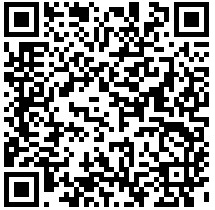

# 2.3. Informações da consulta via QR Code

A imagem do QR Code impressa no DAMDFE deve ter tamanho mínimo 25 mm x 25 mm, sendo 22mm de conteúdo para 3mm de margem segura (quiet zone), para dimensões superiores a 25mm, considerar a margem segura de 10% da dimensão total.

O conteúdo QR Code deverá ser informado no arquivo XML do manifesto em campo específico, conforme descrito no MOC (tag: qrCodMDFe), levando em consideração as especificações para a geração do QR Code para MDF-e com emissão normal e as modificações necessárias para a emissão em contingência.

