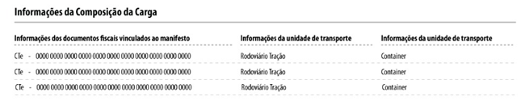
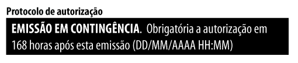

# 2.4. MDF-e emitido em contingência

Quando em decorrência de problemas técnicos não for possível a emissão do MDF-e, o emitente do MDF-e deve imprimir o DAMDFE em papel comum, observando que o documento foi emitido em contingência, sendo que nesse documento obrigatoriamente conterá a chave de acesso dos documentos eletrônicos que o manifesto agrega ou informações pertinentes aos documentos em papel.

A transmissão para o Ambiente Autorizador deverá ser feita logo que esteja cessada a contingência, observando o prazo limite de 168 horas a partir da emissão do documento.

Na hipótese de emissão de MDF-e em contingência é obrigatório imprimir em destaque o texto: “EMISSÃO EM CONTINGÊNCIA”. O texto deve ser exibido no local destinado a impressão do Protocolo de Autorização do MDF-e.

