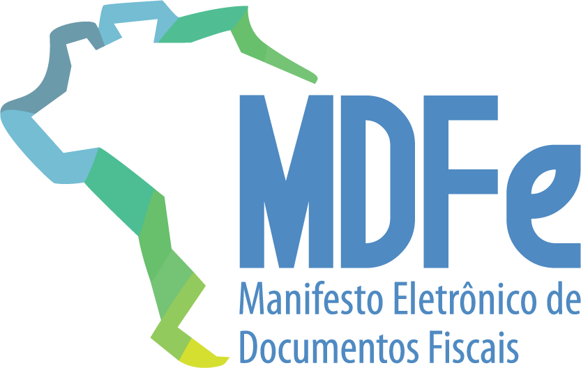

# MDF-e – Manual de Orientação do Contribuinte – Anexo II: DAMDFE

**Projeto Manifesto Eletrônico de Documentos Fiscais**  
**Manual de Orientação do Contribuinte – Anexo II – Manual de Especificações Técnicas do DAMDFE**  
**Versão 3.00B – agosto (2021)**

