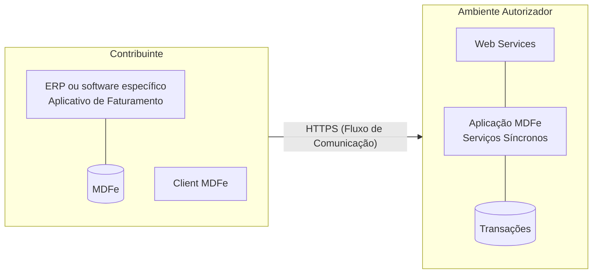

# 3.1 Modelo Conceitual

O ambiente autorizador de MDFe irá disponibilizar os seguintes serviços:

a) Recepção de MDFe (Modelo 58) – Modelo síncrono;  
b) Consulta da Situação Atual do MDFe;  
c) Consulta do status do serviço.  
d) Registro de Eventos  
e) Consulta MDFe não encerrados

Para cada serviço oferecido existirá um Web Service específico. O fluxo de comunicação é sempre iniciado pelo aplicativo do contribuinte através do envio de uma mensagem ao Web Service com a solicitação do serviço desejado.

O Web Service sempre devolve uma mensagem de resposta confirmando o recebimento da solicitação de serviço ao aplicativo do contribuinte na mesma conexão.

O processamento da solicitação de serviço é concluído na mesma conexão, com a devolução de uma mensagem com o resultado do processamento do serviço solicitado;

Os Serviços de Recepção Lote (assíncrono) e de Consulta Retorno Recepção (MOC Visão Geral 3.00a) serão descontinuados em data a ser definida para os contribuintes em Nota Técnica futura, para fins de documentação deste Manual somente os serviços síncronos estarão documentados. Até a efetiva desativação dos serviços citados acima, o seu funcionamento seguirá inalterado, respeitando a definição da versão 3.00a.

O diagrama a seguir ilustra o fluxo conceitual de comunicação entre o aplicativo do contribuinte e o Ambiente Autorizador:

