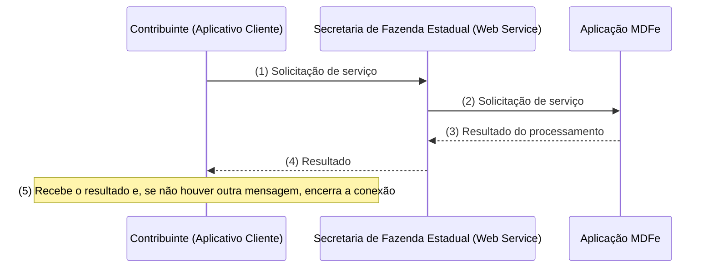

# 3.3 Modelo Operacional

A forma de processamento das solicitações de serviços no MDFe será síncrona, com o atendimento da solicitação de serviço realizado na mesma conexão.

A seguir, o fluxo simplificado de funcionamento:

Etapas do processo ideal:

1. O aplicativo do contribuinte inicia a conexão enviando uma mensagem de solicitação de serviço para o Web Service;
2. O Web Service recebe a mensagem de solicitação de serviço e encaminha ao aplicativo do MDFe que irá processar o serviço solicitado;
3. O aplicativo do MDFe recebe a mensagem de solicitação de serviço e realiza o processamento, devolvendo uma mensagem de resultado do processamento ao Web Service;
4. O Web Service recebe a mensagem de resultado do processamento e o encaminha ao aplicativo do contribuinte;
<!-- p.22 -->

5. O aplicativo do contribuinte recebe a mensagem de resultado do processamento e, caso não exista outra mensagem, encerra a conexão.
