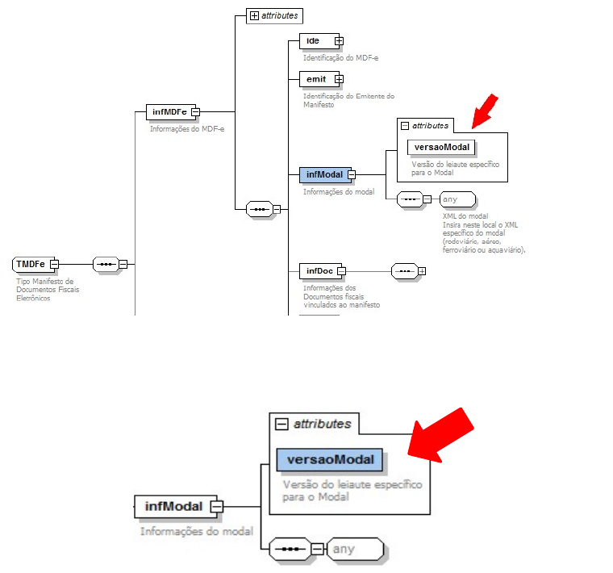

# 3.6 Schema XML – estrutura genérica e estrutura específica do modal

A estrutura do Schema XML do MDFe foi criada como sendo composta de uma parte genérica do schema e uma parte específica para cada modal, com o objetivo de criar uma maior independência entre os modais, onde uma alteração no leiaute específico para um modal não repercuta nos demais.

<!-- p.26 -->

## 3.6.1 Parte Genérica

A estrutura genérica é a parte que possui os campos (tags) de uso comum a serem utilizados por todos os modais.

Para alcançar este objetivo foi criada no schema XML do MDFe uma estrutura genérica com um elemento do tipo `any` que permite a inserção do XML específico do modal, conforme demonstrado na figura a seguir:

A versão do schema XML a ser utilizada na parte específica do modal será identificada com um atributo de versão próprio (tag `versaoModal`), conforme figura a seguir:

*Figura – Estrutura genérica do schema XML: elemento `any` para o XML específico do modal e atributo `versaoModal` em `infModal`.*

<!-- p.27 -->

## 3.6.2 Parte Específica para cada Modal

A estrutura específica é a parte que possui os campos (tags) exclusivos do modal.

A parte específica do schema XML para cada modal será distribuída no mesmo pacote de liberação em arquivo separado para cada um deles.

A identificação do modal se dará no nome do arquivo, como segue:

mdfeModalXXXXXXXXXXXX_v9.99.xsd

Onde XXXXXXXXXXXX é a identificação do modal, e v9.99 é a identificação da versão.

Segue exemplo de nomes de arquivos de schema XML da parte específica de cada modal:

- mdfeModalRodoviario_v3.00.xsd (modal rodoviário, versão 3.00);
- mdfeModalAereo_v3.00.xsd (modal aéreo, versão 3.00);
- mdfeModalFerroviario_v3.00.xsd (modal ferroviário, versão 3.00);
- mdfeModalAquaviario_v3.00.xsd (modal aquaviário, versão 3.00).

## 3.6.3 Parte Genérica e Parte Específica para cada Modal - Versões

Uma versão da parte genérica deverá suportar mais de uma versão da parte específica de cada modal. Normalmente esta relação deve ser de uma para uma (1:1). Apenas em momentos de transição poderemos ter empresas de um modal utilizando uma versão mais atualizada, enquanto outras empresas poderão ainda estar operando com um leiaute anterior da parte específica.

O Ambiente autorizador deverá manter na sua aplicação o controle de versões da parte específica suportadas pela parte genérica.
