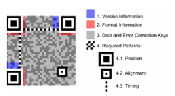
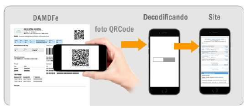

<!-- p.72 -->
# 9 QR Code

O QR Code é um código de barras bidimensional que foi criado em 1994 pela empresa japonesa Denso-Wave. QR significa "quick response" devido à capacidade de ser interpretado rapidamente.

Esse tipo de codificação permite que possa ser armazenada uma quantidade significativa de caracteres:

- Numéricos: 7.089
- Alfanumérico: 4.296
- Binário (8 bits): 2.953

O QR Code a ser impresso no MDFe seguirá o padrão internacional ISO/IEC 18004.

O QR Code deverá existir no DAMDFE relativo à emissão em operação normal ou em contingência off-line, seja ele impresso ou virtual (DAMDFE em meio eletrônico).

A impressão do QR Code no DAMDFE tem a finalidade de facilitar a consulta dos dados do documento fiscal eletrônico pela fiscalização e demais atores do processo, mediante leitura com o uso de aplicativo leitor de QR Code, instalado em smartphones ou tablets. Atualmente existem no mercado, inúmeros aplicativos gratuitos para smartphones que possibilitam a leitura de QR Code.

Esta tecnologia tem sido amplamente difundida e é de crescente utilização como forma de comunicação.

*Figura – Padrão da imagem do QR Code (fonte: Wikipédia).*

*Figura – Processo de leitura do QR Code (adaptado).*
