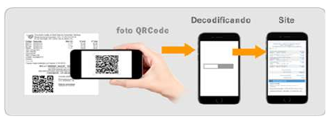

# 10.2 Consulta Pública Resumida de MDFe via QR Code

A aplicação de consulta pública resumida de MDFe via QR Code será disponibilizada pelo Portal Nacional do MDFe e efetuará validações do conteúdo de informações constantes do QR Code versus o conteúdo do respectivo MDFe.

<!-- p.77 -->

Nesta hipótese, o usuário deverá apontar o seu dispositivo móvel (smartphone ou tablet) para a imagem do QR Code gerada na tela ou impressa no DAMDFE. O leitor de QR Code se encarregará de interpretar a imagem e efetuar a consulta do MDFe da URL recuperada no Portal da SEFAZ da Unidade Federada da emissão do documento.

*Figura 7 – Processo de leitura do QR Code.*

Como resultado da consulta QR Code, deverá ser apresentado ao usuário do serviço na tela do dispositivo móvel o MDFe resumido.

Eventuais divergências encontradas entre as informações do MDFe constantes dos parâmetros do QR Code deverão ser informadas em área de mensagem a ser disponibilizada na tela de resposta da consulta pública sem, todavia, um detalhamento excessivo do erro identificado, que será de pouco interesse e apenas poderá acabar por gerar dúvidas e inseguranças.

Assim, será apresentado na tela ao usuário o código do erro e uma mensagem de aviso mais genérica.
