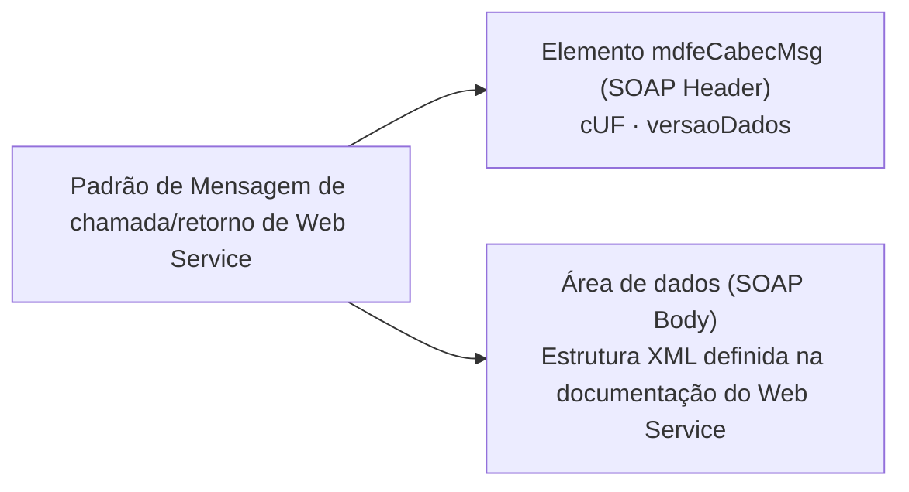

# 2.1.5 Padrão de mensagens dos Web Services

As chamadas dos Web Services disponibilizados pelo Ambiente Autorizador e os respectivos resultados do processamento são realizadas através das mensagens com o seguinte padrão:

- **cUF** – código da UF de origem da mensagem.
- **versaoDados** – versão do leiaute da estrutura XML informado na área de dados.
- **Área de Dados** – estrutura XML variável definida na documentação do Web Service acessado.
