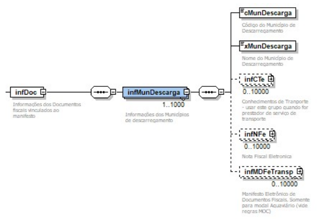
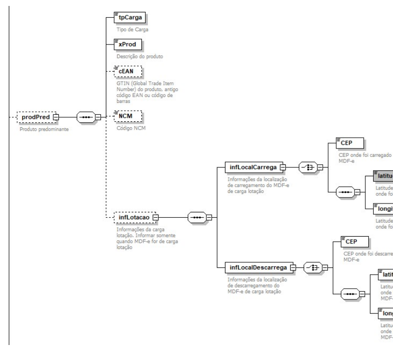

# 2 Alterações de Schema Geral do MDF-e

<!-- p.06 -->
O grupo de informações do município de descarregamento foi ampliado para até 10000 ocorrências.

*Figura – Grupo infDoc / infMunDescarga do MDF-e: informações dos municípios de descarregamento (ocorrências ampliadas para até 10000).*

Foi criado o grupo produto predominante na parte geral do MDF-e.

| # | Campo | Ele | Pai | Tipo | Ocor. | Tam. | Descrição/Observação |
|---|---|---|---|---|---|---|---|
| # | **prodPred** | **G** | **infMDFe** |   | **0-1** |   | **Grupo de informações do Produto predominante da carga do MDF-e** |
| # | tpCarga | E | prodPred | N | 1-1 | 2 | Tipo da Carga. Conforme Resolução ANTT nº. 5.849/2019.  01-Granel sólido; 02-Granel líquido; 03-Frigorificada; 04-Conteinerizada; 05-Carga Geral; 06-Neogranel; 07-Perigosa (granel sólido); 08-Perigosa (granel líquido); 09-Perigosa (carga frigorificada); 10-Perigosa (conteinerizada); 11-Perigosa (carga geral). |
| # | xProd | E | prodPred | C | 1-1 | 2-120 | Descrição do produto predominante |

<!-- p.07 -->

| # | Campo | Ele | Pai | Tipo | Ocor. | Tam. | Descrição/Observação |
|---|---|---|---|---|---|---|---|
| # | cEAN | E | prodPred | C | 0-1 | 14 | GTIN (Global Trade Item Number) do produto, antigo código EAN ou código de barras |
| # | NCM | E | prodPred | C | 0-1 | 8 | Código NCM |
| # | **infLotacao** | **G** | **prodPred** |   | **0-1** |   | **Informações da carga lotação. Informar somente quando MDF-e for de carga lotação** |
| # | **infLocalCarrega** | **G** | **infLotacao** | **G** | **1-1** |   | **Informações da localização do carregamento do MDF-e de carga lotação** |
| # | CEP | CE | infLocalCarrega | N | 1-1 | 8 | CEP onde foi carregado o MDF-e |
| # | latitude | CE | infLocalCarrega | N | 1-1 | [-]2,6 | Latitude do ponto geográfico onde foi carregado o MDF-e |
| # | Longitude | CE | infLocalCarrega | N | 1-1 | [-]3,6 | Longitude do ponto geográfico onde foi carregado o MDF-e |
| # | **infLocalDescarrega** | **G** | **infLotacao** | **G** | **1-1** |   | **Informações da localização do descarregamento do MDF-e de carga lotação** |
| # | CEP | CE | infLocalDescarrega | N | 1-1 | 8 | CEP onde foi descarregado o MDF-e |
| # | latitude | CE | infLocalDescarrega | N | 1-1 | [-]2,6 | Latitude do ponto geográfico onde foi descarregado o MDF-e |
| # | Longitude | CE | infLocalDescarrega | N | 1-1 | [-]3,6 | Longitude do ponto geográfico onde foi descarregado o MDF-e |

*Figura – Grupo prodPred (produto predominante) do MDF-e e os grupos de carga lotação (infLotacao, infLocalCarrega e infLocalDescarrega).*
