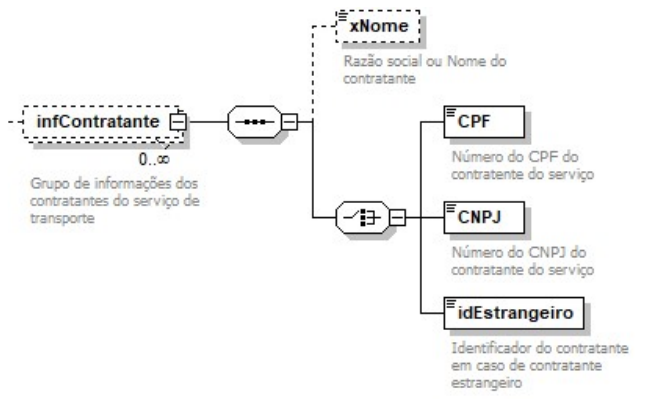
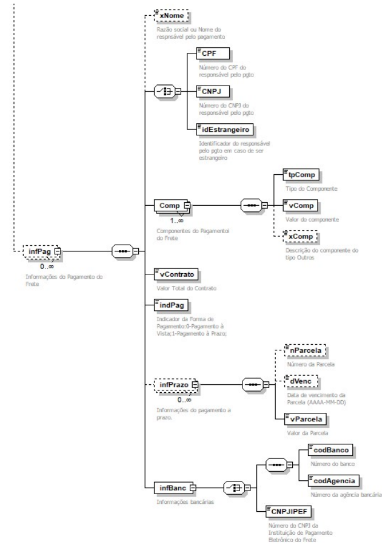

# 3 Alterações de Schema do Modal Rodoviário

<!-- p.08 -->
Alteração no grupo informações do contratante, inclusão dos campos xNome e do idEstrangeiro.

*Figura – Grupo infContratante (grupo de informações dos contratantes do serviço de transporte), com os campos xNome e idEstrangeiro.*

No modal rodoviário foi criado o grupo informações do pagamento do frete (infPag).

| # | Campo | Ele | Pai | Tipo | Ocor. | Tam. | Descrição/Observação |
|---|---|---|---|---|---|---|---|
| # | **infPag** | **G** | **infANTT** | **-** | **0 - n** |   | **Informações do Pagamento do Frete** |
| # | xNome | E | infPag | C | 0 - 1 | 2 - 60 | Nome do responsável pelo pgto |
| # | CPF | CE | infPag | N | 1 - 1 | 11 | Número do CPF do responsável pelo pgto |
| # | CNPJ | CE | infPag | N | 1 - 1 | 14 | Número do CNPJ do responsável pelo pgto |
| # | idEstrangeiro | CE | infPag | C | 1 - 1 | 2 - 20 | Identificador do responsável pelo pgto em caso de ser estrangeiro |
| # | **Comp** | **G** | **infPag** | **-** | **1 - n** |   | **Componentes do Pagamento do Frete** |
| # | tpComp | E | Comp | N | 1 - 1 | 2 | Tipo do Componente: 01 - Vale Pedágio 02 - Impostos, taxas e contribuições 03 - Despesas (bancárias, meios de pagamento, outras) 99 – Outros |
| # | vComp | E | Comp | N | 1 - 1 | 13, 2 | Valor do Componente |
| # | xComp | E | Comp | C | 0 - 1 | 2 - 60 | Descrição do componente do tipo Outros |
| # | vContrato | E | infPag | N | 1 - 1 | 13, 2 | Valor total do contrato |
| # | indPag | E | infPag | N | 1 – 1 | 1 | Indicador da Forma de Pagamento: 0-Pagamento à Vista; 1-Pagamento à Prazo; |

<!-- p.09 -->

| # | Campo | Ele | Pai | Tipo | Ocor. | Tam. | Descrição/Observação |
|---|---|---|---|---|---|---|---|
| # | **infPrazo** | **G** | **infPag** | **-** | **0 – n** |   | **Informações do pagamento a prazo.** **Obs: Informar somente se indPag for à Prazo** |
| # | nParcela | E | infPrazo | N | 0 – 1 | 3 | Número da parcela |
| # | dVenc | E | infPrazo | D | 0 – 1 | 10 | Data de vencimento da Parcela (AAAA-MM-DD) |
| # | vParcela | E | infPrazo | N | 1 – 1 | 13, 2 | Valor da parcela |
| # | **infBanc** | **G** | **infPag** | **-** | **1 – 1** |   | **Informações bancárias.** |
| # | codBanco | CE | infBanc | C | 1 – 1 | 3 - 5 | Número do banco |
| # | codAgencia | CE | infBanc | C | 1 – 1 | 1 - 10 | Número da Agência |
| # | CNPJIPEF | CE | infBanc | N | 1 - 1 | 14 | Número do CNPJ da Instituição de pagamento Eletrônico do Frete |

*Figura – Grupo infPag (informações do pagamento do frete) do modal rodoviário, com componentes, pagamento a prazo e informações bancárias.*
