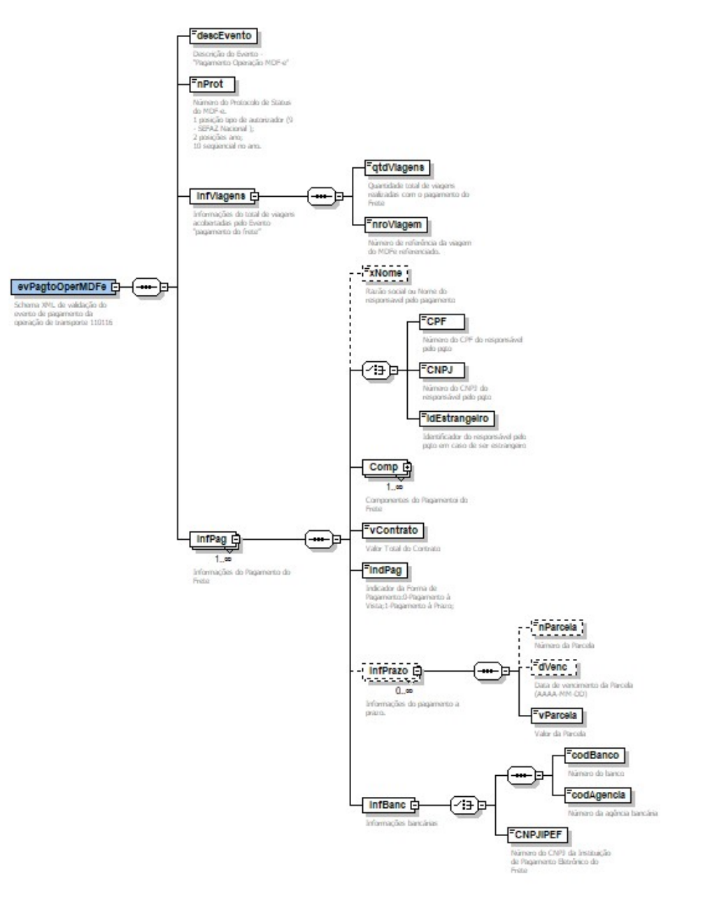

# 5.1.1 Layout Simplificado do Evento

<!-- p.12 -->

*Figura – Layout simplificado do evento evPagtoOperMDFe (schema XML de validação do evento de pagamento da operação de transporte, código 110116).*
