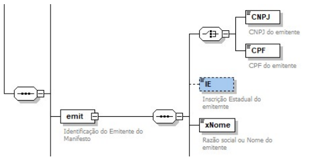

# 3.3 Inscrição Estadual do Emitente do MDF-e

O emitente do MDF-e já pode ser um CPF para as séries reservadas de 920-969 no caso de pessoa física com Inscrição Estadual, nesta versão da NFF passa a poder ser identificado pelo CPF do transportador autônomo de cargas (TAC) sem inscrição, desde que atendidas as regras da NFF. A IE do emitente passa a ser uma tag opcional, que não será informada somente no caso da NFF.

| Campo | Descrição | Ele. | Tipo | Ocor. | Tam. |
|---|---|---|---|---|---|
| **emit** | **Identificação do Emitente do MDF-e** | **G** | | **1 - 1** | |
| CNPJ | CNPJ do emitente | CE | N | 1 - 1 | 14 |
| CPF | CPF do emitente | CE | N | 1 - 1 | 14 |
| IE | Inscrição Estadual do Emitente | E | N | 0 - 1 | 14 |
| xNome | Razão social ou Nome do emitente | E | C | 1 - 1 | 2 - 60 |
| xFant | Nome fantasia do emitente | E | C | 0 - 1 | 1 - 60 |

<!-- p.07 -->

*Figura 1 – Estrutura do grupo emit, com o elemento IE opcional.*
