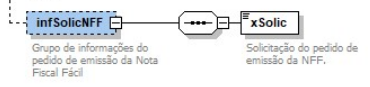

# 3.4 Criação do grupo de informações do pedido de emissão da NFF

O pedido de emissão da NFF existirá somente na hipótese de forma de emissão = 3 e será gerado exclusivamente pelo aplicativo emissor. Essa tag deverá conter todos os campos e valores preenchidos pelo usuário do aplicativo no formato JSON.

A estrutura a seguir será adicionada ao schema do MDF-e e do pedido de Evento.

*Figura 2 – Grupo infSolicNFF (Grupo de informações do pedido de emissão da Nota Fiscal Fácil) e elemento xSolic (Solicitação do pedido de emissão da NFF).*
