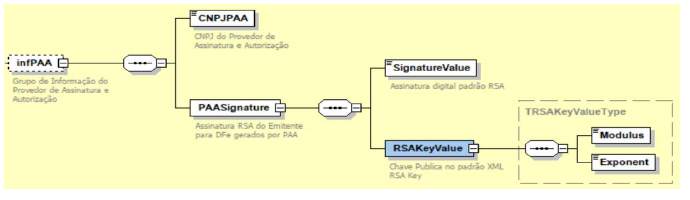
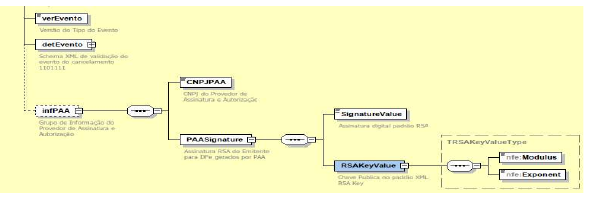

<!-- p.06 -->

# 7 Estrutura das informações do PAA no XML dos DFe

| Grupo/Elemento | Pai | Descrição | Elem | Tipo | Ocorr | Tam. | Observação |
|---|---|---|---|---|---|---|---|
| **infPAA** | **infMDFe** | **Grupo de Informação do Provedor de Assinatura e Autorização** | **G** | | **0-1** | | |
| CNPJPAA | infPAA | CNPJ do Provedor de Assinatura e Autorização | E | C | 1-1 | 14 | |
| **PAASignature** | **infPAA** | **Assinatura RSA do Emitente para DFe gerados por PAA** | **G** | | **1-1** | | |
| SignatureValue | PAASignature | Assinatura digital padrão RSA | E | C | 1-1 | | Converter o atributo Id do DFe para array de bytes e assinar com a chave privada do RSA com algoritmo SHA1 gerando um valor no formato base64. |
| **RSAKeyValue** | **PAASignature** | **Chave Pública no padrão XML RSA Key** | **G** | | **1-1** | | |
| Modulus | RSAKeyValue | | E | C | 1-1 | | |
| Exponent | RSAKeyValue | | E | C | 1-1 | | |

<!-- p.07 -->

Esquema gráfico do leiaute contemplando o PAA.

Esquema gráfico do leiaute do evento contemplando o PAA.

