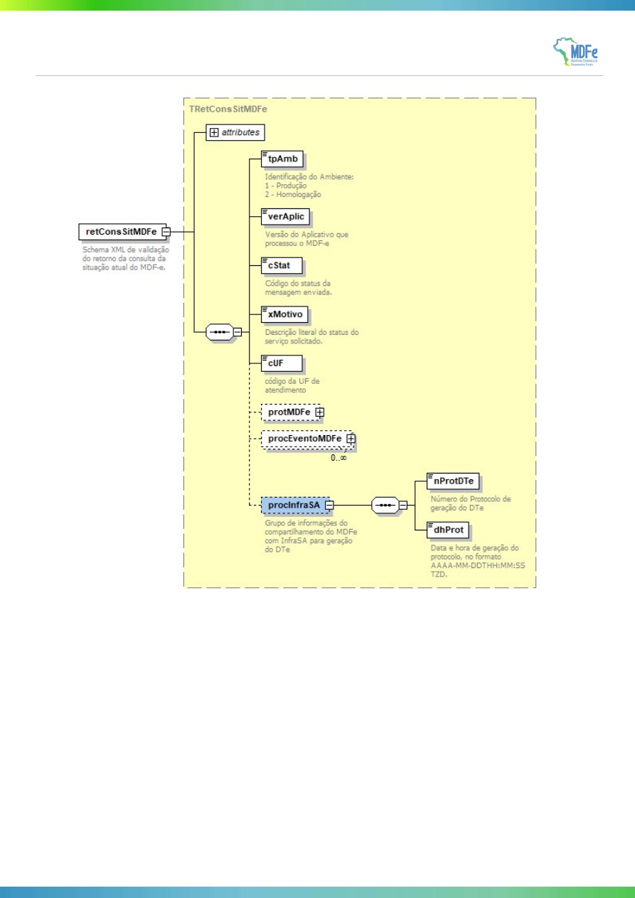

<!-- p.4 -->

# 1.1.2 Leiaute Mensagem de Retorno

**Retorno:** Estrutura XML com o resultado da consulta situação.

**Schema XML: retConsSitMDFe_v9.99.xsd**

> No original, as linhas DR10, DR11 e DR12 estão destacadas em amarelo.

| # | Campo | Ele | Pai | Tipo | Ocor. | Tam. | Descrição/Observação |
|---|---|---|---|---|---|---|---|
| **DR01** | **retConsSitMDFe** | **Raiz** | **-** | **-** | **-** | **-** | **TAG raiz da Resposta** |
| DR02 | versao | A | DR01 | N | 1-1 | 2v2 | Versão do leiaute |
| DR03 | tpAmb | E | DR01 | N | 1-1 | 1 | Identificação do Ambiente: 1 – Produção / 2 - Homologação |
| DR04 | verAplic | E | DR01 | C | 1-1 | 1-20 | Versão do Aplicativo que processou a consulta |
| DR05 | cStat | E | DR01 | N | 1-1 | 3 | Código do status da resposta |
| DR06 | xMotivo | E | DR01 | C | 1-1 | 1-255 | Descrição literal do status da resposta |
| DR07 | cUF | E | DR01 | N | 1-1 | 2 | Código da UF que atendeu à solicitação |
| **DR08** | **protMDFe** | **G** | **DR01** | **XML** | **0-1** | **-** | **Protocolo de autorização de uso do MDFe** |
| **DR09** | **procEventoMDFe** | **G** | **DR01** | **XML** | **0-N** | **-** | **Informações dos eventos e respectivo protocolo de registro de evento.** |
| **DR10** | **procInfraSA** | **G** | **DR01** | **G** | **0-1** | **-** | **Grupo de informações do compartilhamento do MDFe com InfraSA para geração do DTe** |
| DR11 | nProtDTe | E | DR10 | N | 1-1 | 15 | Número do Protocolo de Geração do DTe |
| DR12 | dhProt | E | DR10 | D | 1-1 | - | Data e hora de geração do protocolo, no formato AAAA-MM-DDTHH:MM:SS TZD. |

**Observação:** as tags DR10, DR11 e DR12 serão alimentadas somente para MDFe dos modais ferroviário e rodoviário e somente após a disponibilização para a InfraSA.

<!-- p.5 -->

*Figura: diagrama do schema XML retConsSitMDFe_v9.99.xsd (mensagem de retorno). No original, o elemento procInfraSA aparece destacado em azul.*
