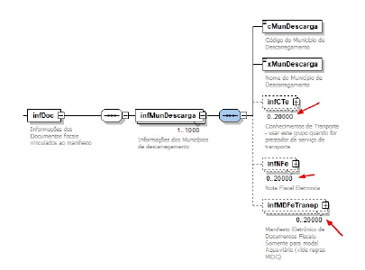

# Alteração de Schema do MDFe

Ampliam-se para até 20.000 ocorrências de documentos originários por município de descarregamento no schema do MDFe.

**Figura 1** – Estrutura do grupo infMunDescarga (infDoc); setas vermelhas no original indicam os grupos infCTe, infNFe e infMDFeTransp com ocorrência 0..20000.
