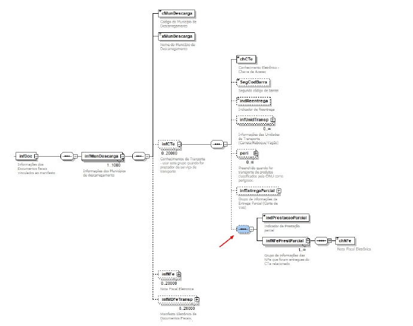

<!-- p.03 -->
# Alteração no leiaute do MDFe

No grupo de documentos originários do tipo Conhecimento de Transporte Eletrônico foram incluídos os campos opcionais conforme figura abaixo:

*Figura: campos opcionais incluídos no grupo infCTe, com os grupos infDoc e infMunDescarga em contexto.*

| # | Campo | Ele | Pai | Tipo | Ocor. | Tam. | Descrição/Observação |
|---|---|---|---|---|---|---|---|
| #01 | Sequência XML | - | infCTe | - | 0-1 | - | |
| #02 | indPrestacaoParcial | E | #01 | N | 1-1 | 1 | Informar tag com valor fixo 1 (sinaliza que a prestação é parcial) |
| **#03** | **infNFePresParcial** | **E** | **#01** | **G** | **1-n** | **-** | **Grupo de informações das NFe entregues na prestação parcial do CTe (Este grupo sempre é informado quando indPrestacaoParcial estiver informado)** |
| #04 | chNFe | E | #03 | N | 1-1 | - | Chave de acesso da NFe entregue na prestação parcial do CTe relacionado |

<!-- REVISAR p.03: nome do grupo divergente no original: 'infNFePresParcial' na tabela de leiaute, 'infNFePrestParcial' na figura e nas regras F36b a F36g; mantido como na tabela -->
