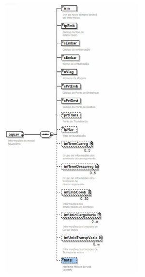

<!-- p.06 -->

# Campo MMSI no modal Aquaviário

Criação do campo Maritime Mobile Service Identify (MMSI) opcional de tamanho 9 aceitando apenas números no schema do modal aquaviário. **Obs: Futuramente será obrigatório por regra de validação**

*Figura: grupo aquav (modal aquaviário). O campo MMSI, novo, aparece destacado em azul no original.*
