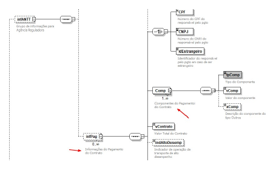

<!-- p.05 -->

# Descrição do infPag e Comp

Os grupos infPag e Comp do leuaite do modal rodoviário passam a ter a seguinte definição, respectivamente: “Informações do pagamento do contrato” e “Componentes do pagamento do contrato”

*Figura: grupos infPag e Comp no leiaute do modal rodoviário. As setas vermelhas do original indicam os elementos alterados.*
