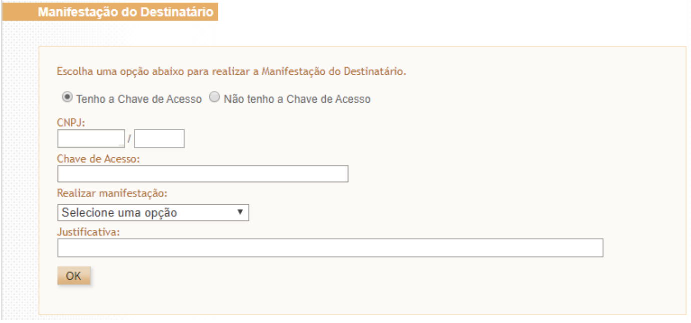
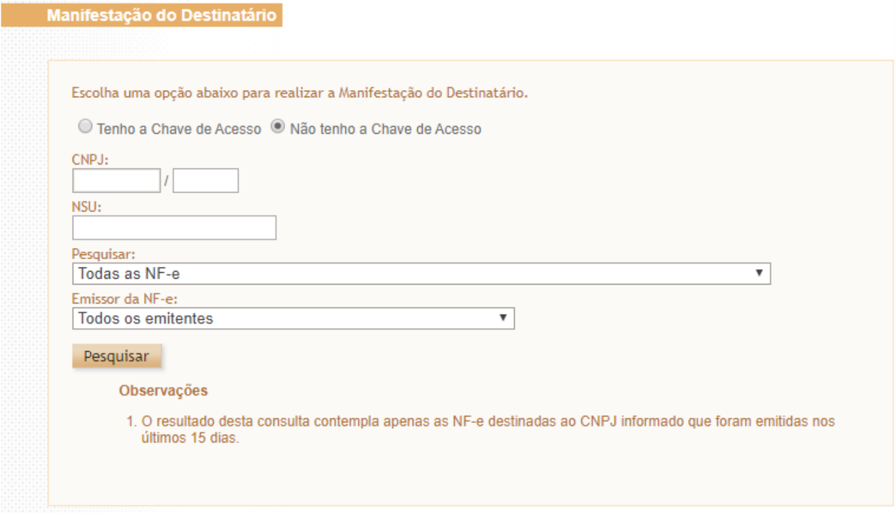
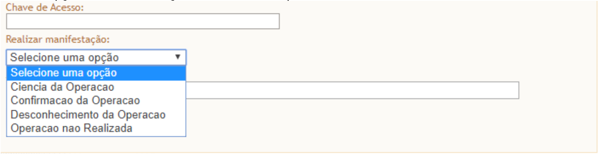
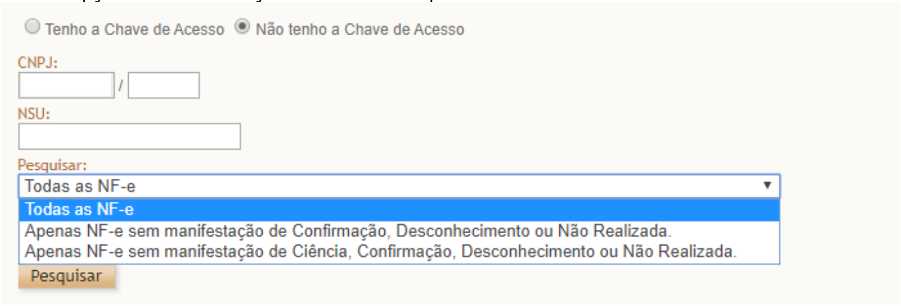
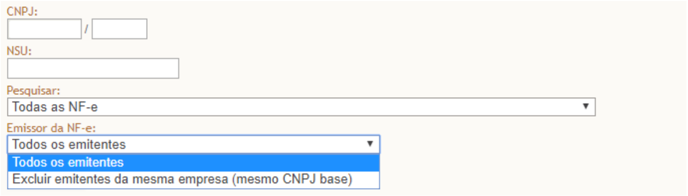

<!-- p.31 -->
# 3.2. Manifestações do Destinatário

(NT 2012.002)

## 3.2.1. Eventos de Manifestação do Destinatário

Os eventos de manifestação do destinatário são:

### 3.2.1.1. Confirmação da Operação

O evento de “Confirmação da Operação” pelo destinatário confirma a operação e o recebimento da mercadoria (para as operações com circulação de mercadoria). Se ocorrer a devolução total ou parcial das mercadorias, além do procedimento atual de geração da Nota Fiscal de devolução, também poderá ser comandado o evento da “Confirmação da Operação”.

<!-- p.32 -->
O registro deste evento libera a possibilidade da empresa efetuar o download da NF-e, conforme especificado no “Serviço de Distribuição”.

Nota: Após a Confirmação da Operação pelo destinatário, a empresa emitente fica automaticamente impedida de cancelar a NF-e.

### 3.2.1.2. Desconhecimento da Operação

Uma empresa pode ficar sabendo das operações destinadas a um determinado CNPJ/CPF consultando o “Serviço de Consulta da Relação de Documentos Destinados” ao seu CNPJ/CPF. O evento de “Desconhecimento da Operação” permite ao destinatário informar o seu desconhecimento de uma determinada operação que conste nesta relação, por exemplo.

### 3.2.1.3. Operação não Realizada

Em algumas situações, a empresa destinatária informa que a operação não foi realizada (com Recusa de Recebimento da mercadoria e outros motivos), não cabendo neste caso a emissão de uma Nota Fiscal de devolução. Este evento permite o registro da declaração de Operação não Realizada pelo destinatário, permitindo também a informação complementar da justificativa desta informação.

### 3.2.1.4. Evento de “Ciência da Operação ou Ciência da Emissão”

Neste evento, o destinatário declara ter ciência sobre uma determinada operação destinada ao seu CNPJ ou CPF, mas não possui elementos suficientes para apresentar a sua manifestação conclusiva sobre a operação citada.

O evento de “Ciência da Emissão” é um evento opcional e pode ser evitado, já que normalmente o destinatário da NF-e deve possuir o arquivo XML da NF-e enviado e/ou disponibilizado pelo emitente.

Após um período determinado, todas as operações com “Ciência da Emissão” deverão obrigatoriamente ter a manifestação final do destinatário declarada em um dos eventos de Confirmação da Operação, Desconhecimento ou Operação não Realizada.

### 3.2.1.5. Sobre a mudança da Manifestação do Destinatário

O destinatário poderá enviar uma única mensagem de Confirmação da Operação, Desconhecimento da Operação ou Operação não Realizada, valendo apenas a última mensagem registrada. Exemplo: o destinatário pode desconhecer uma operação que havia confirmado inicialmente ou confirmar uma operação que havia desconhecido inicialmente.

O evento de “Ciência da Emissão” não configura a manifestação final do destinatário, portanto não cabe o registro deste evento após a manifestação final do destinatário.

Os demais eventos representam uma manifestação conclusiva do destinatário sobre a operação representada pela NF-e.

## 3.2.2. Como operacionalizar a Manifestação do Destinatário

A Manifestação do Destinatário pode ser operacionalizada em qualquer uma das formas que seguem:

<!-- p.33 -->
### 3.2.2.1. Por Meio de *Web Services*

A NT 2012.002 especifica a possibilidade de Manifestação do Destinatário utilizando os diferentes serviços (*Web Services*) disponibilizados para este fim.

Com esta alternativa, uma empresa destinatária pode automatizar seus processos de controle, recebendo a relação de Chaves de Acesso destinadas à sua empresa, podendo também registrar os seus eventos de Manifestação do Destinatário de forma automatizada.

Se for de seu interesse, a empresa pode também buscar de forma automática o XML da NF-e em que ela é destinatária.

Nota: Estes *Web Services* estão disponibilizados no Ambiente Nacional para todas as UF.

### 3.2.2.2. Por Meio de Consulta no Portal Nacional

O Portal Nacional da NF-e (https://www.nfe.fazenda.gov.br) viabiliza também o serviço de consulta às Chaves de Acesso destinadas a uma empresa, dando a possibilidade de manifestação do destinatário para cada Chave de Acesso relacionada.

A consulta deve ser feita com o Certificado Digital da empresa no menu “Serviços”, na operação de “Manifestação Destinatário”.

Como citado acima, no No menu “Serviços”, “Manifestação Destinatário” do Portal Nacional da NF-e (https://www.nfe.fazenda.gov.br) é disponibilizada a opção de realizar a manifestação por chave de acesso ou por NSU (Número Sequencial Único), sendo obrigatório o uso de Certificado Digital do destinatário. Nas telas a seguir será acrescida também a opção de informar o CPF para permitir a manifestação por Pessoa Física.

Tela 1: Manifestação do destinatário por chave de acesso

*Tela 1: Manifestação do destinatário por chave de acesso*

Texto da figura: título “Manifestação do Destinatário”; “Escolha uma opção abaixo para realizar a Manifestação do Destinatário.”; opções “Tenho a Chave de Acesso” (selecionada) e “Não tenho a Chave de Acesso”; campos “CNPJ:”, “Chave de Acesso:”, “Realizar manifestação:” (lista “Selecione uma opção”), “Justificativa:”; botão “OK”.

Tela 2: Manifestação do destinatário por NSU (Número Sequencial Único)

<!-- p.34 -->

*Tela 2: Manifestação do destinatário por NSU (Número Sequencial Único)*

Texto da figura: título “Manifestação do Destinatário”; “Escolha uma opção abaixo para realizar a Manifestação do Destinatário.”; opções “Tenho a Chave de Acesso” e “Não tenho a Chave de Acesso” (selecionada); campos “CNPJ:”, “NSU:”, “Pesquisar:” (lista “Todas as NF-e”), “Emissor da NF-e:” (lista “Todos os emitentes”); botão “Pesquisar”; “Observações” – “1. O resultado desta consulta contempla apenas as NF-e destinadas ao CNPJ informado que foram emitidas nos últimos 15 dias.”

Tela 3: Opções de manifestação do destinatário por chave de acesso

*Tela 3: Opções de manifestação do destinatário por chave de acesso*

Texto da figura: lista “Realizar manifestação:” com as opções “Selecione uma opção”, “Ciencia da Operacao”, “Confirmacao da Operacao”, “Desconhecimento da Operacao”, “Operacao nao Realizada”.

Tela 4: Opções de manifestação do destinatário por NSU

*Tela 4: Opções de manifestação do destinatário por NSU*

Texto da figura: lista “Pesquisar:” com as opções “Todas as NF-e”, “Apenas NF-e sem manifestação de Confirmação, Desconhecimento ou Não Realizada.”, “Apenas NF-e sem manifestação de Ciência, Confirmação, Desconhecimento ou Não Realizada.”

Tela 5: Permite escolher para todos os emitentes.

<!-- p.35 -->

*Tela 5: Permite escolher para todos os emitentes.*

Texto da figura: lista “Emissor da NF-e:” com as opções “Todos os emitentes” e “Excluir emitentes da mesma empresa (mesmo CNPJ base)”.

### 3.2.2.3. Por Meio do Programa Manifestador

No menu “Downloads”, “Manifestador de NF-e” do Portal Nacional da NF-e (https://www.nfe.fazenda.gov.br) foi disponibilizado software desenvolvido pela Sefaz-SP que viabiliza exclusivamente a manifestação do destinatário pessoa jurídica, sendo obrigatório o uso de Certificado Digital do destinatário.

## 3.2.3. Obrigatoriedade de Manifestação

A cláusula décima-quinta-B do Ajuste SINIEF 7/2005 prevê a obrigatoriedade do registro pelo destinatário da NF-e dos eventos de confirmação da operação, operação não realizada e desconhecimento da operação nos prazos especificados naquele Ajuste.

Também está obrigado a realizar a manifestação, de acordo com o Anexo II do Ajuste SINIEF 7/2005, o destinatário de toda NF-e que:

I – seja exigido o preenchimento do Grupo Detalhamento específico de Combustíveis, como nos casos de mercadoria destinada a:

- a) estabelecimentos distribuidores de combustíveis, a partir de 1º de março de 2013;
- b) postos de combustíveis e transportadores revendedores retalhistas, a partir de 1º de julho de 2013;

II - acoberte operações com álcool para fins não-combustíveis, transportado a granel, a partir de 1º de julho de 2014;

III – acoberte, nos casos em que o destinatário for um estabelecimento distribuidor ou atacadista, a partir de 1º de agosto de 2015, a circulação de:

- a) cigarros;
- b) bebidas alcoólicas, inclusive cervejas e chopes;
- c) refrigerantes e água mineral.

Obs:

- a NT 2012/003 (item 03.1), publicada em Agosto/2012, define quais são os CFOP que obrigam a informação do Grupo de Combustível na NF-e. Os CFOP citados estão relacionados com as operações que envolvem “Combustível derivado ou não de Petróleo e Lubrificantes”.
<!-- p.36 -->
- Como as operações com lubrificantes são exceção à obrigatoriedade de manifestação do dentinário, consta no Anexo II a tabela de Códigos de Produto da ANP relativa a lubrificantes e que **não estão obrigados à Manifestação do Destinatário.**
