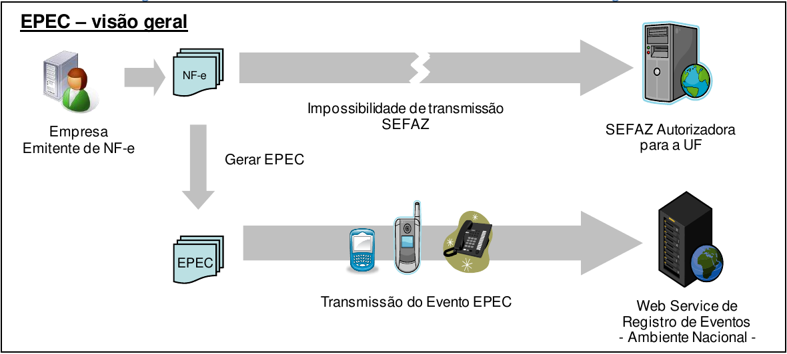

<!-- p.36 -->
# 3.3. Evento Prévio de Emissão em Contingência (EPEC)

O EPEC permite à empresa solicitar o registro do "Evento Prévio de Emissão em Contingência" anterior à emissão do documento em si com um leiaute mínimo de informações. O EPEC deve ser enviado para o Ambiente Nacional (AN), utilizando-se o *Web Service* de Eventos genérico, criado para este fim.

Os principais benefícios deste tipo de contingência são:

- Reduzir custo da emissão em Formulário de Segurança (FS-DA);
- Prover uma rota alternativa em caso de falha da infraestrutura de internet para acesso a SEFAZ Autorizadora, não tendo sido ativada a SEFAZ Virtual de Contingência para a UF;
- A geração de arquivo pequeno, com melhores condições de transmissão, em função de possível problema de largura de banda e outras restrições na transmissão (uso de linha discada, rede de celular, etc.).

## 3.3.1. EPEC, Visão Geral

*Figura 3-1 – Visão Geral do Evento Prévio de Emissão em Contingência*

Texto da figura: "EPEC – visão geral"; Empresa Emitente de NF-e; NF-e; "Impossibilidade de transmissão SEFAZ"; SEFAZ Autorizadora para a UF; "Gerar EPEC"; EPEC; "Transmissão do Evento EPEC"; Web Service de Registro de Eventos - Ambiente Nacional -.

A emissão do EPEC poderá ser adotada por qualquer emissor que esteja impossibilitado de transmissão e/ou recepção das autorizações de uso de suas NF-e, adotando os seguintes passos:

- Gerar a NF-e com “tpEmis = 4”, mantendo também a informação do motivo de entrada em contingência com data e hora do início da contingência, com número diferente de qualquer NF-e que tenha sido transmitida com outro “tpEmis”;
- Gerar o arquivo XML do EPEC com as seguintes informações da NF-e:
  - UF, CNPJ e Inscrição Estadual do emitente;
  - Chave de Acesso;
  - UF e CNPJ ou CPF do destinatário;
  - Valor Total da NF-e, Valor Total do ICMS e Valor Total do ICMS-ST;
  - Outras informações constantes no leiaute.
- Assinar o arquivo com o certificado digital do emitente;
- Enviar o arquivo XML do EPEC para o *Web Service* de Registro de Eventos do AN;
<!-- p.37 -->
- Impressão do DANFE da NF-e que consta do EPEC, em papel comum, constando no corpo a expressão “DANFE impresso em contingência –  EPEC regularmente recebida pela Receita Federal do Brasil”.

Obtida a autorização do Evento (Número do Protocolo: 891xxxxxxxxxxxx), a exemplo do que ocorre com outros eventos da NF-e, este evento também será distribuído para as UF envolvidas na operação, inclusive para a própria UF do emitente.

Após a cessação dos problemas técnicos que impediam a transmissão da NF-e para UF de origem, a NF-e que deu origem a necessidade de uso da Contingência Eletrônica “EPEC” deverá ser transmitida para a SEFAZ de origem, observando o prazo limite de transmissão na legislação, bem como outros procedimentos constantes na legislação caso ocorra rejeição na autorização de uso.

Nota: A Chave de Acesso desta NF-e é exatamente a mesma Chave de Acesso do EPEC autorizado anteriormente.

## 3.3.2. Endereço dos Web Services

O endereço do Web Service de Eventos do Ambiente Nacional está publicado no Portal da NF-e (http://www.nfe.fazenda.gov.br/portal), no link "Serviços" / "Relação de Serviços Web".

Idem para o ambiente de homologação, no Portal de Homologação (http://hom.nfe.fazenda.gov.br/portal)

## 3.3.3. Entrada em Contingência

A decisão da empresa de começar a usar a contingência do EPEC é tomada quando a empresa não recebe a resposta de uma determinada NF-e com pedido de autorização de uso, ou quando não consegue determinar se o pedido foi ou não corretamente enviado. O documento *MOC – Anexo IV – Manual de Contingência NF-e* descreve o tratamento necessário para as NFe pendentes de retorno.

## 3.3.4. Impressão do DANFE

Deverá ser impresso no DANFE o número do Protocolo de Autorização do Evento de EPEC, além do motivo e a hora da entrada em contingência.

O DANFE deverá ser impresso em duas vias que terão a seguinte destinação:

- Uma via permite o trânsito das mercadorias e deverá ser mantida pelo destinatário;
- A outra via deverá ser mantida pelo emitente.

Estas vias deverão ser mantidas em arquivo pelo emitente e pelo destinatário, durante o prazo estabelecido na legislação tributária para a guarda de documentos fiscais.

## 3.3.5. Lote de EPEC

Como é utilizado o *Web Service* genérico de registro de evento é possível registrar os eventos de EPEC para até 20 NF-e diferentes em uma mesma conexão, sendo um EPEC para cada NF-e.
<!-- p.38 -->

## 3.3.6. Controle do Ambiente de Contingência do EPEC

As notas fiscais emitidas em contingência, com a autorização do "Evento Prévio de Emissão em Contingência (EPEC)", devem ser transmitidas imediatamente após a cessação dos problemas técnicos que impediam a transmissão da NF-e, observado o prazo limite definido na legislação.

Neste modelo de contingência serão estabelecidos controles para identificar a existência de EPEC sem o envio da NF-e correspondente. Passado o prazo previsto na legislação para o envio da NF-e, será bloqueada a autorização de novos EPEC para o Contribuinte Emitente, sem prejuízo das demais ações relacionadas com a ausência da NF-e para os EPEC pendentes de conciliação.

## 3.3.7. Controle de EPEC Pendente de Conciliação

Para cada EPEC autorizado, a SEFAZ (e/ou o Ambiente Nacional) deverá manter um controle em banco de dados, contendo, entre outras, as informações de:

- Chave de Acesso da NF-e, com os campos:
  - Modelo do documento fiscal (55=NF-e);
  - UF e CNPJ do Emitente, além da Série e Número da NF-e;
- UF do Destinatário;
- Valor do EPEC;
- Protocolo e Data-Hora da Autorização do EPEC;
- Indicador de Conciliação: 0=Pendente; 1 = EPEC Conciliado;
- Indicador para Liberar a necessidade de Conciliação: 0=Não; 1=Liberada a necessidade de conciliação do EPEC.

Quando o Emitente enviar a NF-e com a mesma Chave de Acesso de um EPEC pendente, o "Indicador de Conciliação" do EPEC deverá ser alterado, eliminando a pendência de conciliação.

## 3.3.8. Controle do Ambiente de Contingência do EPEC

### A. Bloqueio do Ambiente de Contingência EPEC

Diariamente será efetuada uma avaliação dos "EPEC Pendente de Conciliação" há mais de 168 horas (7 dias), bloqueando o Ambiente de Contingência do EPEC para o Emitente com pendência. A partir deste momento, o Emitente não conseguirá obter autorização de novas EPEC, enquanto não regularizar a situação dos "EPEC Pendentes de Conciliação".

### B. Desbloqueio do Ambiente de Contingência EPEC

Deverá ser efetuado o desbloqueio do "Ambiente de contingência EPEC" para um Emitente (CNPJ ou CPF) bloqueado anteriormente, mas que não possua mais "EPEC Pendente de Conciliação". Outras informações:

- A avaliação do desbloqueio do ambiente EPEC para um determinado Emitente pode ser feita no momento de recepção da NF-e correspondente ao EPEC que originou o bloqueio. Se não restarem outros EPEC pendentes de conciliação após o prazo de 168 horas, o ambiente EPEC pode ser liberado;
<!-- p.39 -->
- Deverá ser possível desconsiderar a necessidade de conciliação para um determinado EPEC, a partir de comando de liberação pela SEFAZ, efetuado em Extranet disponibilizada pelo Ambiente Nacional. Esta liberação comandada pode significar o desbloqueio do Ambiente EPEC, caso não existam outros EPEC pendentes de conciliação.

## 3.3.9. Relação de EPEC Pendente de Conciliação

É responsabilidade da empresa obter a autorização de uso da NF-e com Chave de Acesso idêntica ao EPEC previamente autorizado.

A critério de cada UF poderá ser disponibilizada no Portal da SEFAZ, em área restrita, uma Consulta de EPEC Pendente de Conciliação, onde o operador informa o CNPJ ou CPF do Emitente, obtendo as informações de:

- UF, CNPJ ou CPF consultado e Nome da Empresa;
- Relação dos EPEC Pendente de Conciliação, na ordem de Data de Autorização do EPEC, mostrando também as informações destes EPEC.

Os EPEC pendentes de conciliação poderão ser visíveis para o CNPJ ou CPF do emitente ou para o CNPJ ou CPF do destinatário que constam do leiaute do respectivo EPEC.

## 3.3.10. Adaptação nos Serviços de Autorização de Uso

A SEFAZ Autorizadora mantém controle da numeração das NF-e já autorizadas, evitando a duplicidade de autorização de uso para a mesma Chave Natural (campos de: Modelo, UF, CNPJ ou CPF do Emitente, Série e Número da NF-e).

O EPEC autorizado pelo Ambiente Nacional é compartilhado com a SEFAZ do emitente e deverá ser armazenado na UF como um evento normal. A Chave Natural da NF-e constante no EPEC autorizado deverá também ser registrada no banco de dados de controle de numeração das NF-e autorizadas.

## 3.3.11. Serviço de Autorização de NF-e

Conforme citado anteriormente, o Emitente do EPEC deve obter a Autorização de Uso para a NF-e correspondente ao EPEC autorizado.

Caso a NF-e com tipo de emissão 4 (EPEC) seja autorizada ou denegada, o ambiente nacional no Serpro assinará o EPEC como conciliado, conforme o item de "Controle de EPEC Pendente de Conciliação" tratado anteriormente. No caso da NF-e ter sido "Denegada", o ambiente nacional no Serpro assinará para avaliação a posteriori pela SEFAZ, já que o EPEC autorizado pode ter acobertado a circulação da mercadoria.

Como os dados do EPEC são obtidos a partir da NF-e que não conseguiu ser transmitida por problemas técnicos, quando for transmitida, esta NF-e deverá possuir os mesmos dados do EPEC autorizado anteriormente.
<!-- p.40 -->

## 3.3.12. Serviço de Registro de Evento: Cancelamento de NF-e

Não existe o cancelamento de um EPEC autorizado, portanto o pedido de cancelamento da NF-e somente é possível se existir a NF-e.

No caso da empresa ter autorizado o evento de EPEC, mas decidir pelo cancelamento da operação, deverá proceder como segue:

- Obter a autorização de uso da NF-e relacionada com o EPEC autorizado;
- Cancelar a NF-e recém autorizada.

## 3.3.13. Serviço de Registro de Evento: Carta de Correção

O evento de Carta de Correção somente é possível se existir a NF-e autorizada.

## 3.3.14. Serviço de Registro de Evento: Manifestação do Destinatário

Os eventos da Manifestação do Destinatário se referem a uma NF-e autorizada, portanto os serviços relacionados com a Manifestação do Destinatário não serão afetados pela existência unicamente do EPEC, sem ter sido autorizada a NF-e correspondente.

## 3.3.15. Serviço de Inutilização de Numeração

A validação do pedido de inutilização deverá considerar a existência do EPEC, portanto o pedido de inutilização será rejeitado com a mensagem abaixo, caso exista um EPEC autorizado para a faixa de numeração:

- Mensagem: "241 - Rejeição: Um número da faixa já foi utilizado".

## 3.3.16. Serviço de Consulta Situação da NF-e (Web Service: NfeConsulta2)

Caso a NF-e referente ao evento EPEC já tenha sido autorizada, a Consulta da Situação da NF-e deverá retornar normalmente o protocolo de autorização de uso da NF-e e os dados dos eventos, da mesma forma que acontece para qualquer NF-e com evento.

Caso exista unicamente o EPEC, a Consulta da Situação da NF-e deverá retornar os dados do evento EPEC, com a mensagem abaixo:

- "124 - EPEC Autorizado".

## 3.3.17. Sincronismo dos Ambientes de Autorização: Situações de Exceção

### 3.3.17.1. Compartilhamento de Informações entre as SEFAZ e o Ambiente Nacional da Receita Federal
<!-- p.41 -->

A NF-e e o EPEC são autorizados em ambientes de autorização diferentes e existe um processo de compartilhamento de informações entre as SEFAZ e o Ambiente Nacional mantido pela Secretaria Especial da Receita Federal, que se encarrega de sincronizar estas informações. Portanto:

- A NF-e autorizada em uma SEFAZ Autorizadora é compartilhada com o Ambiente Nacional;
- O EPEC autorizado no Ambiente Nacional é compartilhado com a SEFAZ Autorizadora.

Este processo de compartilhamento acontece também para a UF de destino da operação e para todas as demais UF citadas no documento fiscal.

### 3.3.17.2. Sincronismo das Informações

O processo de compartilhamento das informações entre os diferentes ambientes de autorização demora algum tempo para ser efetuado (poucos minutos) e durante este tempo podem ocorrer algumas situações de exceção, conforme segue:

#### A. Autorização Simultânea: EPEC e NF-e

Neste caso a Empresa emitente autoriza simultaneamente, ou com um pequeno atraso, os documentos de:

- EPEC: Autorizado no Ambiente Nacional mantido pela Secretaria Especial da Receita Federal;
- NF-e: Autorizada na SEFAZ Autorizadora, com a mesma Chave Natural do EPEC, mas com o Tipo de Emissão diferente de 4-EPEC.

O documento de EPEC será compartilhado com a SEFAZ do Emitente, causando uma duplicidade de Chave Natural que deverá ser tratada.

Ocorrida esta situação, a Empresa não conseguirá autorizar uma NF-e com uma Chave de Acesso idêntica à Chave de Acesso do EPEC, resultando em um EPEC pendente de conciliação. Decorrido o prazo, o ambiente de contingência EPEC será bloqueado para este emitente. A empresa deverá rever seus processos internos, evitando ocorrências deste tipo.

Para liberar o uso do Ambiente de Contingência EPEC, a empresa deverá contatar a SEFAZ da sua circunscrição, informando a Chave de Acesso do EPEC pendente de conciliação. Analisado o caso, a SEFAZ poderá decidir por desconsiderar a necessidade de conciliação para este EPEC específico, comandando esta liberação no Ambiente de Contingência EPEC.

#### B. Autorização Simultânea: EPEC e Inutilização de Numeração

Neste caso a Empresa emitente autoriza simultaneamente, ou com um pequeno atraso, os documentos de:

- EPEC: Autorizado no Ambiente Nacional mantido pela Secretaria Especial da Receita Federal;
- Pedido de Inutilização de Numeração: Autorizada na SEFAZ Autorizadora, com a mesma Chave Natural do EPEC.
<!-- p.42 -->

O documento de EPEC será compartilhado com a SEFAZ do Emitente, causando uma duplicidade de Chave Natural que deverá ser tratada.

Ocorrida esta situação, a Empresa poderá não conseguir autorizar uma NF-e com uma Chave de Acesso idêntica à Chave de Acesso do EPEC, resultando em um EPEC pendente de conciliação. Decorrido o prazo, o ambiente de contingência EPEC será bloqueado para este emitente. A empresa deverá rever seus processos internos, evitando ocorrências deste tipo.

Para liberar o uso do Ambiente de Contingência EPEC, a empresa deverá contatar a SEFAZ de sua circunscrição, informando a Chave de Acesso do EPEC pendente de conciliação. Analisado o caso, a SEFAZ poderá decidir por desconsiderar a necessidade de conciliação para este EPEC específico, comandando esta liberação no Ambiente de Contingência EPEC.
