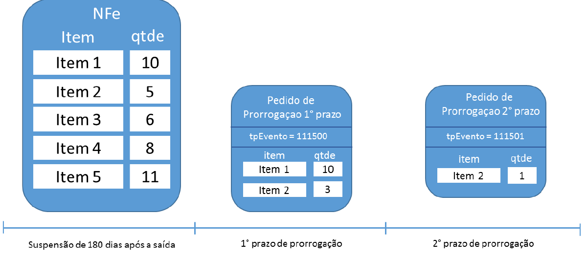
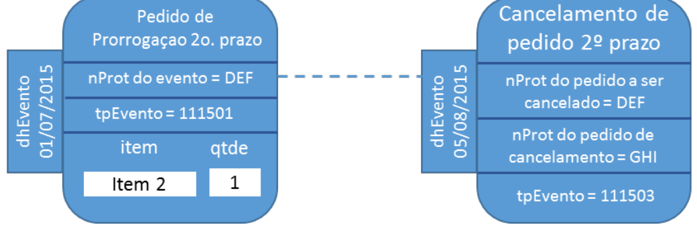
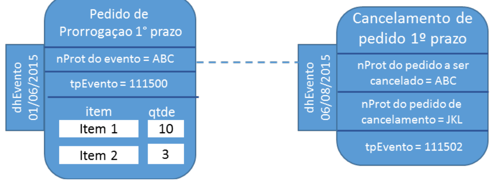
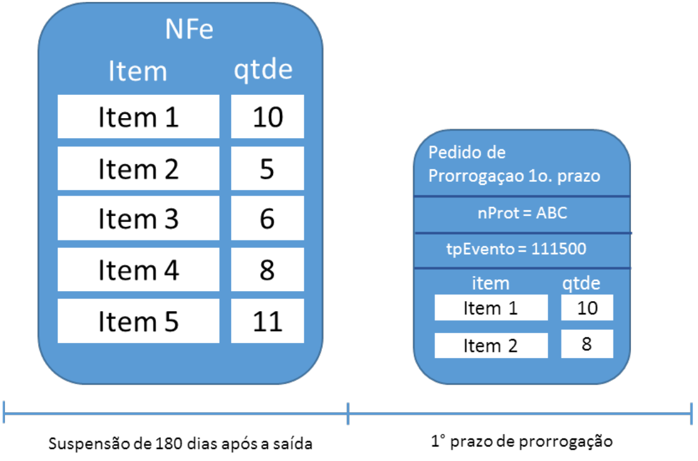
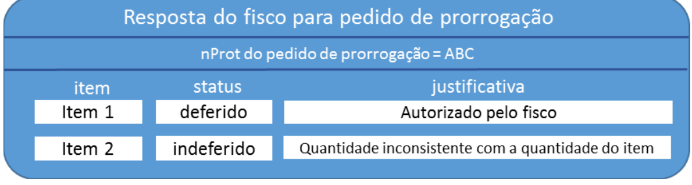
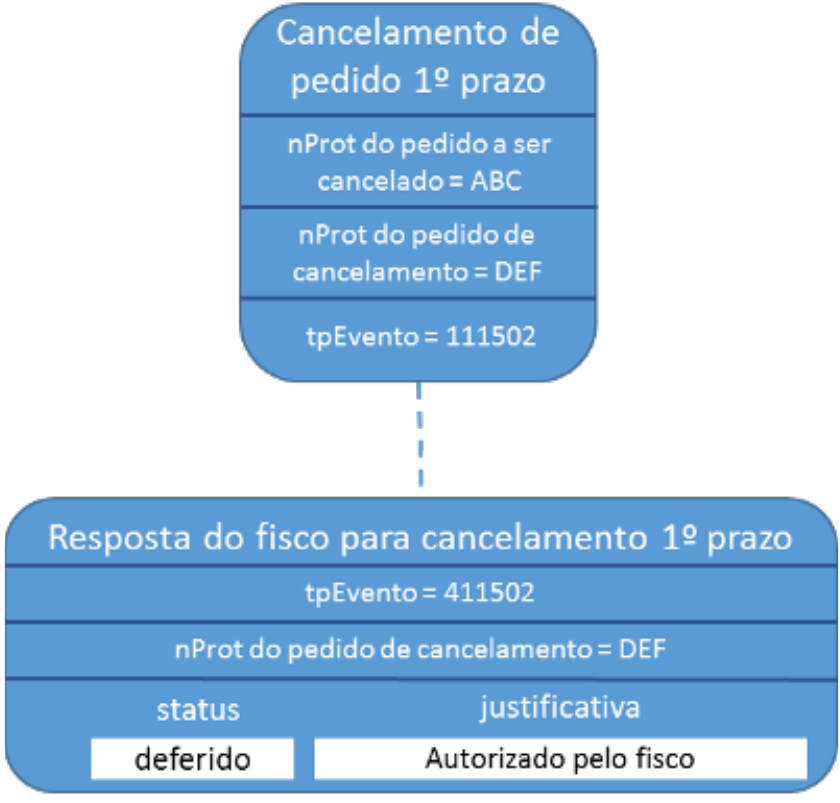
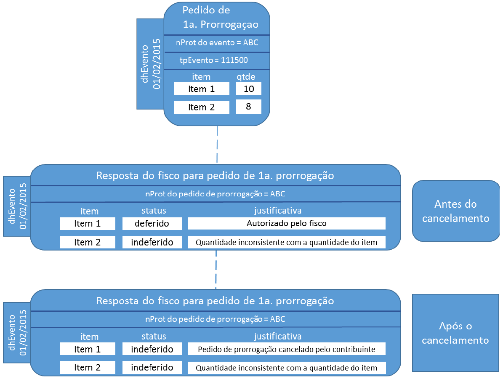

<!-- p.42 -->
# 3.4. Pedidos de Prorrogação de Suspensão ICMS em Remessas Interestaduais

(NT 2015.001)

O Evento de pedido de prorrogação da suspensão do Imposto sobre Operações Relativas à Circulação de Mercadorias nas remessas interestaduais de produtos destinados a conserto, reparo ou industrialização, desde que as mesmas retornem ao estabelecimento de origem, substitui uma petição do contribuinte para o Fisco, que era feita em papel, por um arquivo xml assinado.

O evento será utilizado pelo contribuinte e o alcance das alterações permitidas é definido no CONVÊNIO AE-15/74:

> *“Os Secretários de Fazenda dos Estados e do Distrito Federal, reunidos em Brasília, DF, no dia 11 de dezembro de 1974, resolvem celebrar o seguinte CONVÊNIO.*
>
> *(...)*
>
> *Cláusula primeira Os signatários acordam em conceder suspensão do Imposto sobre Operações Relativas à Circulação de Mercadorias nas remessas interestaduais de produtos destinados a conserto, reparo ou industrialização, desde que as mesmas retornem ao estabelecimento de origem no prazo de 180 (cento oitenta) dias, contados da data das respectivas saídas, prorrogáveis por mais cento e oitenta dias, admitindo-se, excepcionalmente, uma segunda prorrogação de igual prazo.*
>
> *(...)*
>
> *§ 1º O disposto nesta cláusula não se aplica às saídas de sucatas e de produtos primários de origem animal, vegetal ou mineral, salvo se a remessa e o retorno se fizerem nos termos de protocolos celebrados entre os Estados interessados.*
>
> *§ 2º A suspensão nas remessas interestaduais para industrialização promovidas por estabelecimentos localizados no Estado de Mato Grosso do Sul fica condicionada à existência de autorização específica concedida pela Secretaria de Estado de Fazenda desse Estado.*
>
> *(...)*
>
> *Cláusula segunda O presente Convênio passa a vigorar a partir de 1º de janeiro de 1975.*
>
> *(...)*
>
> *Signatários: AC, AL, AM, BA, CE, DF, ES, GB, GO, MA, MG, MT, PA, PB, PE, PI, PR, RJ, RN, RS, SC, SE e SP.”*

As UFs que determinarem em sua legislação local a suspensão do ICMS podem utilizar o mesmo recurso para receberem os pedidos de prorrogação de operações internas. Por enquanto apenas São Paulo adota estes eventos.
<!-- p.43 -->

## 3.4.1. Pedido de Prorrogação

A saída com a suspensão de ICMS (nos casos previstos em legislação) independe da emissão de eventos na NFe. Na necessidade de prorrogação deste prazo, o pedido de prorrogação se dá por eventos vinculados à NFe indicando o item e a quantidade que se pretende prorrogar.

A suspensão do ICMS é prorrogável por mais 180 dias após o primeiro período de prorrogação. Neste caso, a empresa solicita uma nova prorrogação com o evento de  2º prazo de prorrogação.

No exemplo da Figura 3-2, uma saída de 5 itens teve a suspensão prorrogada por 180 dias para os itens 1 e 2 nas quantidades 10 e 3, respectivamente. Em seguida, a empresa pediu a prorrogação da suspensão novamente para o item 2. Como já havia pedido a prorrogação para 3 unidades do item 2, está limitada a este no valor na 2ª prorrogação. No exemplo acima, pediu para apenas uma 1 unidade.

Como a suspensão pode ser prorrogável por até 2 períodos de 180 dias, há dois pedidos de prorrogação: um para o primeiro período de 180 dias (tpEvento = 111500) e outro para o segundo período de 180 dias (tpEvento = 111501).

*Figura 3-2 – Exemplo de Pedido de Prorrogação*

Texto da figura: NFe com itens e quantidades (qtde): Item 1 = 10; Item 2 = 5; Item 3 = 6; Item 4 = 8; Item 5 = 11. "Pedido de Prorrogaçao 1° prazo", tpEvento = 111500, item/qtde: Item 1 = 10; Item 2 = 3. "Pedido de Prorrogaçao 2° prazo", tpEvento = 111501, item/qtde: Item 2 = 1. Linha do tempo: "Suspensão de 180 dias após a saída", "1° prazo de prorrogação", "2° prazo de prorrogação".

> **Nota (transcrição):** o texto da figura mostra tpEvento = 111500 e 111501 (no texto da seção 3.4.3 constam 411500 a 411503 para os eventos do fisco).

## 3.4.2. Cancelamento do Pedido de Prorrogação

Se a empresa quiser desfazer o pedido de prorrogação (1º ou 2º prazo), pode enviar um evento pedindo seu cancelamento, porém, deverá observar a seguinte regra para cancelar eventos de Pedido de Prorrogação 1º prazo:

> *A quantidade de um determinado item prorrogado de 360 a 540 dias (nos eventos de prorrogação 2° prazo) deve sempre ter sido prorrogado de 180 a 360 dias por eventos de prorrogação 1° prazo. Por isso, ao tentar cancelar eventos de prorrogação 1° prazo, deve-se atentar para a quantidade de itens nos eventos de prorrogação de 2° prazo. É preciso que existam itens prorrogados no primeiro prazo (até 360 dias) suficientes para que as prorrogações a partir de 360 dias sejam compatíveis.*

Considerando como exemplo os dados do exemplo da Figura 3-2, não é possível cancelar o Pedido de Prorrogação 1º prazo sem antes cancelar o Pedido de Prorrogação 2º prazo. Neste caso, para realizar este cancelamento a empresa deverá seguir os seguintes passos:
<!-- p.44 -->

1. Solicitar evento de Cancelamento de Pedido de Prorrogação 2º prazo e, após deferimento deste;

   

   *Figura 3-3 – Exemplo de Cancelamento de Pedido de Prorrogação 2º prazo*

   Texto da figura: "Pedido de Prorrogaçao 2o. prazo" (dhEvento 01/07/2015): nProt do evento = DEF; tpEvento = 111501; item/qtde: Item 2 = 1. Ligado por linha tracejada a "Cancelamento de pedido 2º prazo" (dhEvento 05/08/2015): nProt do pedido a ser cancelado = DEF; nProt do pedido de cancelamento = GHI; tpEvento = 111503.

2. Solicitar evento de Cancelamento de Pedido de Prorrogação 1º prazo

   

   *Figura 3-4 – Exemplo de Cancelamento de Pedido de Prorrogação 1º prazo*

   Texto da figura: "Pedido de Prorrogaçao 1° prazo" (dhEvento 01/06/2015): nProt do evento = ABC; tpEvento = 111500; item/qtde: Item 1 = 10; Item 2 = 3. Ligado por linha tracejada a "Cancelamento de pedido 1º prazo" (dhEvento 06/08/2015): nProt do pedido a ser cancelado = ABC; nProt do pedido de cancelamento = JKL; tpEvento = 111502.

O evento de cancelamento, além de vinculado à NFe de remessa, também está vinculado ao evento de prorrogação que se pretende cancelar. Este vínculo ocorre pelo ID do evento e pelo protocolo de registro do evento.

## 3.4.3. Deferimento dos pedidos de prorrogação e de cancelamento pela SEFAZ

Todos os eventos de pedido de prorrogação e cancelamento são síncronos. A obtenção de um protocolo de registro na NFe não implica o deferimento pelo fisco como ocorre no registro de cancelamento de NFe, por exemplo.

O deferimento pela Sefaz depende de um evento (tp – 411500, 411501, 411502 ou 411503) assinado com certificado da Fazenda responsável pela empresa emitente da NFe de remessa. Este evento traz o posicionamento da Sefaz frente o pedido e a motivação no caso de indeferimento.

Para cada item, a Sefaz defere/indefere o pedido e justifica a resposta.

O evento do fisco está vinculado à NFe de remessa e ao pedido de prorrogação pelo ID do evento e pelo protocolo de registro do evento na NFe.
<!-- p.45 -->

*Figura 3-5 – Exemplo de Pedido de Prorrogação*

Texto da figura: NFe com itens e quantidades (qtde): Item 1 = 10; Item 2 = 5; Item 3 = 6; Item 4 = 8; Item 5 = 11. "Pedido de Prorrogaçao 1o. prazo": nProt = ABC; tpEvento = 111500; item/qtde: Item 1 = 10; Item 2 = 8. Linha do tempo: "Suspensão de 180 dias após a saída", "1° prazo de prorrogação".

A empresa pediu a prorrogação de 8 unidades do item 2. Porém, a NFe de remessa contém apenas 5 unidades do item 2. O evento de resposta para o pedido de prorrogação com  nProt = ABC autoriza a prorrogação de prazo para 10 unidades do item 1 e indefere o pedido de prorrogação para o item 2.

*Figura 3-6 – Exemplo Resposta do Fisco ao Pedido de Prorrogação*

Texto da figura: "Resposta do fisco para pedido de prorrogação"; nProt do pedido de prorrogação = ABC; item / status / justificativa: Item 1 | deferido | Autorizado pelo fisco; Item 2 | indeferido | Quantidade inconsistente com a quantidade do item.

A empresa pode pedir para cancelar um pedido de prorrogação depois da manifestação do fisco (deferindo ou indeferindo o cancelamento).
<!-- p.46 -->

*Figura 3-7 – Exemplo de Cancelamento de Pedido de Prorrogação*

Texto da figura: "Cancelamento de pedido 1º prazo": nProt do pedido a ser cancelado = ABC; nProt do pedido de cancelamento = DEF; tpEvento = 111502. Ligado por linha tracejada a "Resposta do fisco para cancelamento 1º prazo": tpEvento = 411502; nProt do pedido de cancelamento = DEF; status / justificativa: deferido | Autorizado pelo fisco.

O deferimento de um pedido de cancelamento de um pedido de prorrogação que tenha sido aprovado anteriormente gera um novo evento do fisco revertendo todos os deferimentos.

Em situações que estejam fora do controle do fisco, por exemplo, uma ordem judicial em virtude de um mandado de segurança, determinando a reversão de uma resposta do fisco, há a possibilidade do fisco emitir novo evento revertendo sua posição.

Assim, um evento de prorrogação pode ter mais de um evento de resposta do fisco ao longo do tempo. A resposta do fisco que prevalece é sempre a última.
<!-- p.47 -->

*Figura 3-8 – Exemplo Resposta do Fisco ao Cancelamento de Pedido de Prorrogação*

Texto da figura: "Pedido de 1a. Prorrogaçao" (dhEvento 01/02/2015): nProt do evento = ABC; tpEvento = 111500; item/qtde: Item 1 = 10; Item 2 = 8. "Resposta do fisco para pedido de 1a. prorrogação" (dhEvento 01/02/2015), rotulada "Antes do cancelamento": nProt do pedido de prorrogação = ABC; item / status / justificativa: Item 1 | deferido | Autorizado pelo fisco; Item 2 | indeferido | Quantidade inconsistente com a quantidade do item. "Resposta do fisco para pedido de 1a. prorrogação" (dhEvento 01/02/2015), rotulada "Após o cancelamento": nProt do pedido de prorrogação = ABC; Item 1 | indeferido | Pedido de prorrogação cancelado pelo contribuinte; Item 2 | indeferido | Quantidade inconsistente com a quantidade do item.

Exemplo de sequência de eventos no tempo e seu relacionamento:

(1) emissão da NFe de remessa ................ 01/02/2015  
(2) pedido de prorrogação 1º prazo ................ 01/07/2015  
(3) resposta do fisco para prorrogação 1º prazo ................ 02/07/2015  
(4) cancelamento pela empresa para prorrogação 1º prazo ................ 05/08/2015  
(5) resposta do fisco para o cancelamento 1º prazo ................ 06/08/2015  
(6) resposta do fisco para prorrogação 1° prazo ................ 06/08/2015
