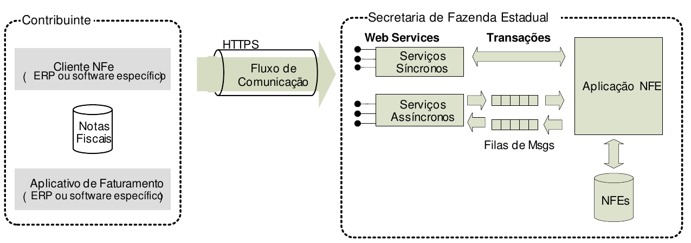

<!-- p.49 -->
# 4.1. Modelo Conceitual

As Secretarias de Fazenda Estaduais disponibilizam os seguintes serviços:

- Recepção de NF-e;
- Recepção de Lote;
- Consulta Processamento de Lote;
- Inutilização de numeração de NF-e;
- Consulta da situação atual da NF-e;
- Consulta do status do serviço;
- Consulta cadastro;
- Registro de eventos.

Para cada serviço oferecido existe um *Web Service* específico. O fluxo de comunicação é sempre iniciado pelo aplicativo do contribuinte através do envio de uma mensagem ao *Web Service* com a solicitação do serviço desejado.

O *Web Service* devolve uma mensagem de resposta confirmando o recebimento da solicitação de serviço ao aplicativo do contribuinte na mesma conexão.

A Figura 4-1 ilustra o fluxo conceitual de comunicação entre o aplicativo do contribuinte e o Sistema da Secretaria de Fazenda Estadual.

*Figura 4-1 – Arquitetura de Comunicação: Visão Conceitual*

Texto da figura: Contribuinte (Cliente NFe (ERP ou software específico); Notas Fiscais; Aplicativo de Faturamento (ERP ou software específico)) – HTTPS, Fluxo de Comunicação – Secretaria de Fazenda Estadual (Web Services: Serviços Síncronos, Serviços Assíncronos; Transações; Filas de Msgs; Aplicação NFE; NFEs).
