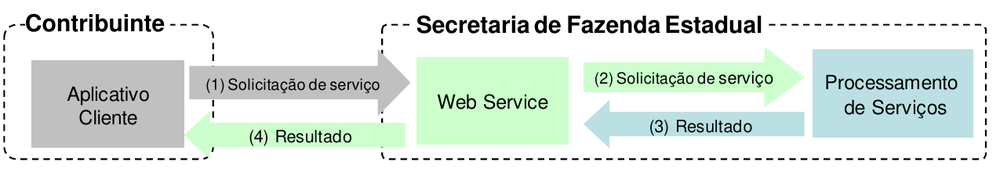
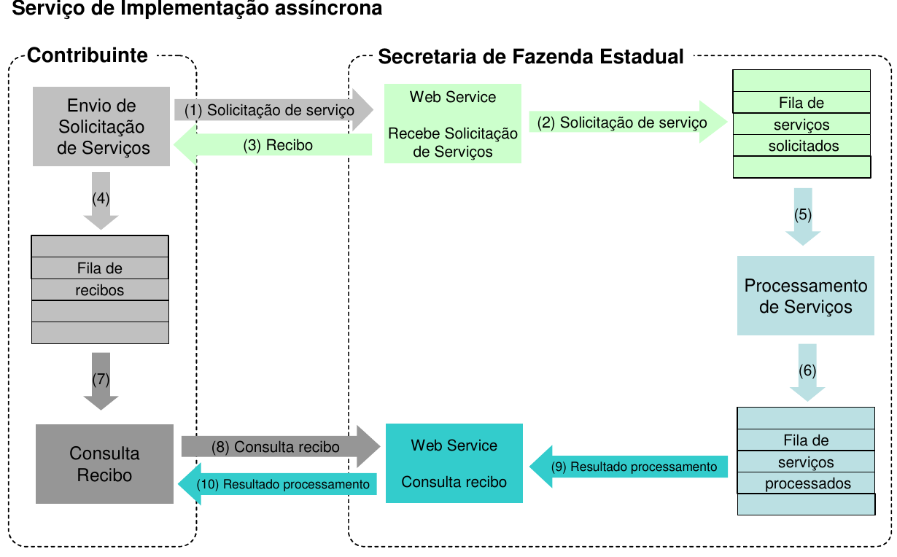
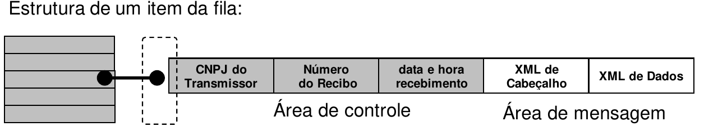

<!-- p.57 -->
# 4.3. Modelo Operacional

A solicitação de serviço poderá ser atendida na mesma conexão ou ser armazenada em filas de processamento nos serviços mais críticos para um melhor aproveitamento dos recursos de comunicação e de processamento das Secretarias de Fazenda Estaduais, ou seja, os serviços podem ser síncronos ou assíncronos em função da forma de processamento da solicitação de serviços:

- **Serviços síncronos** – o processamento da solicitação de serviço é concluído na mesma conexão, com a devolução de uma mensagem com o resultado do processamento do serviço solicitado;
- **Serviços assíncronos** – o processamento da solicitação de serviço não é concluído na mesma conexão, havendo a devolução de uma mensagem de resposta com um recibo que apenas confirma o recebimento da solicitação de serviço. O aplicativo do contribuinte deverá realizar uma nova conexão para consultar o resultado do processamento do serviço solicitado anteriormente.

As solicitações de serviços que exigem processamento intenso serão executadas de forma assíncrona e as demais solicitações de serviços de forma síncrona, conforme descrito na Tabela 4-6.

**Tabela 4-6 – Forma de Implementação dos Serviços Web**

| Serviço | Implementação |
|---|---|
| Autorização de NF-e | Síncrona/Assíncrona |
| Inutilização de Numeração de NF-e | Síncrona |
| Consulta da situação atual da NF-e | Síncrona |
| Consulta do status do serviço | Síncrona |
| Consulta cadastro | Síncrona |
| Registro de eventos | Síncrona |

Os *Web Services* disponibilizam os serviços que serão utilizados pelos aplicativos dos contribuintes. O mecanismo de utilização dos *Web Services* segue as seguintes premissas:

a) É disponibilizado um *Web Service* por serviço, existindo um método para cada tipo de serviço, com exceção do registro de eventos, que poderão ser atendidos por *Web Services* diferentes conforme o tipo de evento;  
b) Para os serviços síncronos, o envio da solicitação e a obtenção do retorno serão realizados na mesma conexão através de um único método;  
<!-- p.58 -->
c) Para os serviços assíncronos, o método de envio retorna uma mensagem de confirmação de recebimento da solicitação de serviço com o recibo e a data e hora local de recebimento da solicitação ou retorna uma mensagem de erro;

&nbsp;&nbsp;&nbsp;&nbsp;1) As Secretarias de Fazenda Estaduais se comprometem a processar os lotes de notas fiscais recebidas em até 3 minutos em no mínimo 95% do total do volume recebido no período de 24 horas. Este indicador de performance será constantemente avaliado e aperfeiçoado;  
&nbsp;&nbsp;&nbsp;&nbsp;2) No recibo de recepção do lote, também será informado o tempo médio de resposta do serviço nos últimos minutos; as empresas poderão verificar a performance do serviço de processamento dos lotes, verificando o tempo médio de resposta do serviço nos últimos 5 minutos;  
&nbsp;&nbsp;&nbsp;&nbsp;3) Cada Portal de Secretaria de Fazenda Estadual disponibilizará o resultado do processamento do lote por um período mínimo de 24 horas (NfeRetAutorizacao). Após o término do processamento, a informação da situação atual de cada nota será disponibilizada para consulta individual (nfeConsulta);

d) As URL dos *Web Services* encontram-se disponíveis no Portal Nacional da NF-e; mediante acesso à URL pode ser obtido o WSDL (*Web Services Description Language*) de cada *Web Service*;  
e) O processo de utilização dos *Web Services* sempre é iniciado pelo contribuinte enviando uma mensagem nos padrões XML e SOAP, através do protocolo TLS com autenticação mútua;  
f) A ocorrência de qualquer erro na validação dos dados recebidos interrompe o processo com a disponibilização de uma mensagem contendo o código e a descrição do erro.

## 4.3.1. Serviços Síncronos

As solicitações de serviços de implementação síncrona são processadas imediatamente e o resultado do processamento é obtido em uma única conexão, conforme o fluxo exposto na Figura 4-2.

*Figura 4-2 – Serviço de Implementação Síncrona*

Texto da figura: Contribuinte (Aplicativo Cliente) – (1) Solicitação de serviço – Secretaria de Fazenda Estadual (Web Service) – (2) Solicitação de serviço – Processamento de Serviços; (3) Resultado; (4) Resultado.

Etapas do processo:

(1) O aplicativo do contribuinte inicia a conexão enviando uma mensagem de solicitação de serviço para o Web Service;  
(2) O Web Service recebe a mensagem de solicitação de serviço e encaminha ao aplicativo da NF-e que irá processar o serviço solicitado;  
(3) O aplicativo da NF-e recebe a mensagem de solicitação de serviço e realiza o processamento, devolvendo uma mensagem de resultado do processamento ao Web Service;  
(4) O Web Service recebe a mensagem de resultado do processamento e o encaminha ao aplicativo do contribuinte;  
(5) O aplicativo do contribuinte recebe a mensagem de resultado do processamento e, caso não exista outra mensagem, encerra a conexão.

## 4.3.2. Serviços Assíncronos

As solicitações de serviços de implementação assíncrona são processadas de forma distribuída por vários processos e o resultado do processamento somente é obtido em uma segunda conexão.

<!-- p.59 -->
A Figura 4-3 apresenta o fluxo simplificado de funcionamento de um serviço de implementação assíncrona.

*Figura 4-3 – Serviço de Implementação Assíncrona*

Texto da figura: Serviço de Implementação assíncrona. Contribuinte (Envio de Solicitação de Serviços; Fila de recibos; Consulta Recibo) – Secretaria de Fazenda Estadual (Web Service Recebe Solicitação de Serviços; Fila de serviços solicitados; Processamento de Serviços; Fila de serviços processados; Web Service Consulta recibo). Setas: (1) Solicitação de serviço; (2) Solicitação de serviço; (3) Recibo; (4); (5); (6); (7); (8) Consulta recibo; (9) Resultado processamento; (10) Resultado processamento.

Etapas do processo:

(1) O aplicativo do contribuinte inicia a conexão enviando uma mensagem de solicitação de serviço para o *Web Service* de recepção de solicitação de serviços;  
(2) O *Web Service* de recepção de solicitação de serviços recebe a mensagem de solicitação de serviço e a coloca na fila de serviços solicitados, acrescentando o CNPJ do transmissor obtido do certificado digital do transmissor;  
(3) O *Web Service* de recepção de solicitação de serviço retorna o recibo da solicitação de serviço e a data e hora de recebimento da mensagem no *Web Service*;  
(4) O aplicativo do contribuinte recebe o recibo e o coloca na fila de recibos de serviços solicitados e ainda não processados e, caso não exista outra mensagem, encerra a conexão;  
(5) Na Secretaria de Fazenda Estadual a solicitação de serviços é retirada da fila de serviços solicitados pelo aplicativo da NF-e;  
(6) O serviço solicitado é processado pelo aplicativo da NF-e e o resultado do processamento é colocado na fila de serviços processados;  
(7) O aplicativo do contribuinte retira um recibo da fila de recibos de serviços solicitados;  
(8) O aplicativo do contribuinte envia uma consulta de recibo, iniciando uma conexão com o *Web Service* para consulta de recibo;  
(9) O *Web Service* para consulta de recibo recebe a mensagem de consulta recibo e localiza o resultado de processamento da solicitação de serviço;  
(10) O *Web Service* para consulta de recibo devolve o resultado de processamento ao aplicativo contribuinte;  
(11) O aplicativo do contribuinte recebe a mensagem de resultado do processamento e, caso não exista outra mensagem, encerra a conexão.

## 4.3.3. Filas e Mensagens

As filas de mensagens de solicitação de serviços são necessárias para a implementação do processamento assíncrono das solicitações de serviços.

<!-- p.60 -->
As mensagens de solicitações de serviços no processamento assíncrono são armazenadas em uma fila de entrada.

Para ilustrar como as filas armazenam as informações, observe o diagrama exposto na Figura 4-4.

*Figura 4-4 – Exemplo de Fila de Armazenamento*

Texto da figura: Estrutura de um item da fila: CNPJ do Transmissor | Número do Recibo | data e hora recebimento (Área de controle) | XML de Cabeçalho | XML de Dados (Área de mensagem).

A estrutura de um item é composta pela área de controle (identificador) e pela área de detalhe. As seguintes informações são adotadas como atributos de controle:

- **CNPJ do transmissor**: CNPJ da empresa que enviou a mensagem que não necessita estar vinculado ao CNPJ do estabelecimento emissor da NF-e. Somente o transmissor da mensagem terá acesso ao resultado do processamento das mensagens de solicitação de serviços;
- **Recibo de entrega**: Número sequencial único atribuído para a mensagem pela Secretaria de Fazenda Estadual. Este atributo identifica a mensagem de solicitação de serviços na fila de mensagem;
- **Data e hora de recebimento da mensagem:** Data e hora local do instante de recebimento da mensagem atribuída pela Secretaria de Fazenda Estadual. Este atributo é importante como parâmetro de desempenho do sistema, eliminação de mensagens, adoção do regime de contingência, etc. O tempo médio de resposta é calculado com base neste atributo.

A área de mensagem contém uma área de cabeçalho e a área de dados em formato XML.

Para processar as mensagens de solicitações de serviços, a aplicação da NF-e irá retirar a mensagem da fila de entrada de acordo com a ordem de chegada, devendo armazenar o resultado do processamento da solicitação de serviço em uma fila de saída.

A fila de saída terá a mesma estrutura da fila de entrada, sendo a única diferença o conteúdo do detalhe da mensagem, que contém o resultado do processamento da solicitação de serviço em formato XML.

O tempo médio de resposta que mede a performance do serviço de processamento dos lotes é calculado com base no tempo decorrido entre o momento de recebimento da mensagem e o momento de armazenamento do resultado do processamento da solicitação de serviço na fila de saída.

Nota: O termo fila é utilizado apenas para designar um repositório de recibos emitidos. A implementação da fila poderá ser feita através de Banco de Dados ou qualquer outra forma, sendo transparente ao contribuinte que realizará a consulta do processamento efetuado (processos assíncronos).

## 4.3.4. Número do Recibo de Lote

O número do Recibo do Lote deve ser gerado pelo Portal da Secretaria de Fazenda Estadual, com a seguinte regra de formação, que também pode ser vista na Tabela 4-7:

- 2 posições com o Código da UF onde foi entregue o lote (codificação do IBGE);
<!-- p.61 -->
- 1 posição com o Tipo de Autorizador (0 ou 1=SEFAZ normal, 2=Contingência SCAN-RFB, 3=SEFAZ VIRTUAL-RS, 4=SEFAZ VIRTUAL-RFB);
- 12 posições numéricas sequenciais.

**Tabela 4-7 – Estrutura do Recibo do Lote**

| Campo | Código da UF | Tipo Autorizador | Sequencial |
|---|---|---|---|
| Quantidade de caracteres | 02 (Tabela 8-1) | 01 | 12 |

## 4.3.5. Número do Protocolo

O número do protocolo (nProt) é gerado pelo Portal da Secretaria da Fazenda Estadual ou da Secretaria da Receita Federal do Brasil para identificar univocamente as transações realizadas de autorização de uso, denegação de uso, cancelamento de NF-e e inutilização de numeração de NF-e. A regra de formação do número do protocolo pode ser vista na Tabela 4-8.

**Tabela 4-8 – Estrutura do Número do Protocolo**

| Tipo Autorizador | código da UF | Ano | sequencial de 10 posições |
|---|---|---|---|
| 9 | 9 9 | 9 9 | 9 9 9 9 9 9 9 9 9 9 |

- 1 posição para indicar o Tipo Autorizado:
    - 1=Secretaria de Fazenda Estadual;
    - 2=Receita Federal;
    - 3=SEFAZ Virtual RS ;
    - 4=SEFAZ Virtual RFB);
- 2 posições para o código da UF do IBGE (Tabela 8-1);
- 2 posições para ano;
- 10 posições para o sequencial no ano.

A geração do número de protocolo é única, e é utilizada por todos os *Web Services* que precisam atribuir um número de protocolo para o resultado do processamento.

## 4.3.6. Tempo Médio de Resposta

O tempo médio de resposta é um indicador que mede a performance do serviço de processamento dos lotes dos últimos 5 minutos.

O tempo médio de processamento de uma NF-e é obtido pela divisão do tempo decorrido entre o recebimento da mensagem e o momento de armazenamento da mensagem de processamento do lote pela quantidade de NF-e existentes no lote.

O tempo médio de resposta é a média dos tempos médios de processamento de uma NF-e dos últimos 5 minutos.

Caso o tempo médio de resposta fique abaixo de 1 (um) segundo, o tempo será informado como 1 segundo. Arredondar as frações de segundos para cima.

## 4.3.7. Ambientes de Homologação e de Produção

As Secretarias de Fazenda Estaduais mantêm dois ambientes para recepção de NF-e. O ambiente de homologação é específico para a realização de testes e integração das aplicações do contribuinte durante a fase de implementação e adequação do sistema de emissão de NF-e do contribuinte, e nos casos em que este sistema sofre alterações após entrar em regime de operação normal.

<!-- p.62 -->
A autorização de uso de NF-e no ambiente de produção, nos termos das cláusulas quarta e quinta do Ajuste SINIEF 07/05, de 30 de setembro de 2005, tem o efeito de permitir que o arquivo da NF-e seja utilizado como documento fiscal.

A utilização pelo contribuinte de qualquer um dos dois ambientes fica condicionada a prévia autorização da Secretaria de Fazenda, Finanças ou Tributação de sua UF, através do respectivo processo de credenciamento.

O acesso a cada um dos ambientes será concedido mediante prévia requisição do contribuinte ou de ofício, caso seja de interesse da Administração Tributária.

A relação dos *Web Services* em operação está disponível no Portal Nacional:

**WS de Homologação:**  
http://hom.nfe.fazenda.gov.br/portal/webServices.aspx?tipoConteudo=Wak0FwB7dKs=

**WS de Produção:**  
https://www.nfe.fazenda.gov.br/portal/webServices.aspx?tipoConteudo=Wak0FwB7dKs=

A documentação do WSDL pode ser obtida na internet acessando o endereço do *Web Service* desejado.

- Exemplificando, para obter o WSDL de cada um dos *Web Services* acione o navegador Web (Internet Explorer, por exemplo) e digite o endereço desejado seguido do literal ‘?WSDL’.

### Sobre as Condições de Teste para as Empresas

O ambiente de homologação deve ser usado para que as empresas possam efetuar os testes necessários nas suas aplicações, antes de passar a consumir os serviços no ambiente de produção.

Em relação à massa de dados para que os testes possam ser efetuados, lembramos que podem ser geradas NF-e no ambiente de homologação à critério da empresa (NF-e sem valor fiscal). As NF-e no ambiente de homologação podem ser geradas por aplicativo da própria empresa, ou usando o Programa Emissor Público, com a mesma finalidade.

Os testes no ambiente de produção, quando liberado este ambiente, por falha da aplicação da empresa podem disparar os mecanismos de controle de uso indevido[^1], impedindo, por exemplo, uma nova Consulta a Relação de Documentos Destinados para documentos que já foram consultados anteriormente.

[^1]: Item 4.3.8.

## 4.3.8. Uso Indevido

(NT 2018.002)

A análise do comportamento atual das aplicações das empresas (“aplicação cliente”) permite identificar algumas situações de uso indevido nos ambientes autorizadores. Atualmente, várias UF autorizadoras de documentos fiscais eletrônicos estão tendo seus serviços utilizados de forma indevida por alguns contribuintes. Esse uso indevido pode comprometer a estabilidade dos Web <!-- p.63 -->Services e resultar na saturação dos recursos, deixando o ambiente autorizador inoperante, podendo também ser interpretadas como ataques aos recursos de processamento, rede e armazenamento.

Portanto, para preservar os sistemas autorizadores, observado um comportamento indevido da aplicação de alguma empresa no consumo dos diversos *Web Services*, a Sefaz autorizadora, a seu critério, poderá implantar as regras de validação de Consumo Indevido.

O contribuinte que estiver utilizando indevidamente os sistemas poderá sofrer as penalidades definidas na legislação de cada UF.

Como exemplo maior do mau uso do ambiente, ressalta-se a falta de controle de algumas aplicações que entram em “loop”, consumindo recursos de forma indevida, sobrecarregando principalmente o canal de comunicação com a Internet, além da capacidade de processamento dos serviços expostos pelas Sefaz.

Existem controles para identificar as situações de uso indevido de sucessivas tentativas de busca de registros já disponibilizados anteriormente.

As novas tentativas serão rejeitadas com o erro “656–Rejeição: Consumo Indevido”.

O erro e problema mais comum encontrado pelas Sefaz é o envio repetido (em loop) de requisições para os *Web Service*s dos sistemas autorizadores de documentos fiscais eletrônicos. Normalmente isso ocorre devido algum erro na aplicação do emissor de documentos fiscais eletrônicos ou má utilização do usuário.

Após o envio de uma requisição para o sistema autorizador, essa requisição pode ser autorizada ou rejeitada. Caso ela seja rejeitada, o usuário do sistema deverá verificar o motivo da rejeição e corrigi-la, se assim desejar, ou caso a rejeição seja indevida (o sistema autorizador rejeitou de forma equivocada) deverá entrar em contato com a SEFAZ autorizadora.

A Tabela 4-9 apresenta alguns exemplos de Consumo Indevido dos *Web Service*s existentes:

**Tabela 4-9 – Exemplos de Consumo Indevido de Web Services**

| Web Services | Aplicação com erro/problema |
|---|---|
| Envio de Lote de NF-e | • Aplicação da empresa em “looping” enviando o mesmo Lote de NF-e rejeitado por erro de Schema, ou com NF e rejeitada por um erro específico • Usuário do sistema fica enviando manualmente a mesma NF-e |
| Consulta Resultado do Lote | • Aplicação da empresa efetua em “looping” consultando os números de Recibo de Lote em sequência, mesmo para Número de Recibo que não foram gerados para sua empresa • Usuário do sistema fica enviando manualmente a mesma consulta |
| Registro de Evento da NF-e | • Aplicação da empresa em “looping” enviando o mesmo Pedido de Cancelamento ou Evento, que sempre é rejeitado • Usuário do sistema fica enviando manualmente o mesmo cancelamento ou evento |
| Inutilização de Numeração | • Aplicação da empresa em “looping” enviando o mesmo pedido de inutilização, que sempre é rejeitado • Usuário do sistema fica enviando manualmente o mesmo pedido de Inutilização |
| Consulta Situação da NF-e (Consulta Protocolo) | • Algumas empresas utilizam esta consulta para verificar a disponibilidade dos serviços da SEFAZ Autorizada, consultando a mesma Chave de Acesso, em “looping” • Algumas empresas mantêm em “looping” uma consulta as Chaves de Acesso de NF-e destinadas para sua empresa &nbsp;&nbsp;&nbsp;&nbsp;◦ Em alguns casos, fica sendo consultada uma Chave de Acesso inexistente durante meses • Usuário do sistema fica enviando manualmente o mesmo pedido de consulta da NF-e |
| Consulta Status Serviço | • Aplicação em “loop” consumindo o *Web Service* em uma frequência maior do que a prevista |
