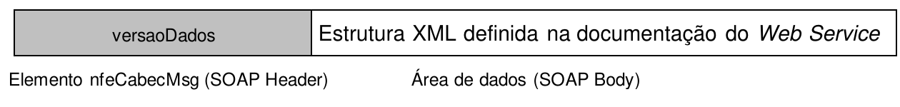

<!-- p.64 -->
# 4.4. Padrão de Mensagens dos *Web Services*

As chamadas dos *Web Services* disponibilizados pelos *Web Service* da NF-e e os respectivos resultados do processamento são realizadas através das mensagens com o padrão mostrado na Figura 4-5, onde:

- **versaoDados:** versão do leiaute da estrutura XML informado na área de dados;
- **Área de Dados** estrutura XML variável definida na documentação do *Web Service* acessado.



*Figura 4-5 – Padrão de Mensagem de Chamada/Retorno de Web Service*

Texto da figura: caixa cinza "versaoDados" (legenda: "Elemento nfeCabecMsg (SOAP Header)") seguida da caixa "Estrutura XML definida na documentação do Web Service" (legenda: "Área de dados (SOAP Body)").

## 4.4.1. Informação de Controle e Área de Dados das Mensagens

A criação das variáveis de “Código da UF” e “Versão dos Dados” no SOAP Header (ou “Área de Cabeçalho”) foi uma decisão inicial do Projeto NF-e, quando ainda não se tinha muitas informações sobre a capacidade de processamentos dos *Web Services* pelas SEFAZ. Na época, esta decisão foi tomada para conseguir rejeitar previamente as mensagens enviadas para um ambiente de autorização diferente do previsto, sem precisar “abrir” os dados da mensagem.

As variáveis do SOAP Header (“cabeçalho”) constam também na mensagem enviado pela Empresa e observado que, a cada troca de versão do leiaute XML, este controle tem atrapalhado, já que as empresas montam corretamente a mensagem, mas algumas vezes esquecem-se de alterar os dados do cabeçalho.

Na versão 4.0 do leiaute da NF-e foi eliminado o uso de variáveis no SOAP Header (eliminada a “Área de Cabeçalho”) na requisição enviada para todos os *Web Services* previstos no Sistema NFE.

Portanto, foram eliminadas também as regras de validação relacionadas com o controle da chamada ao *Web Service* que usam estas variáveis do SOAP Header. Exemplo do SOAP Header que não será mais necessário:

```xml
<soap12:Header>
  <nfeCabecMsg xmlns="http://www.portalfiscal.inf.br/nfe/wsdl/nfeAutorizacao">
    <versaoDados>string</versaoDados>
    <cUF>string</cUF>
  </nfeCabecMsg>
</soap12:Header>
```

A informação armazenada na área de dados é um documento XML que deve atender o leiaute definido na documentação do *Web Service* acessado:

```xml
<soap12:Body>
<nfeAutorizacaoResponse xmlns="http://www.portalfiscal.inf.br/nfe/wsdl/nfeAutorizacao">
  <nfeRetornoMsg>xml</nfeRetornoMsg>
</nfeAutorizacaoResponse>
```

<!-- p.65 -->
## 4.4.2. Validação da Estrutura XML das Mensagens dos *Web Services*

As informações são enviadas ou recebidas dos *Web Services* através de mensagens no padrão XML definido na documentação de cada *Web Service*.

As alterações de leiaute e da estrutura de dados XML realizadas nas mensagens são controladas através da atribuição de um número de versão para a mensagem.

Um Schema XML é uma linguagem que define o conteúdo do documento XML, descrevendo os seus elementos e a sua organização, além de estabelecer regras de preenchimento de conteúdo e de obrigatoriedade de cada elemento ou grupo de informação.

A validação da estrutura XML da mensagem é realizada por um analisador sintático (*parser*) que verifica se a mensagem atende as definições e regras de seu Schema XML.

Qualquer divergência da estrutura XML da mensagem em relação ao seu Schema XML provoca um erro de validação do Schema XML.

A primeira condição para que a mensagem seja validada com sucesso é que ela seja submetida com êxito ao Schema XML correspondente.

Assim, os aplicativos do contribuinte devem estar preparados para gerar as mensagens no leiaute em vigor, devendo ainda informar a versão do leiaute da estrutura XML da mensagem no campo *versaoDados* da área de cabeçalho da mensagem.

## 4.4.3. Schemas XML das Mensagens dos *Web Services*

Toda mudança de leiaute das mensagens dos *Web Services* implica na atualização do seu respectivo Schema XML.

A identificação da versão dos Schemas será realizada com o acréscimo do número da versão no nome do arquivo precedida do literal ‘_v’, conforme os exemplos a seguir:

- enviNFe_v1.03.xsd
  - Schema XML de Envio de NF-e, versão 1.03
- leiauteNFe_v10.15.xsd
  - Schema XML dos tipos básicos da NF-e, versão 10.15

A maioria dos Schemas XML da NF-e utilizam as definições de tipos básicos ou tipos complexos que estão definidos em outros Schemas XML (ex.: tiposBasico_v1.00.xsd, etc.), nestes casos, a modificação de versão do Schema básico será repercutida no Schema principal.

Por exemplo, o tipo numérico de 15 posições com 2 decimais é definido no Schema tiposBasico_v1.00.xsd, caso ocorra alguma modificação na definição deste tipo, todos os Schemas que utilizam este tipo básico devem ter a sua versão atualizada e as declarações “import” ou “include” devem ser atualizadas com o nome do Schema básico atualizado.

Exemplo de Schema XML:

```xml
<?xml version="1.0" encoding="UTF-8"?>
<xs:schema xmlns:ds="http://www.w3.org/2000/09/xmldsig#" xmlns:xs="http://www.w3.org/2001/XMLSchema"
           xmlns="http://www.portalfiscal.inf.br/nfe"
           targetNamespace="http://www.portalfiscal.inf.br/nfe" elementFormDefault="qualified"
           attributeFormDefault="unqualified">
    <xs:import namespace="http://www.w3.org/2000/09/xmldsig#" schemaLocation="xmldsig-core-
```

<!-- p.66 -->
```xml
         schema_v1.01.xsd"/>
    <xs:include schemaLocation="tiposBasico_v1.00.xsd"/>
    <xs:element name="NFe">
          <xs:annotation>
                <xs:documentation>Nota Fiscal Eletrônica</xs:documentation>
          </xs:annotation>
```

As modificações de leiaute das mensagens dos *Web Services* podem ser causadas por necessidades técnicas ou em razão da modificação de alguma legislação. As modificações decorrentes de alteração da legislação deverão ser implementadas nos prazos previstos no ato normativo que introduziu a alteração. As modificações de ordem técnica serão divulgadas pela Coordenação Técnica do Sistema e poderão ocorrer sempre que se fizerem necessárias.
