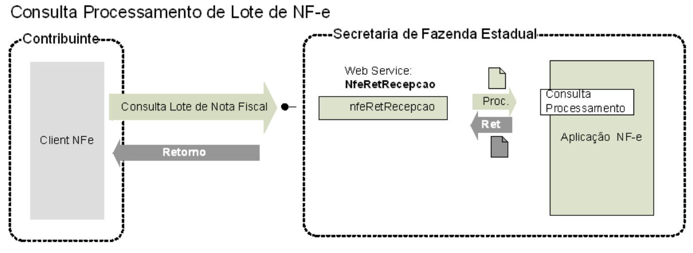

<!-- p.75 -->
# 5.2. Web Service – NfeRetAutorizacao

**Função**: serviço destinado a retornar o resultado do processamento do lote de NF-e.  
A mensagem de retorno poderá ser utilizada pela SEFAZ para enviar mensagens de interesse da SEFAZ para o emissor.  
**Processo**: assíncrono.  
**Método**: **nfeRetAutorizacao**

*Figura 5-2 – Fluxo do Web Service nfeRetAutorizacao (Consulta Processamento de Lote de NF-e)*

Texto da figura: Consulta Processamento de Lote de NF-e; Contribuinte (Client NFe); Secretaria de Fazenda Estadual (Web Service: NfeRetRecepcao, nfeRetRecepcao, Proc., Ret, Consulta Processamento, Aplicação NF-e); setas: "Consulta Lote de Nota Fiscal" e "Retorno".

## 5.2.1. Leiaute Mensagem de Entrada

**Entrada**: Estrutura XML contendo o número do recibo que identifica a mensagem de envio de lotes de NF-e.

**Schema XML: consReciNFe_v4.00.xsd**

**Tabela 5-5 – Leiaute Mensagem de Entrada do Web Service nfeRetAutorizacao**

| # | Campo | Ele | Pai | Tipo | Ocor. | Tam. | Descrição/Observação |
|---|---|---|---|---|---|---|---|
| **BP01** | **consReciNFe** | **Raiz** | **-** |  | **-** | **-** | **TAG raiz** |
| BP02 | versao | A | BP01 | N | 1-1 | 1-2v2 | Versão do leiaute |
| BP03 | tpAmb | E | BP01 | N | 1-1 | 1 | Identificação do Ambiente: 1=Produção/2=Homologação |
| BP04 | nRec | E | BP01 | N | 1-1 | 15 | Número do Recibo gerado pelo Portal da Secretaria de Fazenda Estadual, conforme descrição do item **4.3.4** |

<!-- p.76 -->

## 5.2.2. Leiaute Mensagem de Retorno

**Retorno:** Estrutura XML com o resultado do processamento da mensagem de envio de lote de NF-e.

**Schema XML: retConsReciNFe_v4.00.xsd**

**Tabela 5-6 – Leiaute Mensagem de Retorno do Web Service nfeRetAutorizacao**

| # | Campo | Ele | Pai | Tipo | Ocor. | Tam. | Descrição/Observação |
|---|---|---|---|---|---|---|---|
| **BR01** | **retConsReciNFe** | **Raiz** | **-** | **-** | **-** | **-** | **TAG raiz da Resposta** |
| BR02 | versao | A | BR01 | N | 1-1 | 1-2v2 | Versão do leiaute |
| BR03 | tpAmb | E | BR01 | N | 1-1 | 1 | Identificação do Ambiente: 1=Produção/2=Homologação |
| BR04 | verAplic | E | BR01 | C | 1-1 | 1-20 | Versão do Aplicativo que recebeu a Consulta. A versão deve ser iniciada com a sigla da UF nos casos de WS próprio ou a sigla SVAN ou SVRS nos demais casos. |
| BR04a | nRec | E | BR01 | N | 1-1 | 15 | Número do Recibo consultado. Será preenchido com zeros se for impossível de obter o valor da mensagem de entrada (Ex. mensagem inválida). |
| BR05 | cStat | E | BR01 | N | 1-1 | 3 | Código do status da resposta para o Lote (conforme item 4.4.2 do documento *MOC – Anexo I – Leiaute NF-e/NFC-e*) Se cStatus = 215, 516, ou 517 significa que a mensagem de consulta é inválida. Se cStatus = 225, 565, ou 568, significa que o lote de NF-e consultado é inválido |
| BR06 | xMotivo | E | BR01 | C | 1-1 | 1-255 | Descrição literal do status da resposta. |
| BR06a | cUF | E | BR01 | N | 1-1 | 2 | Código da UF que atendeu a solicitação. |
| BR06a1 | dhRecbto | E | BR01 | D | 1-1 | - | Preenchido com a data e hora do processamento (informado também no caso de rejeição). Formato: “AAAA-MM-DDThh:mm:ssTZD” (UTC – Universal Coordinated Time). |
| BR06b | cMsg | E | BR01 | N | 0-1 | 1-4 | Código da Mensagem (v2.0) Campo de uso da SEFAZ para enviar mensagem de interesse da SEFAZ para o emissor. (NT 2011.004) |
| BR06c | xMsg | E | BR01 | C | 0-1 | 1-200 | Mensagem da SEFAZ para o emissor. (v2.0) |
| **BR07** | **protNFe\*** | **xml** | **BR01** | **-** | **0-50** | **-** | **Conjunto de resultado do processamento de cada NF-e (vide leiaute abaixo). Estas informações são retornadas apenas para o código do status do lote = 104 (Lote processado)** |

\* Para cada Protocolo de uma NF-e processada teremos o seguinte leiaute: (Atualizado NT 2018.005)

| # | Campo | Ele | Pai | Tipo | Ocor. | Tam. | Descrição/Observação |
|---|---|---|---|---|---|---|---|
| **PR01** | **protNFe** | **Raiz** | **-** | **-** | **-** | **-** | **TAG raiz do Protocolo de recebimento da NFe** |
| PR02 | versao | A | PR01 | N | 1-1 | 2v2 | Versão do leiaute das informações de Protocolo. |
| **PR03** | **infProt** | **G** | **PR01** | **-** | **1-1** | **-** | **Informações do Protocolo de resposta. TAG a ser assinada** |
| PR04 | Id | ID | PR03 | C | 0-1 | - | Identificador da TAG a ser assinada, somente precisa ser informado se a UF assinar a resposta. Em caso de assinatura da resposta pela SEFAZ preencher o campo com o Número do Protocolo, precedido com o literal “ID” |
| PR05 | tpAmb | E | PR03 | N | 1-1 | 1 | Identificação do Ambiente: 1=Produção/2=Homologação |
| PR06 | verAplic | E | PR03 | C | 1-1 | 1-20 | Versão do Aplicativo que processou o Lote. A versão deve ser iniciada com a sigla da UF nos casos de WS próprio ou a sigla SVAN ou SVRS nos demais casos. |
| PR07 | chNFe | E | PR03 | N | 1-1 | 44 | Chave de Acesso da NF-e |
| PR08 | dhRecbto | E | PR03 | D | 1-1 | - | Preenchido com a data e hora do processamento (informado também no caso de rejeição). Formato: “AAAA-MM-DDThh:mm:ssTZD” (UTC – Universal Coordinated Time). |
| PR09 | nProt | E | PR03 | N | 0-1 | 15 | Número do Protocolo da NF-e, conforme item **4.3.5** |
| PR10 | digVal | E | PR03 | C | 0-1 | 28 | Digest Value da NF-e processada Utilizado para conferir a integridade da NFe original. |
| PR11 | cStat | E | PR03 | N | 1-1 | 3 | Código do status da resposta (conforme item 4.4.1 do documento *MOC – Anexo I – Leiaute NF-e/NFC-e*) |
| PR12 | xMotivo | E | PR03 | C | 1-1 | 1-255 | Descrição literal do status da resposta para a NF-e. |
| **PR13** | **Sequência XML** | **G** | **PR03** |  | **0-1** |  | **Grupo de informações para envio de mensagens do interesse da SEFAZ (Criado na NT 2018.005)** |
| PR14 | cMsg | E | PR13 | N | 0-1 | 1-4 | Código da Mensagem. (Criado na NT 2018.005) |
| PR15 | xMsg | E | PR13 | C | 1-1 | 1-200 | Mensagem da SEFAZ para o emissor. (Criado na NT 2018.005) |
| **PR90** | **Signature** | **G** | **PR01** | **xml** | **0-1** | **-** | **Assinatura XML do grupo identificado pelo atributo “Id” A decisão de assinar a mensagem fica a critério da UF interessada.** |

<!-- p.77 -->

## 5.2.3. Descrição do Processo de *Web Service*

Este método oferece a consulta do resultado do processamento de um lote de NF-e.

O aplicativo do Contribuinte deve ser construído de forma a aguardar um tempo mínimo de 15 segundos entre o envio do Lote de NF-e para processamento e a consulta do resultado deste processamento, evitando a obtenção desnecessária do status de erro 105 –  "Lote em Processamento".

## 5.2.4. Regras de Validação

Serão aplicadas as regras de validação genéricas conforme os grupos citados na Tabela 5-7, detalhados na Seção 4.1 do documento *MOC – Anexo I – Leiaute e Regras de Validação da NF-e e da NFC-e*.

**Tabela 5-7 – Regras de Validação Genéricas do Web Service nfeRetAutorizacao**

| Grupo | Descrição |
|---|---|
| A | Validação do Certificado de Transmissão (protocolo TLS) |
| B | Validação Inicial da Mensagem no *Web Service* |
| D | Validação da Área de Dados |

As regras de validação específicas deste WS podem ser vistas na Tabela 5-8.

**Tabela 5-8 – Regras de Validação Específicas do Web Service nfeRetAutorizacao**

| # | Regra de Validação | Aplic. | Msg | Efeito | Descrição Erro |
|---|---|---|---|---|---|
| E01 | Tipo do ambiente da NF-e difere do ambiente do *Web Service* | Obrig | 252 | Rej. | Rejeição: Ambiente informado diverge do Ambiente de recebimento |
| E02 | UF do Recibo difere da UF do *Web Service* | Obrig | 248 | Rej. | Rejeição: UF do Recibo diverge da UF autorizadora |
| E02a | Tipo autorizador do recibo diverge do Órgão Autorizador. | Obrig | 553 | Rej. | Rejeição: Tipo autorizador do recibo diverge do Órgão Autorizador. |
| E03 | Verifica se o Lote não está na fila de saída, nem na fila de entrada | Obrig | 106 | Rej. | Rejeição: Lote não localizado |
| E04 | Verifica se o Lote não está na fila de resposta, mas está na fila de entrada | Obrig | 105 | Rej. | Rejeição: Serviço em Operação |
| E05 | CNPJ/CPF do transmissor do lote difere do CNPJ/CPF do transmissor da consulta (NT 2018.001) | Obrig | 223 | Rej. | Rejeição: CNPJ/CPF do transmissor do lote difere do CNPJ/CPF do transmissor da consulta |

<!-- p.78 -->

## 5.2.5. Final do Processamento

A mensagem de retorno poderá ser:

- **Lote processado** – *cStat*=104, com os resultados individuais de processamento das NF-e;
- **Lote em processamento** – *cStat*=105, o aplicativo do contribuinte deverá fazer uma nova consulta;
- **Lote não localizado** – *cStat*=106, o aplicativo do contribuinte deverá providenciar o reenvio da mensagem;
- **Recibo ou CNPJ do requisitante com problemas** –  *cStat*= 248 ou 223, o aplicativo do contribuinte deverá sanar o problema;

## 5.2.6. Canal de Comunicação com Contribuinte

A SEFAZ poderá utilizar este serviço como canal de comunicação com o emissor da NF-e. A aplicação deverá verificar se existe alguma mensagem para o emissor, se existir a mensagem será disponibilizada para o contribuinte.
