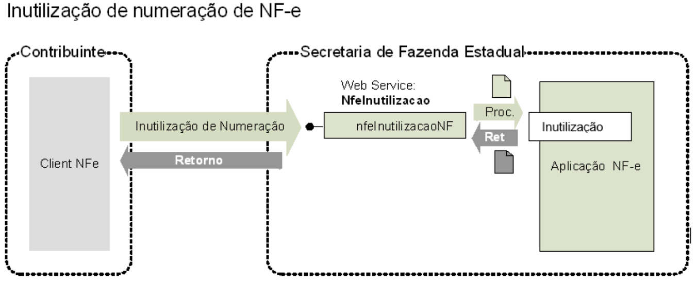

<!-- p.78 -->
# 5.3. Web Service – NfeInutilizacao

**Função**: serviço destinado ao atendimento de solicitações de inutilização de numeração.  
**Processo**: síncrono.  
**Método: nfeInutilizacaoNF**

*Figura 5-3 – Fluxo do Web Service nfeInutilizacaoNF*

Texto da figura: Inutilização de numeração de NF-e; Contribuinte (Client NFe); Secretaria de Fazenda Estadual (Web Service: NfeInutilizacao, nfeInutilizacaoNF, Proc., Ret, Inutilização, Aplicação NF-e); setas: "Inutilização de Numeração" e "Retorno".

## 5.3.1. Leiaute Mensagem de Entrada

**Entrada**: Estrutura XML contendo a mensagem de solicitação de inutilização.

**Schema XML: inutNFe_v4.00.xsd**

**Tabela 5-9 – Leiaute Mensagem de Entrada do Web Service NFeInutilizacao**

| # | Campo | Ele | Pai | Tipo | Ocor. | Tam. | Descrição/Observação |
|---|---|---|---|---|---|---|---|
| **DP01** | **inutNFe** | **Raiz** | **-** | **-** | **-** | **-** | **TAG raiz** |
| DP02 | versao | A | DP01 | N | 1-1 | 1-2v2 | Versão do leiaute |
| **DP03** | **infInut** | **G** | **DP01** | **-** | **1-1** | **-** | **Dados do Pedido TAG a ser assinada** |
| DP04 | Id | ID | DP03 | C | 1-1 | 43 | Identificador da TAG a ser assinada formada com Código da UF + Ano (2 posições) + CNPJ + modelo + série + número inicial e número final precedida do literal “ID” |
| DP05 | tpAmb | E | DP03 | N | 1-1 | 1 | Identificação do Ambiente: 1=Produção/2=Homologação |
| DP06 | xServ | E | DP03 | C | 1-1 | 10 | Serviço solicitado: ‘INUTILIZAR’ |
| DP07 | cUF | E | DP03 | N | 1-1 | 2 | Código da UF do solicitante |
| DP08 | ano | E | DP03 | N | 1-1 | 2 | Ano de inutilização da numeração |
| DP09 | CNPJ | E | DP03 | C | 1-1 | 14 | CNPJ do emitente |
| DP10 | mod | E | DP03 | N | 1-1 | 2 | Modelo do documento (55 ou 65) |
| DP11 | serie | E | DP03 | N | 1-1 | 1-3 | Série da NF-e |
| DP12 | nNFIni | E | DP03 | N | 1-1 | 1-9 | Número da NF-e inicial a ser inutilizada |
| DP13 | nNFFin | E | DP03 | N | 1-1 | 1-9 | Número da NF-e final a ser inutilizada |
| DP14 | xJust | E | DP03 | C | 1-1 | 15-255 | Informar a justificativa do pedido de inutilização |
| **DP15** | **Signature** | **G** | **DP01** | **xml** | **1-1** | **-** | **Assinatura XML do grupo identificado pelo atributo “Id”** |

<!-- p.79 -->

## 5.3.2. Leiaute Mensagem de Retorno

**Retorno:** Estrutura XML contendo a mensagem do resultado da solicitação de inutilização:

**Schema XML: retInutNFe_v4.00.xsd**

**Tabela 5-10 – Leiaute Mensagem de Retorno do Web Service NFeInutilizacao**

| # | Campo | Ele | Pai | Tipo | Ocor. | Tam. | Descrição/Observação |
|---|---|---|---|---|---|---|---|
| **DR01** | **retInutNFe** | **Raiz** | **-** | **-** | **-** | **-** | **TAG raiz da Resposta** |
| DR02 | versao | A | DR01 | N | 1-1 | 1-2v2 | Versão do leiaute |
| **DR03** | **infInut** | **G** | **DR01** | **-** | **1-1** | **-** | **Dados da resposta – TAG a ser assinada** |
| DR04 | Id | ID | DR03 | C | 0-1 | 17 | Identificador da TAG a ser assinada, somente precisa ser informado se a UF assinar a resposta. Em caso de assinatura da resposta pela SEFAZ preencher o campo com o Número do Protocolo, precedido com o literal “ID”. |
| DR05 | tpAmb | E | DR03 | N | 1-1 | 1 | Identificação do Ambiente: 1=Produção/2=Homologação |
| DR06 | verAplic | E | DR03 | C | 1-1 | 1-20 | Versão do Aplicativo que processou o pedido de inutilização. A versão deve ser iniciada com a sigla da UF nos casos de WS próprio ou a sigla SVAN ou SVRS nos demais casos. |
| DR07 | cStat | E | DR03 | N | 1-1 | 3 | Código do status da resposta (conforme item 4.4.1 do documento *MOC – Anexo I – Leiaute NF-e/NFC-e*) |
| DR08 | xMotivo | E | DR03 | C | 1-1 | 1-255 | Descrição literal do status da resposta. |
| DR09 | cUF | E | DR03 | N | 1-1 | 2 | Código da UF que atendeu a solicitação |
| **Os campos a seguir são obrigatórios no caso de homologação da inutilização cStat=102. Os campos de dhRecbto e nProt não serão preenchidos em caso de erro** | | | | | | | |
| DR10 | ano | E | DR03 | N | 0-1 | 2 | Ano de inutilização da numeração |
| DR11 | CNPJ | E | DR03 | C | 0-1 | 14 | CNPJ do emitente |
| DR12 | mod | E | DR03 | N | 0-1 | 2 | Modelo da NF-e |
| DR13 | serie | E | DR03 | N | 0-1 | 1-3 | Série da NF-e |
| DR14 | nNFIni | E | DR03 | N | 0-1 | 1-9 | Número da NF-e inicial a ser inutilizada |
| DR15 | nNFFin | E | DR03 | N | 0-1 | 1-9 | Número da NF-e final a ser inutilizada |
| DR16 | dhRecbto | E | DR03 | D | 1-1 | - | Preenchido com a data e hora do processamento (informado também no caso de rejeição). Formato: “AAAA-MM-DDThh:mm:ssTZD” (UTC – Universal Coordinated Time). |
| DR17 | nProt | E | DR03 | N | 0-1 | 15 | Número do Protocolo de Inutilização, conforme item **4.3.5** |
| **DR18** | **Signature** | **G** | **DR01** | **xml** | **0-1** | **-** | **Assinatura XML do grupo identificado pelo atributo “Id” A decisão de assinar a mensagem fica a critério da UF interessada.** |

<!-- p.80 -->
Nota:  A resposta da SEFAZ pode ser assinada e neste caso deve ser preenchido o atributo "Id' (PR04). Este atributo é opcional e não deve ser informado pela SEFAZ caso a mensagem de resposta não seja assinada.

## 5.3.3. Descrição do Processo de *Web Service*

Este método será responsável por receber as solicitações referentes à inutilização de faixas de numeração de notas fiscais eletrônicas. Ao receber a solicitação, a aplicação NFE realiza o processamento da solicitação e devolve o resultado do processamento para o aplicativo do transmissor.

A mensagem de pedido de inutilização de numeração de NF-e é um documento eletrônico e deve ser assinado digitalmente pelo emitente da NF-e.

## 5.3.4. Regras de Validação

Serão aplicadas as regras de validação genéricas conforme os grupos citados na Tabela 5-11, detalhados no documento *MOC – Anexo I – Leiaute e Regras de Validação da NF-e e da NFC-e*.

**Tabela 5-11 – Regras de Validação Genéricas do Web Service NFeInutilizacao**

| Grupo | Descrição |
|---|---|
| A | Validação do Certificado de Transmissão (protocolo TLS) |
| B | Validação Inicial da Mensagem no *Web Service* |
| D | Validação da Área de Dados |
| E | Validação do Certificado Digital de Assinatura |
| F | Validação da Assinatura Digital |

As regras de validação específicas deste WS podem ser vistas na Tabela 5-12.

**Tabela 5-12 – Regras de Validação Específicas do Web Service NFeInutilizacao**

| # | Regra de Validação | Aplic. | Msg | Efeito | Descrição Erro |
|---|---|---|---|---|---|
| I01 | Tipo do ambiente da NF-e difere do ambiente do *Web Service* | Obrig. | 252 | Rej. | Rejeição: Ambiente informado diverge do Ambiente de recebimento |
| I02 | UF do Pedido de inutilização difere da UF do *Web Service* | Obrig. | 250 | Rej | Rejeição: UF diverge da UF autorizadora |
| I02a | Série do Pedido de Inutilização identifica emitente com CPF: • Série na faixa de 910-969  (NT 2018.001) | Obrig. | 266 | Rej | Rejeição: Série utilizada não permitida no *Web Service* |
| I02b | Ano da Inutilização não pode ser superior ao Ano atual | Obrig. | 453 | Rej. | Rejeição: Ano de inutilização não pode ser superior ao Ano atual |
| I02c | Ano da inutilização não pode ser inferior a 2006 | Obrig. | 454 | Rej. | Rejeição: Ano de inutilização não pode ser inferior a 2006 |
| I03 | Número da Faixa Inicial maior do que o número Final | Obrig. | 224 | Rej | Rejeição: A faixa inicial é maior que a faixa final |
| I04 | Quantidade máxima de numeração a inutilizar ultrapassa o limite (10.000 números) | Obrig. | 201 | Rej | Rejeição: Número máximo de numeração a inutilizar ultrapassou o limite |
| I04.a | Campo Id inválido: conteúdo informado difere da concatenação dos campos correspondentes | Obrig. | 502 | Rej. | Rejeição: Erro na Chave de Acesso –  Campo Id não corresponde à concatenação dos campos correspondentes |
| I05 | Acesso Cadastro Contribuinte: • Verificar Emitente não autorizado a emitir NF-e | Obrig. | 203 | Rej | Rejeição: Emissor não habilitado para emissão de NF-e |
| I06 | • Verificar Situação Fiscal irregular do Emitente | Obrig. | 240 | Rej | Rejeição: Cancelamento/Inutilização – Irregularidade Fiscal do Emitente |
| I07 | Acesso BD NFE-Inutilização  (Chave: CNPJ Emit, Modelo, Série, nNFIni, nNFFin): • Verificar se já existe um Pedido de inutilização igual (NT 2011.004) | Obrig. | 563 | Rej | Rejeição: Já existe pedido de Inutilização com a mesma faixa de inutilização |
| I07a | • Verificar se algum Número da Faixa de Inutilização atual pertence a uma faixa anterior | Obrig. | 256 | Rej | Rejeição: Uma NF-e da faixa já está inutilizada na Base de dados da SEFAZ |
| I08 | Acesso BD NFE (Chave: CNPJ Emit, Modelo, Série, Número): • Verificar se existe NF-e utilizada na faixa de inutilização solicitada | Obrig. | 241 | Rej | Rejeição: Um número da faixa já foi utilizado |
| I09 | Acesso ao BD Evento EPEC (Chave: Modelo, UF, CNPJ Emitente, Série, Nro): • Verificar se existe EPEC (NT 2014.001) | Obrig. | 241 | Rej | Rejeição: Um número da faixa já foi utilizado |

<!-- p.81 -->
Para cada inutilização de numeração de NF-e homologada é criado um novo protocolo de status para NF-e, com a atribuição de um número de protocolo único, seguindo o disposto no item **4.3.5**.

## 5.3.5. Final do Processamento

No caso de homologação da Inutilização retornar o cStat = 102.

É verificada a existência de um Pedido de Inutilização de Numeração em duplicidade (mesma faixa de numeração a ser inutilizada), rejeitando o novo Pedido de Inutilização com o erro “563-Rejeição: Já existe pedido de Inutilização com a mesma faixa de inutilização”. Para esta rejeição, será informado na resposta o Número do Protocolo de Autorização do Pedido de Inutilização anteriormente autorizado (tag: retInutNFe/infInut/nProt). (NT 2015.002)
