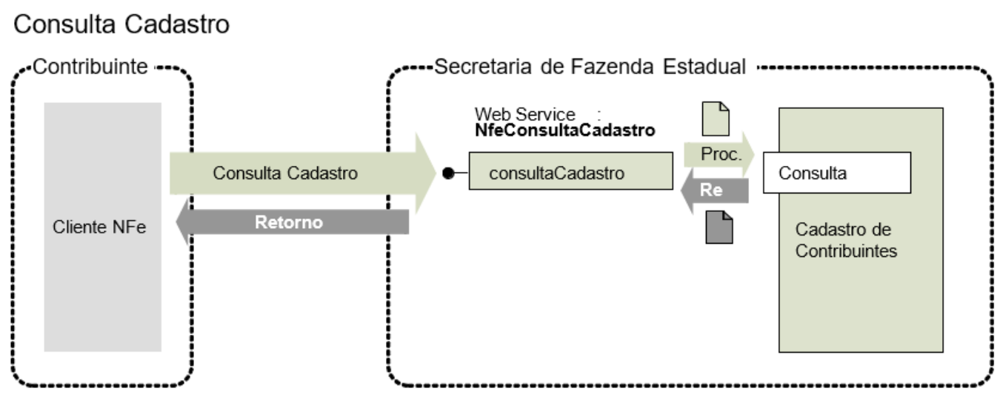

<!-- p.87 -->
# 5.6. Web Service – NfeConsultaCadastro

**Função:** Serviço para consultar o cadastro de contribuintes do ICMS da unidade federada.  
**Processo**: síncrono.  
**Método: consultaCadastro**

*Figura 5-6 – Fluxo do Web Service NfeConsultaCadastro*

Texto da figura: Consulta Cadastro; Contribuinte (Cliente NFe); Secretaria de Fazenda Estadual (Web Service: NfeConsultaCadastro, consultaCadastro, Proc., Re[t], Consulta, Cadastro de Contribuintes); setas: "Consulta Cadastro" e "Retorno".

## 5.6.1. Leiaute da Mensagem de Entrada

**Entrada**: Estrutura XML para consulta ao cadastro de contribuintes ICMS.

**Schema XML: consCad_v2.00.xsd**

**Tabela 5-21 – Leiaute Mensagem de Entrada do Web Service NfeConsultaCadastro**

| # | Campo | Ele | Pai | Tipo | Ocor. | Tam. | Descrição/Observações |
|---|---|---|---|---|---|---|---|
| **GP01** | **ConsCad** | **Raiz** | **-** | **-** | **-** | **-** | **TAG raiz da solicitação** |
| GP02 | versao | A | GP01 | N | 1-1 | 1-2v2 | Versão do leiaute |
| **GP03** | **infCons** | **G** | **GP01** | **-** | **1-1** | **-** | **Dados da consulta** |
| GP04 | xServ | E | GP03 | C | 1-1 | 8 | Serviço solicitado ‘CONS-CAD’ |
| GP05 | UF | E | GP03 | C | 1-1 | 2 | Sigla da UF consultada, informar 'SU' para SUFRAMA. |
| GP06 | IE | CE | GP03 | C | 1-1 | 2-14 | Inscrição estadual do contribuinte |
| GP07 | CNPJ | CE | GP03 | N | 1-1 | 3-14 | CNPJ do contribuinte |
| GP08 | CPF | CE | GP03 | N | 1-1 | 3-11 | CPF do contribuinte |

## 5.6.2. Leiaute da Mensagem de Retorno

**Retorno**: Estrutura XML com o retorno da consulta ao cadastro de contribuintes do ICMS.

**Schema XML: retConsCad_v2.00.xsd**

**Tabela 5-22 – Leiaute Mensagem de Retorno do Web Service NfeConsultaCadastro**

| # | Campo | Ele | Pai | Tipo | Ocor. | Tam. | Descrição/Observações |
|---|---|---|---|---|---|---|---|
| **GR01** | **retConsCad** | **Raiz** | **-** | **-** | **-** | **-** | **TAG raiz da solicitação** |
| GR02 | versao | A | GR01 | N | 1-1 | 1-2v2 | Versão do leiaute |
| **GR03** | **infCons** | **G** | **GR01** | **-** | **1-1** | **-** | **Dados da consulta** |
| GR04 | verAplic | E | GR03 | C | 1-1 | 1-20 | Versão do Aplicativo que processou a consulta. A versão deve ser iniciada com a sigla da UF nos casos de WS próprio ou a sigla SVAN ou SVRS nos demais casos. |
| GR05 | cStat | E | GR03 | N | 1-1 | 3 | Código do status da resposta (conforme item 4.4.1 do documento *MOC – Anexo I – Leiaute NF-e/NFC-e*) |
| GR06 | xMotivo | E | GR03 | C | 1-1 | 1-255 | Descrição do Status da resposta. |
| GR06a | UF | E | GP03 | C | 1-1 | 2 | Sigla da UF consultada. |
| GR06b | IE | CE | GP03 | C | 1-1 | 2-14 | Inscrição estadual consultada |
| GR06c | CNPJ | CE | GP03 | N | 1-1 | 3-14 | CNPJ consultado |
| GR06d | CPF | CE | GP03 | N | 1-1 | 3-11 | CPF consultado |
| GR06e | dhCons | E | GR03 | D | 1-1 |  | Data e hora de processamento da consulta Formato = AAAA-MM-DDTHH:MM:SS |
| GR06f | cUF | E | GR03 | N | 1-1 | 2 | Código da UF que atendeu a solicitação. |
| **GR07** | **infCad** | **G** | **GR03** | **-** | **0-N** | **-** | **Dados da situação cadastral Esta estrutura existe somente para as consultas realizadas com sucesso cStat=111, com possibilidade de múltiplas ocorrências (Ex.: consulta por IE de contribuinte com Inscrição Única – retorno de todos os estabelecimentos do contribuinte).** |
| GR08 | IE | E | GR07 | C | 1-1 | 2-14 | Inscrição estadual do contribuinte |
| GR09 | CNPJ | CE | GR07 | N | 1-1 | 3-14 | CNPJ do contribuinte |
| GR10 | CPF | CE | GR07 | N | 1-1 | 3-11 | CPF em caso de pessoa física com IE |
| GR11 | UF | E | GR07 | C | 1-1 | 2 | O campo deve ser preenchido com a sigla da UF de localização do contribuinte. Em algumas situações, a UF de localização pode ser diferente da UF consultada. Ex. IE de contribuinte inscrito como Substituto Tributário. |
| GR12 | cSit | E | GR07 | N | 1-1 | 1 | Situação do contribuinte: 0=não habilitado; 1=habilitado. |
| GR12a | indCredNFe | E | GR07 | N | 1-1 | 1 | Indicador de contribuinte credenciado a emitir NF-e. 0=Não credenciado para emissão da NF-e; 1=Credenciado; 2=Credenciado com obrigatoriedade para todas operações; 3=Credenciado com obrigatoriedade parcial; 4=a SEFAZ não fornece a informação. Este indicador significa apenas que o contribuinte é credenciado para emitir NF-e na SEFAZ consultada. |
| GR12b | indCredCTe | E | GR07 | N | 1-1 | 1 | Indicador de contribuinte credenciado a emitir CT-e. 0=Não credenciado para emissão da CT-e; 1=Credenciado; 2=Credenciado com obrigatoriedade para todas operações; 3=Credenciado com obrigatoriedade parcial; 4=a SEFAZ não fornece a informação. Este indicador significa apenas que o contribuinte é credenciado para emitir CT-e na SEFAZ consultada. |
| GR13 | xNome | E | GR07 | C | 1-1 | 1-60 | Razão Social ou nome do Contribuinte |
| GR13a | xFant | E | GR07 | C | 0-1 | 1-60 | Nome Fantasia |
| GR14 | xRegApur | E | GR07 | C | 0-1 | 1-60 | Regime de Apuração do ICMS do Contribuinte |
| GR15 | CNAE | E | GR07 | N | 0-1 | 6-7 | CNAE principal do contribuinte |
| GR16 | dIniAtiv | E | GR07 | D | 0-1 |  | Data de Início da Atividade do Contribuinte |
| GR17 | dUltSit | E | GR07 | D | 0-1 |  | Data da última modificação da situação cadastral do contribuinte. |
| GR18 | dBaixa | E | GR07 | D | 0-1 |  | Data de ocorrência da baixa do contribuinte. |
| GR20 | IEUnica | E | GR07 | C | 0-1 | 2-14 | IE única, este campo será informado quando o contribuinte possuir IE única. |
| GR21 | IEAtual | E | GR07 | C | 0-1 | 2-14 | IE atual (em caso de IE antiga consultada) |
| **GR22** | **Ender** | **G** | **GR07** |  | **0-1** |  | **Endereço – grupo de informações opcionais.** |
| GR23 | xLgr | E | GR22 | C | 0-1 | 1-255 | Nome do Logradouro |
| GR24 | Nro | E | GR22 | C | 0-1 | 1-60 | Número |
| GR25 | xCpl | E | GR22 | C | 0-1 | 1-60 | Complemento |
| GR26 | xBairro | E | GR22 | C | 0-1 | 1-60 | Nome do Bairro |
| GR27 | cMun | E | GR22 | N | 0-1 | 7 | Código do Município do Contribuinte, conforme Tabela do IBGE |
| GR28 | xMun | E | GR22 | C | 0-1 | 1-60 | Nome do município |
| GR29 | CEP | E | GR22 | N | 0-1 | 7-8 | Código do CEP |

<!-- p.88 -->
<!-- p.89 -->

## 5.6.3. Descrição do Processo de *Web Service*

Este *Web Service* oferece a consulta pública do cadastro de contribuintes do ICMS de uma unidade federada.

O *Web Service* poderá ser oferecido por qualquer UF, sendo de oferecimento obrigatório para as UF que autorizam a emissão de qualquer espécie de Documento Fiscal eletrônico –  DF-e.

Apenas as empresas autorizadas a emitir Documentos Fiscais eletrônicos poderão utilizar este serviço. A UF que oferecer o *Web Service* deverá verificar se o CNPJ da empresa solicitante consta do cadastro nacional de emissores de Documentos Fiscais eletrônicos –  DF-e.

A identificação da empresa solicitante do serviço será realizada através do CNPJ contido na extensão otherName – OID=2.16.76.1.3.3 do certificado digital utilizado na conexão TLS.

Importante ressaltar que este *Web Service* não tem a mesma disponibilidade dos demais *Web Services* da NF-e.

O aplicativo do contribuinte envia a solicitação para o *Web Service* da Secretaria de Fazenda Estadual. Ao receber a solicitação a aplicação do Portal da Secretaria de Fazenda Estadual processará a solicitação de consulta, validando o argumento de pesquisa informado (CNPJ ou CPF ou IE), e retornará mensagem contendo a situação cadastral atual do contribuinte no cadastro de contribuintes do ICMS.

## 5.6.4. Regras de Validação

Serão aplicadas as regras de validação genéricas conforme os grupos citados na Tabela 5-23, detalhados no documento *MOC – Anexo I – Leiaute e Regras de Validação da NF-e e da NFC-e*.

**Tabela 5-23 – Regras de Validação Genéricas do Web Service NfeConsultaCadastro**

| Grupo | Descrição |
|---|---|
| A | Validação do Certificado de Transmissão (protocolo TLS) |
| B | Validação Inicial da Mensagem no *Web Service* |
| D | Validação da Área de Dados |

As regras de validação específicas deste WS podem ser vistas na Tabela 5-24.

**Tabela 5-24 – Regras de Validação Específicas do Web Service NfeConsultaCadastro**

| # | Regra de Validação | Aplic. | Msg | Efeito | Descrição Erro |
|---|---|---|---|---|---|
| K01 | UF da consulta difere da UF do *Web Service* | Obrig. | 265 | Rej. | Rejeição: Sigla da UF da consulta difere da UF do *Web Service* |
| K02 | Se Certificado de Transmissão  = e-CNPJ: • Acessar Cadastro Centralizado de Contribuinte (CCC): • ~~Acessar Cadastro Nacional de Emissores (CNE):~~ &nbsp;&nbsp;○ Verificar CNPJ do Certificado Digital é emitente de NF-e (NT 2018.001) (Alterada na NT 2018.001  v 1.10) | Obrig. | 257 | Rej. | Rejeição: Solicitante não habilitado para emissão da NF-e |
| K02a | Se Certificado de Transmissão = e-CPF: • Acessar Cadastro Centralizado de Contribuintes (CCC): &nbsp;&nbsp;○ Verificar CPF do Certificado Digital é emitente de NF-e (NT 2018.001) | Obrig. | 257 | Rej. | Rejeição: Solicitante não habilitado para emissão da NF-e |
| K03 | Se informado CNPJ: Verificar dígito controle, ou zeros | Obrig. | 258 | Rej. | Rejeição: CNPJ da consulta inválido |
| K04 | Se informado CNPJ: Acessar Cadastro Contribuinte por CNPJ Não encontrado Contribuinte | Obrig. | 259 | Rej. | Rejeição: CNPJ da consulta não cadastrado como contribuinte na UF |
| K05 | Se informado IE: Verificar dígito controle ou zeros | Obrig. | 260 | Rej. | Rejeição: IE da consulta inválida |
| K06 | Se informado IE: Acessar Cadastro Contribuinte por IE Não encontrado Contribuinte | Obrig. | 261 | Rej. | Rejeição: IE da consulta não cadastrada como contribuinte na UF |
| K07 | Se informado CPF: Verificar se a UF fornece consulta por CPF | Obrig. | 262 | Rej. | Rejeição: UF não fornece consulta por CPF |
| K08 | Se informado CPF: Verificar dígito controle ou zeros | Obrig. | 263 | Rej. | Rejeição: CPF da consulta inválido |
| K09 | Se informado CPF: Acessar Cadastro Contribuinte por CPF Não encontrado Contribuinte | Obrig. | 264 | Rej. | Rejeição: CPF da consulta não cadastrado como contribuinte na UF |

> **Revogado/Descontinuado:** na regra K02, o item “Acessar Cadastro Nacional de Emissores (CNE):” aparece riscado na página 90.

<!-- p.90 -->

## 5.6.5. Final do Processamento

A consulta com sucesso poderá resultar:

- cStat = 111 –  consulta cadastro com uma ocorrência;
- cStat = 112 –  consulta cadastro com mais de uma ocorrência, existe mais de um estabelecimento para o argumento pesquisado –  ex.: consulta por IE de contribuinte com diversos estabelecimentos e inscrição estadual única.
