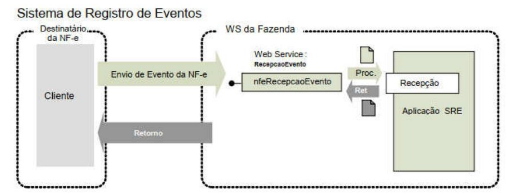

<!-- p.112 -->
# 5.11. Web Service – NFeRecepcaoEvento – Manifestação do Destinatário

*Figura sem legenda numerada na página: Sistema de Registro de Eventos – NFeRecepcaoEvento (Manifestação do Destinatário).*

Texto da figura: “Sistema de Registro de Eventos”; “Destinatário da NF-e”; “Cliente”; “Envio de Evento da NF-e”; “Retorno”; “WS da Fazenda”; “Web Service: RecepcaoEvento”; “nfeRecepcaoEvento”; “Proc.”; “Ret”; “Recepção”; “Aplicação SRE”.

**Processo:** síncrono.  
**Método:** nfeRecepcaoEvento  
**Função**: permite que o destinatário da Nota Fiscal eletrônica confirme a sua participação na operação acobertada pela Nota Fiscal eletrônica emitida para o seu CNPJ/CPF, através do envio da mensagem de:

- **Confirmação da Operação** – confirmando a ocorrência da operação e o recebimento da mercadoria (para as operações com circulação de mercadoria);
- **Desconhecimento da Operação** – declarando o desconhecimento da operação;
- **Operação Não Realizada** – declarando que a operação não foi realizada (com recusa do Recebimento da mercadoria e outros) e a justificativa do porquê a operação não se realizou;
- **Ciência da Emissão** (ou Ciência da Operação) – declarando ter ciência da operação destinada ao CNPJ, mas ainda não possuir elementos suficientes para apresentar uma manifestação conclusiva, como as acima citadas. Este evento era chamado de Ciência da Operação.

Uma listagem destes eventos pode ser encontrada no item **3.2.1**.

**Autor do Evento**: destinatário da NF-e. A mensagem XML do evento será assinada com o certificado digital que tenha o CNPJ-Base (8 primeiras posições do CNPJ) ou CPF do Destinatário da NF-e.  
A ciência da emissão é um evento opcional que pode ser utilizado pelo destinatário para declarar que tem ciência da existência da operação, mas ainda não tem elementos suficientes para apresentar uma manifestação conclusiva. O destinatário deve apresentar uma manifestação conclusiva dentro de um prazo máximo definido, contados a partir da data de autorização da NF-e.

**Código do Tipo de Evento:**

- 210200 – Confirmação da Operação
- 210210 – Ciência da Emissão
- 210220 – Desconhecimento da Operação
- 210240 – Operação não Realizada

## 5.11.1. Leiaute Mensagem de Entrada

**Entrada:** Estrutura XML da parte específica do evento, a ser inserida na tag detEvento (P17) da Parte Geral do *Web Service* de Registro de Eventos especificada na seção **5.8**.

**Schema XML: envConfRecebto_v9.99.xsd**

<!-- p.113 -->
**Tabela 5-41 – Leiaute Mensagem de Entrada do Web Service NFeRecepcaoEvento – Manifestação do Destinatário**

| # | Campo | Ele | Pai | Tipo | Ocor. | Tam. | Descrição/Observação |
|---|---|---|---|---|---|---|---|
| HP18 | versao | A | P17 | N | 1-1 | 2v2 | Versão do evento |
| HP19 | descEvento | E | P17 | C | 1-1 | 5-60 | Informar a descrição do evento: Confirmacao da Operacao Ciencia da Operacao Desconhecimento da Operacao Operacao nao Realizada |
| HP20 | xJust | E | P17 | C | 0-1 | 15-255 | Informar a justificativa porque a operação não foi realizada, este campo deve ser informado somente no evento de Operação não Realizada. |

## 5.11.2. Leiaute Mensagem de Retorno

**Retorno**: Estrutura XML com a mensagem do resultado da transmissão, conforme retorno do *Web Service* de Registro de Eventos – Parte Geral, especificado no item **5.8.2**.

**Descrição do resultado do processamento do evento (xEvento):**

- Confirmacao de Operacao registrada
- Ciencia da Operacao registrada
- Desconhecimento da Operacao registrada
- Operacao nao Realizada registrada

**Schema XML: retEnvConfRecebto _v9.99.xsd**

O leiaute desta mensagem de retorno não apresenta nenhuma diferença com relação à  
Schema XML: retEnvEvento_v1.00.xsd  
Tabela 5-33.

## 5.11.3. Regras de Validação

Serão aplicadas as regras de validação gerais apresentadas no item **5.8.4** e as regras de negócio específicas que podem ser vistas na Tabela 5-42.

**Tabela 5-42 – Regras de Validação da Específicas do Evento Manifestação do Destinatário**

| # | Regra de Validação | Aplic. | Msg | Efeito | Descrição Erro |
|---|---|---|---|---|---|
| H01 | Evento de “Operação não Realizada” deve ter uma justificativa | Obrig. | 595 | Rej. | Rejeição: Obrig.atória a informação da justificativa do evento. |
| H02 | O nSeqEvento deve ser = 1 | Obrig. | 594 | Rej. | Rejeição: O número de sequencia do evento informado é maior que o permitido |
| H03 | Verificar prazo de recepção do evento, em relação a data da autorização | Obrig. | 596 | Rej. | Rejeição: Evento apresentado fora do prazo: [prazo vigente] |
| H04 | Evento de “Ciência da Emissão” para NF-e Cancelada ou Denegada | Obrig. | 650 | Rej. | Rejeição: Evento de "Ciência da Emissão" para NF-e Cancelada ou Denegada |
| H05 | Evento de “Desconhecimento da Operação” para NF-e Cancelada ou Denegada | Obrig. | 651 | Rej. | Rejeição: Evento de "Desconhecimento da Operação" para NF-e Cancelada ou Denegada |
| H06 | Evento de "Ciência da Emissão" informado após a Manifestação final do destinatário (Confirmação da Operação, Operação não Realizada ou Desconhecimento). | Obrig. | 655 | Rej. | Rejeição: Evento de Ciência da Emissão informado após a manifestação final do destinatário |
| H07 | Se Evento do Destinatário, verificar se UF do destinatário corresponde a UF do *Web Service* (Nota: esta validação não se aplica para o Ambiente Nacional, no atendimento de todas as UF) | Obrig. | 658 | Rej. | Rejeição: UF do destinatário da Chave de Acesso diverge da UF autorizadora |

<!-- p.114 -->
## 5.11.4. Final do Processamento do Lote

O resultado do processamento do lote está especificado na seção *Web Service* de Registro de Eventos – Parte Geral, item **5.8.5**.
