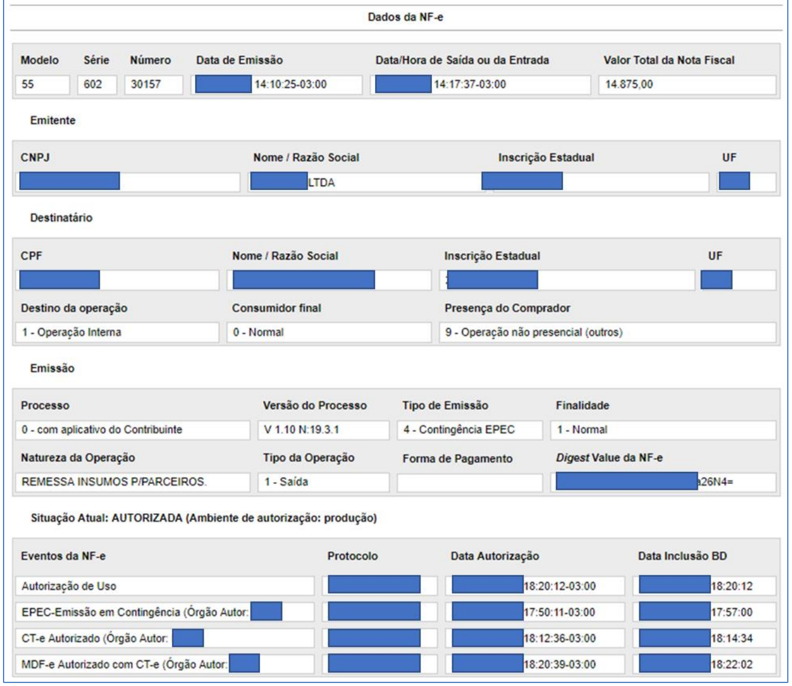

<!-- p.126 -->
# 7. Consulta Pública da NF-e

## 7.1. Consulta Completa da NF-e

A Consulta Completa, individualmente realizada através da Internet nos portais das Administrações Tributárias, retornará todo o conteúdo da NF-e, exclusivamente aos participantes da operação comercial descritos no documento eletrônico, que desempenham papéis de emitente, destinatário, transportador e terceiros citados no XML da NF-e (informado na tag autXML), por meio do acesso identificado do consulente ao portal da administração tributária.

Estas restrições não se aplicarão às NF-e emitidas para os seguintes destinatários: pessoa física (CPF) sem inscrição estadual e pessoa jurídica (CNPJ) sem inscrição estadual.

## 7.2. Consulta Resumida da NF-e

Para as situações não enquadradas na Consulta Completa, o acesso aos dados da NF-e só será possível através da consulta resumida.

## 7.3. Exibição de EPEC na Consulta Pública

### 7.3.1. Evento EPEC com a Respectiva NF-e

Caso a NF-e referente ao EPEC já tenha sido autorizada, a Consulta Pública da NF-e deverá ser visualizada normalmente, mostrando também a existência do evento de emissão em contingência.

<!-- p.127 -->

*Figura 7-1 – Visualização de um Evento Prévio de Emissão em Contingência*

Texto da figura (dados do contribuinte tarjados no original): Dados da NF-e: Modelo 55; Série 602; Número 30157; Data de Emissão (tarjada) 14:10:25-03:00; Data/Hora de Saída ou da Entrada (tarjada) 14:17:37-03:00; Valor Total da Nota Fiscal 14.875,00. Destinatário: Destino da operação 1 - Operação Interna; Consumidor final 0 - Normal; Presença do Comprador 9 - Operação não presencial (outros). Emissão: Processo 0 - com aplicativo do Contribuinte; Versão do Processo V 1.10 N:19.3.1; Tipo de Emissão 4 - Contingência EPEC; Finalidade 1 - Normal; Natureza da Operação REMESSA INSUMOS P/PARCEIROS; Tipo da Operação 1 - Saída. Situação Atual: AUTORIZADA (Ambiente de autorização: produção). Eventos da NF-e: Autorização de Uso; EPEC-Emissão em Contingência (Órgão Autor: ...); CT-e Autorizado (Órgão Autor: ...); MDF-e Autorizado com CT-e (Órgão Autor: ...), com colunas Protocolo, Data Autorização e Data Inclusão BD.

### 7.3.2. Evento EPEC sem a Respectiva NF-e

Caso exista unicamente o EPEC, a Consulta Pública da NF-e deverá mostrar os dados do EPEC, visualizando unicamente a Aba NF-e, com as informações existentes.

## 7.4. Leiaute de Distribuição: Evento da NF-e

Deverão ser disponibilizados para o destinatário os dados do Evento enviados para a SEFAZ, acrescentados os dados da homologação deste Evento.

**Tabela 7-1 – Leiaute de Distribuição: Evento da NF-e**

| # | Campo | Ele | Pai | Tipo | Ocor. | Tam. | Descrição/Observação |
|---|---|---|---|---|---|---|---|
| **ZR01** | **procEventoNFe** | **Raiz** | **-** | **-** | **-** | **-** | **TAG raiz** |
| ZR02 | versao | A | ZR01 | N | 1-1 | 1-2v2 | |
| **ZR03** | **evento** | **G** | **ZR01** | **Xml** | **1-1** | **-** | |
| ZR04 | (dados) | - | - | - | - | - | Dados do Evento |
| **ZR05** | **retEvento** | **G** | **ZR01** | **xml** | **1-1** | **-** | |
| ZR06 | (dados) | - | - | - | - | - | Dados da homologação do Evento |

No caso de troca de arquivo entre as empresas, é sugerida a adoção do nome do arquivo como segue:

<!-- p.128 -->
&lt;999...999&gt;_&lt;888888&gt;-procEventoNFe.xml

Onde:

- &lt;999...999&gt;: corresponde a Chave de Acesso da NF-e;
- &lt;888888&gt;: identifica o tipo de evento (CC-e=110110, Cancelamento=110111, etc.)
- “-procEventoNFe”: identifica o processamento do documento autorizado.
