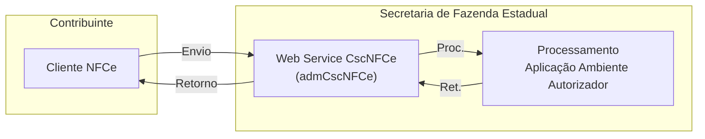

<!-- p.6 -->
# 5. Serviço de Manutenção do CSC NFC-e

O Serviço de Manutenção do CSC NFC-e é o serviço oferecido pelo *Web Service* da SEFAZ autorizadora para atualização do repositório de CSC NFC-e. A utilização de cada uma das funcionalidades oferecidas pelo serviço deverá ser feita por meio da especificação do tipo de operação no XML de requisição.

*Figura: fluxo de envio e retorno entre o Cliente NFCe e o Web Service CscNFCe (admCscNFCe) da Secretaria de Fazenda Estadual. Redesenhado em mermaid a partir do esquema original.*
