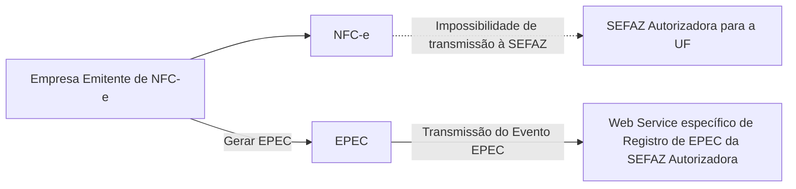

<!-- p.5 -->
# 3.1 Visão Geral

Esta modalidade de contingência é baseada no conceito de "Declaração Prévia" do evento EPEC, que contem as principais informações sobre a NFC-e emitida em contingência.

**EPEC – visão geral**

*Figura – EPEC – visão geral (redesenhada em mermaid)*

A emissão do EPEC poderá ser adotada por qualquer emissor que esteja impossibilitado de transmissão e/ou recepção das autorizações de uso de suas NFC-e, adotando os seguintes passos:

- Gerar a NFC-e com “tpEmis = 4”, mantendo também a informação do motivo de entrada em contingência com data e hora do início da contingência, com número diferente de qualquer NFC-e que tenha sido transmitida com outro “tpEmis”;
- Gerar o arquivo XML do EPEC com as seguintes informações da NFC-e:
  - UF, CNPJ e Inscrição Estadual do emitente;
  - Chave de Acesso;
  - UF e CNPJ ou CPF do destinatário se Valor Total da nota acima de R$10.000,00;
  - Valor Total da NFC-e, Valor Total do ICMS;
  - Outras informações constantes no leiaute;
- Assinar o arquivo com o certificado digital do emitente;
- Enviar o arquivo XML do EPEC para o Web Service de registro de eventos do ambiente de contingência da SEFAZ autorizadora;
- Impressão do DANFE da NFC-e que consta do EPEC, em papel comum, constando no corpo a expressão “DANFE impresso em contingência – DPEC regularmente recebida pela SEFAZ autorizadora”.
- Adotar as seguintes providências, após a cessação dos problemas técnicos que impediam a transmissão da NFC-e para o ambiente normal da SEFAZ autorizadora:
  - Transmitir as NFC-e emitidas em Contingência Eletrônica para o ambiente normal da SEFAZ, observando o prazo limite de transmissão na legislação, bem como outros procedimentos constantes na legislação caso ocorra rejeição na autorização de uso;
  - A Chave de Acesso desta NFC-e é a mesma Chave de Acesso do EPEC autorizado.
