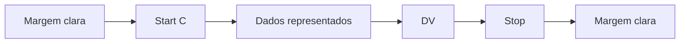

# 2 Código de Barras

O padrão de código de barras a ser impresso no DANFE é o CODE-128C. Utilize o código de barras:

a) No caso de DANFE impresso para representar uma NF-e emitida em operação normal ou em contingência utilizando o Sistema de Contingência do Ambiente Nacional: apenas um código de barras com a chave de acesso do arquivo da nota fiscal eletrônica, descrita no item **3.9.1** e;

b) No caso de DANFE impresso para representar uma NF-e emitida nas demais hipóteses de contingência: dois códigos de barras; um para representar a chave de acesso do arquivo da nota fiscal eletrônica, e outro para representar dados da NF-e emitida em contingência, conforme o item **3.9.2**.

A impressão dos códigos de barras no DANFE tem a finalidade de facilitar e agilizar a captura de dados para consulta nos portais estaduais e da Receita Federal do Brasil.

Com a chave de acesso é possível realizar a consulta de uma Nota Fiscal Eletrônica e de sua situação, bem como visualizar a autorização de uso da mesma. Dentre outras finalidades do código, destacam-se o registro do trânsito de mercadorias nos Postos Fiscais e, a critério de cada unidade federada, a disponibilização do arquivo da NF-e consultada.

Os dados adicionais contidos no segundo código de barras serão utilizados para auxiliar o registro do trânsito de mercadorias acobertadas por notas fiscais eletrônicas emitidas em contingência.

O conjunto de caracteres representativos do Código de Barras CODE-128C encontra-se no Anexo III.01 deste manual. Para a sua impressão será considerada a seguinte estrutura de simbolização:

- **Margem clara**: espaço claro que não contém nenhuma marca legível por máquina, localizado à esquerda e à direita do código, a fim de evitar interferência na decodificação da simbologia. A margem clara é chamada também de "área livre", "zona de silêncio" ou "margem de silêncio".
- **Start C**: inicia a codificação dos dados CODE-128C de acordo com o conjunto de caracteres. O Start C não representa nenhum caractere.
- **Dados representados**: caracteres representados no código de barras.
<!-- p.07 -->
- **DV**: dígito verificador da simbologia.
- **Stop**: caractere de parada que indica o final do código ao leitor óptico.

O código de barras deverá ser impresso com os padrões próprios residentes das impressoras de não impacto (laser ou deskjet) e de impacto (matriciais ou de linhas) a fim de respeitarem os padrões dos referidos códigos:

- A área reservada no DANFE;
- Largura mínima total do código de barras (considerando o código de barras da chave de acesso, com 44 posições):
  - 6 cm para impressoras de Não Impacto (Laser de Jato de Tinta);
  - 11,5 cm para impressora de impacto (Matricial e de linha)
- Altura mínima da barra: 0,8 cm;
- Largura mínima da barra: 0,02 cm, conforme explicado a seguir:

Considerando que para cada símbolo da barra são codificados dois caracteres, então teremos:

- Tamanho do campo = 44 (caracteres) / 2 = 22 (símbolos)
- Considerando que cada símbolo possui 11 (módulos) * 22 (símbolos) = 242 posições
- Margem clara = deve ter no mínimo a dimensão de 10 (módulos) * 2 = 20 posições
- Start C = 11 (módulos) = 11 posições
- DV = 11 (módulos) = 11 posições
- Stop = 13 (módulos) = 13 posições
- Tamanho total da simbologia = 242 + 20 + 11 + 11 + 13 = 297 (posições)
- Largura mínima de cada módulo da barra = 6 cm / 297 (posições) = 0,02 cm
