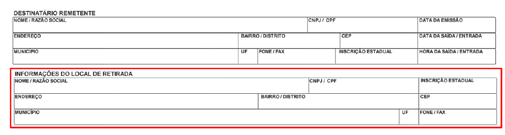
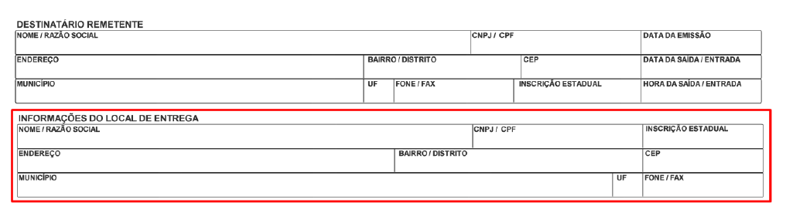

# 3.1. Campos do DANFE

Os campos do DANFE deverão representar o conteúdo das respectivas TAG XML da NF-e, quando conhecidos no momento da solicitação de autorização de uso. Não poderão ser impressas informações que não constem do arquivo da NF-e.

O conteúdo dos campos poderá ser impresso em mais de uma linha desde que a leitura possa ser feita de forma clara.

O item **3.8** deste manual traz a sugestão de tamanhos a serem seguidos para cada campo, que garantem a legibilidade prevista na legislação. Embora os tamanhos descritos no item **3.8** não sejam obrigatórios, o DANFE deverá ser impresso conforme um dos modelos permitidos (conforme o item **3.6.3**) e utilizando-se os tamanhos mínimos de fonte descritos no item **3.7**.

O DANFE deverá conter todos os campos previstos no modelo adotado, com exceção dos campos não obrigatórios do quadro “Dados dos Produtos/Serviços”, conforme disposto no item **3.1.7**.

As regras estabelecidas para a impressão dos campos aplicam-se também para a impressão das folhas adicionais do DANFE.

## 3.1.1. Chave de Acesso

A chave de acesso será impressa em onze blocos de quatro dígitos cada, com a seguinte máscara:

`9999 9999 9999 9999 9999 9999 9999 9999 9999 9999 9999`

## 3.1.2. Dados da NF-e

<!-- p.09 -->
No caso de emissão de NF-e normal ou em contingência SVC-XX, os campos 1 e 2 serão preenchidos conforme o item **3.9.1**;

No caso de emissão de NF-e em contingência FS ou FS-DA, os campos 1 e 2 serão preenchidos conforme o item **3.9.2**. Observando que no Campo 2, o Código de Barras Adicional “Dados da NF-e” será impresso em nove blocos de quatro dígitos cada, com a seguinte máscara: `9999 9999 9999 9999 9999 9999 9999 9999 9999`;

No caso de emissão de NF-e em contingência EPEC, os campos 1 e 2 serão preenchidos conforme o item **3.9.3**.

## 3.1.3. Dados do Emitente

Deverá conter a identificação do emitente, composta no mínimo por:

- nome ou razão social;
- endereço completo (logradouro, número, complemento, bairro, município, UF, CEP); e
- telefone.

Opcionalmente poderá conter logotipo, desde que sua inclusão não prejudique a exibição das informações obrigatórias.

## 3.1.4. Informações do local de retirada (NT 2018.005)

Caso haja preenchimento do grupo F - Local de retirada, fica possibilitada a exibição de informações no DANFE em área especifica, conforme sugestão de modelo abaixo:

*Figura: Sugestão de modelo de informações do local de retirada (NT 2018.005).*

## 3.1.5. Informações do local de entrega (NT 2018.005)

Caso haja preenchimento do grupo G - Local de entrega, fica possibilitada a exibição de informações no DANFE em área especifica, conforme sugestão de modelo abaixo:

*Figura: Sugestão de modelo de informações do local de entrega (NT 2018.005).*

## 3.1.6. Quadro Fatura/Duplicatas

Poderá conter linhas divisórias internas separando as informações. Poderão ser acrescidas ao quadro outras informações relativas ao assunto, além das informações contidas no grupo de Dados de <!-- p.10 -->Cobrança da NF-e, desde que estas informações adicionais também estejam contidas no arquivo da NF-e.

## 3.1.7. Quadro Dados dos Produtos / Serviços

As informações adicionais de produto (TAG `<infAdProd>`) deverão constar impressas no DANFE logo abaixo do item ao qual se referirem.

As informações relativas ao Fundo de Combate à Pobreza (FCP) devem ser informadas:

- No campo "Informações Adicionais do Produto, tag: infAdProd", os valores informados por item nos campos (vBCFCP, pFCP, vFCP, vBCFCPST, pFCPST, vFCPST), quando existirem.

Sempre que o conteúdo de um mesmo item for impresso utilizando-se mais de uma linha do quadro de “Dados dos Produtos/Serviços”, deverá ser aplicado um destaque divisório que identifique quais linhas foram utilizadas para cada item, a fim de distinguir com clareza um item do outro. O destaque divisório pode ser aplicado com o uso de linha (pontilhadas, continuas, ou tracejada), espaçamento duplo entre linhas, sombreamento ou qualquer outro recurso ou efeito semelhante que resulte no destaque divisório.

Exemplo de destaque divisório com linha tracejada:

| Cód. Produto | Descrição do Produto/Serviço | NCM |
|---|---|---|
| 123 | Camisa Social Masculina Manga Longa EAN 7890123456789 | 61099000 |
| 124 | Camisa Social Masculina Manga Curta EAN 7890123456790 | 61099000 |
| 125 | Camiseta Polo EAN 7890123456790 | 61099000 |

<!-- p.11 -->
Exemplo de destaque divisório com espaço duplo:

| Cód. Produto | Descrição do Produto/Serviço | NCM |
|---|---|---|
| 123 | Camisa Social Masculina Manga Longa EAN 7890123456789 | 61099000 |
| 124 | Camisa Social Masculina Manga Curta EAN 7890123456790 | 61099000 |
| 125 | Camiseta Polo EAN 7890123456790 | 61099000 |

Exemplo de destaque divisório com sombreamento:

| Cód. Produto | Descrição do Produto/Serviço | NCM |
|---|---|---|
| 123 | Camisa Social Masculina Manga Longa EAN 7890123456789 | 61099000 |
| 124 | Camisa Social Masculina Manga Curta EAN 7890123456790 | 61099000 |
| 125 | Camiseta Polo EAN 7890123456790 | 61099000 |

Essa exigência também se aplica no caso da utilização de uma mesma coluna para aposição de outro campo, conforme o item **3.2**.

Deve-se utilizar o quadro “Dados dos Produtos/Serviços” para detalhar as operações que não caracterizem circulação de mercadorias ou prestações de serviços, e que exijam emissão de documentos fiscais (como transferência de créditos ou apropriação de incentivos fiscais, por exemplo).

Nas situações em que o valor unitário comercial for diferente do valor unitário tributável, ambas as informações deverão estar expressas e identificadas no DANFE, podendo ser utilizada uma das linhas adicionais previstas, ou o campo de informações adicionais.

Independentemente do descrito no item **3.3**, o contribuinte poderá suprimir colunas do quadro “Dados dos Produtos/Serviços” que não se apliquem a suas atividades e acrescentar outras do seu interesse. A inserção destas colunas será realizada à direita da coluna “Descrição dos Produtos/Serviços”. A ordem das colunas remanescentes deverá ser respeitada.

As seguintes colunas não poderão ser suprimidas:

- Código dos Produtos/Serviços;
- Descrição dos Produtos/Serviços;
- NCM;
- CST;
- CFOP;
- Unidade;
- Quantidade;
- Valor Unitário;
- Valor Total;
- Base de Cálculo do ICMS próprio;
- Valor do ICMS próprio; e
- Alíquota do ICMS.

## 3.1.8. Informações Complementares

Deverá conter todas as Informações Adicionais da NF-e incluídas nas TAGs `<infAdFisco>` e `<infCpl>`, ficando facultada a impressão das informações adicionais contidas nas TAGs `<obsCont>`. Na hipótese <!-- p.12 -->de insuficiência de espaço no quadro de “informações complementares”, a impressão destas deverá ser continuada no verso ou na folha seguinte, neste mesmo quadro ou no quadro “Dados dos Produtos/Serviços”.

As empresas remetentes devem informar, no campo de “Informações Complementares”, os valores descritos no grupo de tributação do ICMS para a UF de destino. (NT 2015.003)

Exemplo 1 de preenchimento do DANFE (1ª situação da sistemática de cálculo descrita a seguir):

**INFORMAÇÕES COMPLEMENTARES:** Valores totais do ICMS Interestadual: DIFAL da UF destino R$216,00 + FCP R$40,00; DIFAL da UF Origem R$324,00.

Exemplo 2 de preenchimento do DANFE (2ª situação da sistemática de cálculo descrita a seguir):

**INFORMAÇÕES COMPLEMENTARES:** Valores totais do ICMS Interestadual: DIFAL da UF destino R$156,00 + FCP R$40,00; DIFAL da UF Origem R$234,00.

As informações relativas ao Fundo de Combate à Pobreza (FCP) devem ser informadas:

- Os valores de totais do FCP (id: W04b e W06a) devem ser informados em "Informações Adicionais de Interesse do Fisco, campo “infAdFisco", quando existirem.

## 3.1.9. Reservado ao Fisco

O contribuinte não deverá preencher este quadro, sendo seu preenchimento de uso exclusivo do fisco, exceto, a critério da UF, quanto à orientação de impressão do teor das tags contidas no XML de retorno de autorização da NF-e. Em caso de utilização de formulário de segurança provido de estampa fiscal, esse quadro não estará presente."

## 3.1.10. Quadro do Transportador

O campo identificação da Modalidade do Frete (id: X02, tag:modFrete) deverá ser preenchido com um dos seguintes códigos (NT 2016/002) (Atualizado NT 2108.005):
<!-- REVISAR p.12: referência “NT 2108.005” possivelmente erro de digitação (provável NT 2018.005); conferir no original -->

- 0=Contratação do Frete por conta do Remetente (CIF);
- 1=Contratação do Frete por conta do Destinatário (FOB);
- 2=Contratação do Frete por conta de Terceiros;
- 3=Transporte Próprio por conta do Remetente;
- 4=Transporte Próprio por conta do Destinatário;
- 9=Sem Ocorrência de Transporte.

Exemplo de preenchimento:

| Nome / Razão Social | Frete por Conta | Código ANTT |
|---|---|---|
| | 0 – Remetente | |
