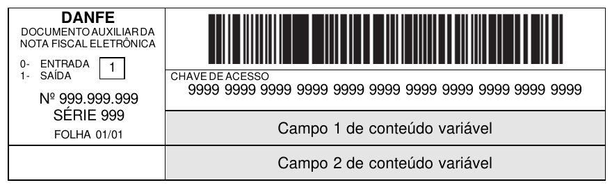
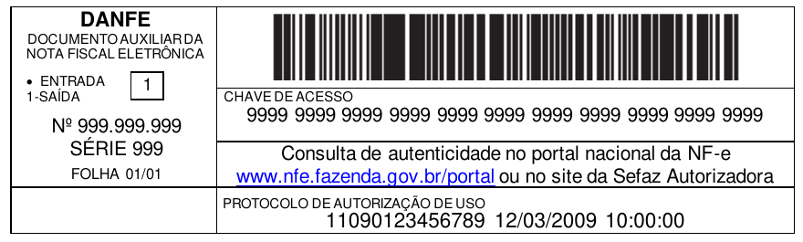
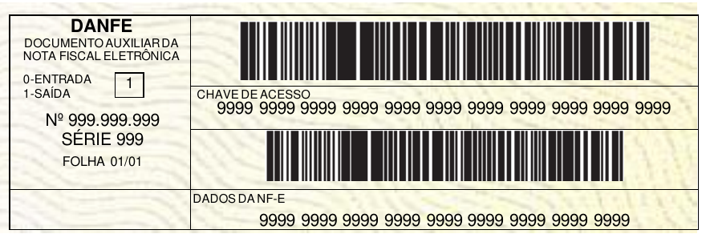
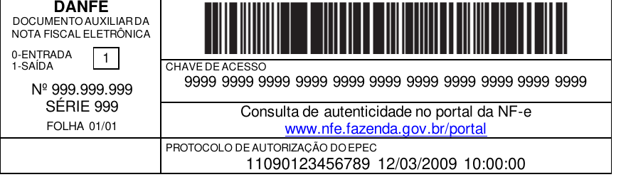

<!-- p.20 -->
# 3.9. Campos de Conteúdo Variável

O leiaute de impressão DANFE prevê dois campos de conteúdo variável logo abaixo do local onde é impressa a chave de acesso, de acordo com a seguinte disposição:

*Figura: Disposição dos campos de conteúdo variável (Campo 1 e Campo 2).*

O conteúdo destes campos é função da forma de emissão da NF-e.

## 3.9.1. Emissão Normal da NF-e e SVC-XX

A emissão de NF-e normal e a emissão com a utilização da Sefaz Virtual de Contingência do Ambiente Nacional (SVC-AN) ou da Sefaz Virtual de Contingência do RS (SVC-RS) são formas conclusivas de emissão da NF-e, pois é dada a autorização de uso para a NF-e, sem necessidade de posterior transmissão para a SEFAZ.

Nestes casos, após a obtenção da autorização de uso da NF-e o emissor poderá imprimir o DANFE em papel comum, informando o número do protocolo de autorização de uso e a data e a hora de autorização no Campo 2, de acordo com a seguinte disposição:

*Figura: Exemplo de DANFE na emissão normal da NF-e e SVC-XX (item 3.9.1).*

O Campo 1 conterá a mensagem informando onde pode ser consultada a autenticidade da NF-e a partir do valor da chave de acesso.

## 3.9.2. Emissão da NF-e em Contingência com Impressão do DANFE em Formulário de Segurança

O uso do formulário de segurança (FS ou FS-DA) para impressão do DANFE é a forma de contingência mais simples. As NF-e devem ser transmitidas posteriormente para a SEFAZ quando cessados os problemas técnicos que impediam a transmissão.

<!-- p.21 -->
Neste caso, o emissor deverá gerar o Código de Barras Adicional “Dados da NF-e” no Campo 1 e a representação numérica deste Código de Barras Adicional no Campo 2:

*Figura: Exemplo de DANFE em formulário de segurança (item 3.9.2).*

O Código de Barras Adicional dos Dados da NF-e será formado pelo seguinte conteúdo, em um total de 36 caracteres:

| | cUF | tpEmis | CNPJ | vNF | ICMSp | ICMSs | DD | DV |
|---|---|---|---|---|---|---|---|---|
| Quantidade de caracteres | 02 | 01 | 14 | 14 | 01 | 01 | 02 | 01 |

- cUF = Código da UF do destinatário ou remetente do Documento Fiscal, informar 99 quando a operação for de comércio exterior;
- tpEmis = Forma de Emissão da NF-e, informar 2-Contingência FS ou 5-Contingência FS-DA, conforme o Capítulo 2 do Anexo I do MOC 7.
- CNPJ = CNPJ do destinatário ou do remetente, informar zeros no caso de operação com o exterior ou o CPF caso o destinatário ou remetente seja pessoa física;
- vNF = Valor Total da NF-e (sem ponto decimal, informar sempre os centavos);
- ICMSp = Destaque de ICMS próprio na NF-e no seguinte formato:
  - 1 = há destaque de ICMS próprio;
  - 2 = não há destaque de ICMS próprio.
- ICMSs = Destaque de ICMS por substituição tributária na NF-e, no seguinte formato:
  - 1 = há destaque de ICMS por substituição tributária;
  - 2 = não há destaque de ICMS por substituição tributária.
- DD = Dia da emissão da NF-e;
- DV = Dígito Verificador, calculado de forma igual ao DV da Chave de Acesso (item 5.4).

**Obs. Todos os campos que formam o código de barras devem ser preenchidos com alinhamento à direita, sem formatação e com os zeros não significativos necessários para alcançar o tamanho do campo.**

## 3.9.3. Emissão da NF-e com Prévio Registro do EPEC no Ambiente Nacional

Nesta modalidade de contingência eletrônica o emissor deve gerar o Evento Prévio de Emissão em Contingência (EPEC), que consiste em um arquivo de resumo das operações que está realizando. Este arquivo será transmitido ao Ambiente Nacional para autorização do EPEC.

Após o registro do EPEC o emissor poderá imprimir o DANFE em papel comum devendo consignar o número e data e hora do protocolo de autorização do EPEC no campo 2:

*Figura: Exemplo de DANFE com prévio registro do EPEC (item 3.9.3).*
