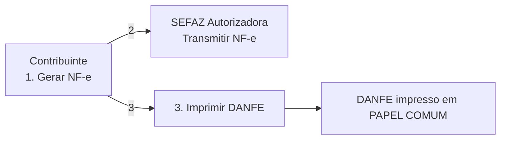
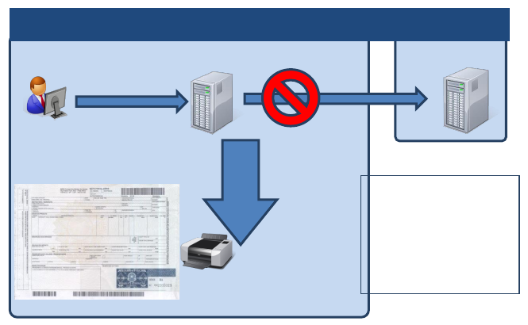
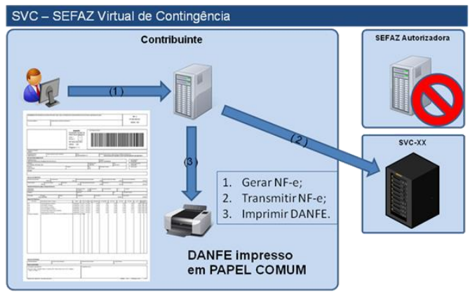
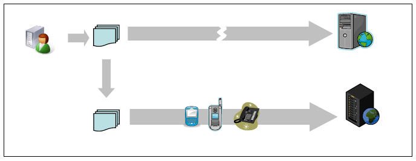
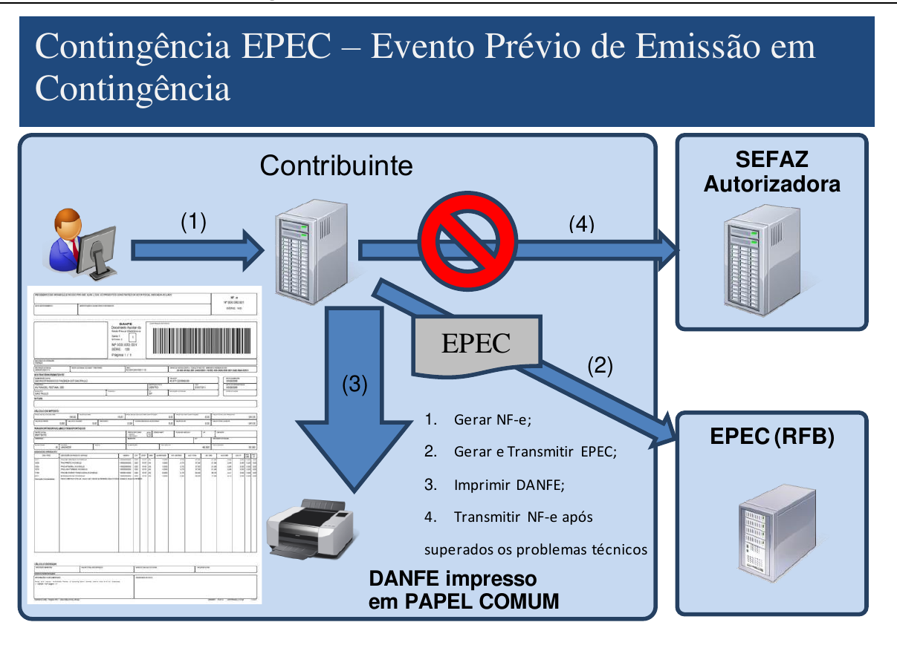
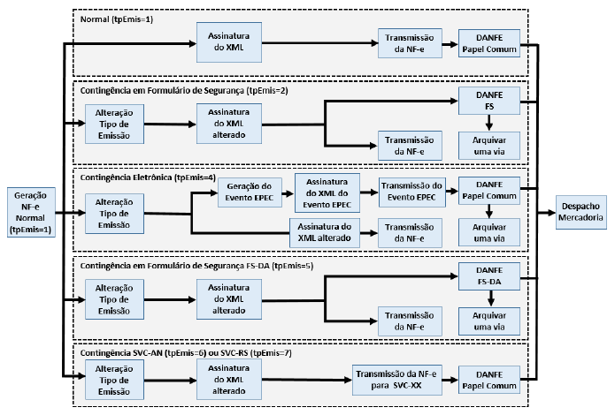

# 2.1. Modalidades de Emissão de NF-e

<!-- p.07 -->

O AJUSTE SINIEF 07/05 e as legislações específicas de cada UF disciplinam e detalham as modalidades de emissão de NF-e que serão descritos de forma simplificada a seguir.

Em um cenário de falha que impossibilite a emissão da NF-e na modalidade normal, o emissor deve escolher a modalidade de emissão de contingência que lhe for mais conveniente, ou até mesmo aguardar a normalização da situação para voltar a emitir a NF-e na modalidade normal, caso a emissão da NF-e não seja premente.

Como não existe precedência ou hierarquia nas modalidades de emissão da NF-e em contingência, o emissor pode adotar uma, algumas ou todas as modalidades que tiver à sua disposição, ou não adotá-las.

## 2.1.1. Emissão Normal

O processo de emissão normal é a situação desejada e mais adequada para o emissor, pois é a situação em que todos os recursos necessários para a emissão da NF-e estão operacionais e a autorização de uso da NF-e é concedida normalmente pela SEFAZ.

Nesta situação a emissão das NF-e é realizada normalmente com a impressão do DANFE em papel comum, após o recebimento da autorização de uso da NF-e.

*Figura: Emissão de NF-e – modalidade normal*

## 2.1.2. Contingência em Formulário de Segurança para impressão de Documento Auxiliar de Documento Fiscal Eletrônico – FS-DA

A contingência com o uso do formulário de segurança é o processo mais simples de implementar, sendo o processo de contingência que tem a menor dependência de recursos de infraestrutura, hardware e software para ser utilizado.

Sendo identificada a existência de qualquer incidente que prejudique ou impossibilite a transmissão das NF-e e/ou obtenção da autorização de uso da SEFAZ, a empresa pode adotar a Contingência com formulário de segurança que requer os seguintes procedimentos do emissor:

- atribuir novo número de NF-e para as NF-e transmitidas que estão pendentes de retorno;

<!-- p.08 -->

- alterar o campo tpEmis para “5”¹;
- informar o motivo de entrada em contingência com data, hora com minutos e segundos do seu início, que devem ser impressas no DANFE;
- regerar o XML da NF-e com outro número e, eventualmente, outra série, caso já tenha transmitido a NF-e com o campo tpEmis com valor “1”;
- impressão de pelo menos duas vias do DANFE em formulário de segurança constando no corpo a expressão **“DANFE em Contingência - impresso em decorrência de problemas técnicos”**, tendo as vias a seguinte destinação:
  - uma das vias permitirá o trânsito das mercadorias e deverá ser mantida em arquivo pelo destinatário pelo prazo estabelecido na legislação tributária para a guarda de documentos fiscais;
  - a outra via deverá ser mantida em arquivo pelo emitente pelo prazo estabelecido na legislação tributária para a guarda dos documentos fiscais.
- transmitir as NF-e imediatamente após a cessação dos problemas técnicos que impediam a transmissão da NF-e, observando o prazo limite de transmissão na legislação;
- a Chave de Acesso da NF-e é a mesma Chave de Acesso do DANFE emitido em Formulário de Segurança;
- tratar as NF-e transmitidas por ocasião da ocorrência dos problemas técnicos que estão pendentes de retorno.

*Figura: Contingência FS-DA*

> ¹ Se a empresa estiver utilizando seu estoque de FS-IA nos termos do Convênio ICMS 58/95, deverá utilizar o campo tpEmis com valor “2”.

## 2.1.3. Ambiente de Autorização – SVC

### 2.1.3.1. Ambiente de Contingência Alternativo

O ambiente de autorização da SVC, SEFAZ Virtual de Contingência, poderá assumir a recepção e autorização de NF-e de outra unidade da federação, quando solicitado pela SEFAZ de origem. Existirão dois locais alternativos de autorização em contingência, operados pelas estruturas das SEFAZ VIRTUAIS atuais:

- SVAN – SEFAZ Virtual do Ambiente Nacional;
- SVRS – SEFAZ Virtual do Rio Grande do Sul.

<!-- p.09 -->

Portanto, de forma natural, mesmo as estruturas de autorização das SEFAZ VIRTUAIS passarão a ter a contingência da SVC, utilizando a infraestrutura de autorização uma da outra. As SEFAZ autorizadoras adotarão uma das duas SVC, conforme definido no Ato COTEPE 39, de 04/09/2012:

> Art. 1º O Serviço de Sefaz Virtual de Contingência, previsto no Ajuste SINIEF 07/05, de 30 de setembro de 2005, e disciplinado pelo Convênio ICMS 32/12, de 30 de março de 2012, será oferecido:
>
> I - pela Sefaz Virtual do Ambiente Nacional, disponibilizada pela Secretaria da Receita Federal do Brasil, para os Estados do Acre, Alagoas, Amapá, Minas Gerais, Paraíba, Rio de Janeiro, Rio Grande do Sul, Rondônia, Roraima, Santa Catarina, Sergipe, São Paulo e Tocantins e para o Distrito Federal; e
>
> II - pela Sefaz Virtual do Rio Grande do Sul, disponibilizada pelo Estado do Rio Grande do Sul, para os estados do Amazonas, Bahia, Ceará, Espírito Santo, Goiás, Maranhão, Mato Grosso, Mato Grosso do Sul, Pará, Pernambuco, Piauí, Paraná e Rio Grande do Norte.

### 2.1.3.2. Ambiente de Produção e Ambiente de Teste

A SVC deverá manter um ambiente de produção e um ambiente de teste (homologação) disponíveis para as empresas. O ambiente de testes (homologação) deverá estar sempre ativo para todas as UF e o ambiente de produção será disponibilizado conforme ativação da SEFAZ de origem da circunscrição do contribuinte.

### 2.1.3.3. Ativação da SVC-XX

O ambiente de autorização da SVC é ativado pela UF interessada e uma vez acionado passa a recepcionar as NF-e enviadas pelas empresas credenciadas para emitir NF-e na UF. O ambiente da SVC deverá manter controle sobre os contribuintes credenciados para emissão de NF-e para todas as UF, através do sincronismo automático com o Cadastro Centralizado de Contribuintes (CCC), mantido na SEFAZ-RS.

Ocorrendo a indisponibilidade do ambiente de autorização normal, seja de forma programada ou não, a SEFAZ de origem acionará a SVC para que ative o serviço de recepção e autorização de NF-e para utilização dos contribuintes da sua circunscrição. Esta ativação será realizada na área de acesso restrito do Portal Nacional da NF-e ou na Extranet da SVC-RS, conforme o caso.

Finda a indisponibilidade, a SEFAZ de origem acionará novamente a SVC, agora para desativar o serviço. A desativação do serviço de recepção e autorização de NF-e pela SVC será precedida por um período de 15 minutos, em que ambos os ambientes estarão simultaneamente disponíveis, de forma a minimizar o impacto da mudança para as Empresas.

Inicialmente, a ativação / desativação será baseada em interação humana de um representante da SEFAZ de origem, acionando o ambiente de autorização da SVC específica para a sua UF.

Esta operação de ativação prevê o registro prévio da informação de Data-Hora de início e fim de funcionamento do ambiente da SVC, servindo, portanto, para as situações que a indisponibilidade da recepção de NF-e no ambiente normal de autorização da SEFAZ de origem seja previsível e de longa duração. É o caso das interrupções programadas para manutenção preventiva da infraestrutura de recepção e autorização da SEFAZ de origem.

### 2.1.3.4. Serviços Disponibilizados pela SVC

Serão disponibilizados pela SVC os mesmos serviços do ambiente normal de autorização, com as características que seguem:

**a) Serviço de Recepção**

<!-- p.10 -->

O serviço de recepção e autorização de NF-e pela SVC (Web Service: NFeAutorizacao) somente estará disponível conforme decisão sobre a ativação ou não da SVC para uma determinada SEFAZ de origem.

**b) Serviço de Retorno da Recepção**

O serviço de retorno da recepção do lote de NF-e pela SVC (Web Service: NFeRetAutorizacao) sempre estará disponível para consultar o resultado do processamento dos Lotes enviados para a SVC.

**c) Serviço de Registro de Eventos: Cancelamento**

O Serviço de Registro de Eventos (Web Service: RecepcaoEvento, seção 5.9 da Visão Geral do MOC 7.00), para o evento de Cancelamento (Tipo Evento=110111), sempre estará disponível somente para as NF-e autorizadas pela própria SVC, dentro das regras definidas para a operação normal de cancelamento.

Quando da utilização da SVC pela empresa, uma eventual necessidade de cancelamento de uma NF-e autorizada no ambiente normal deverá ser represada para comando posterior no ambiente de autorização normal da SEFAZ de origem da circunscrição do contribuinte.

**Nota:**

Futuramente, poderá ser analisada a possibilidade de cancelamento na SVC de uma NF-e emitida no ambiente de autorização normal da SEFAZ e/ou o cancelamento no ambiente de autorização normal da SEFAZ de uma NF-e autorizada pela SVC. Neste caso, somente será possível o cancelamento no outro ambiente, caso o documento autorizado já tenha sido automaticamente compartilhado entre o ambiente normal de autorização e o ambiente da SVC (e vice-versa).

**d) Serviço de Registro de Eventos: CC-e e outros**

O registro dos demais tipos de evento, tais como a Carta de Correção Eletrônica e outros, inicialmente não será disponibilizado para atendimento pela SVC.

**e) Serviço de Inutilização**

O Serviço de Inutilização (Web Service: NFeInutilizacao) não deverá ser oferecido pela SVC.

Quando da utilização da SVC pela empresa, uma eventual necessidade de inutilização de numeração identificada pela aplicação da empresa deverá ser represada para comando posterior no ambiente de autorização normal da SEFAZ de origem da circunscrição do contribuinte.

**f) Serviço de Consulta da Situação da NF-e**

O Serviço de Consulta da Situação atual da NF-e (Web Service: NFeConsultaProtocolo) sempre estará disponível somente para as NF-e autorizadas pela própria SVC, dentro das regras definidas para a operação normal desta consulta.

A Consulta da Situação da NF-e retorna toda a estrutura de autorização da NF-e, portanto com informações inexistentes na SVC para uma NF-e autorizada pela SEFAZ de origem.

**g) Serviço de Consulta do Status dos Serviços da SVC**

O Serviço de Consulta do Status dos Serviços (Web Service: NFeStatusServico) sempre deverá estar disponível na SVC. No caso de indisponibilidade do ambiente normal de autorização da SEFAZ de origem da circunscrição do contribuinte, a aplicação da empresa consultará este Web Service e identificará a oportunidade de trocar seu ambiente normal de autorização para utilização da SVC-XX.

O Serviço de Consulta ao Status da SVC poderá retornar os seguintes códigos de situação:

<!-- p.11 -->

- 107 - Serviço SVC em Operação;
- 113 - SVC em processo de desativação. SVC será desabilitada para a SEFAZ-XX em dd/mm/aa às hh:mm horas;
- 114 – SVC desabilitada pela SEFAZ Origem.

A empresa somente deverá efetuar a consulta ao Status do Serviço da SVC no caso de indisponibilidade do ambiente de autorização normal da SEFAZ.

Acessando a Consulta Status da SVC, a empresa somente poderá utilizar os serviços de recepção e autorização de NF-e da SVC quando obtiver o Status “107 - Serviço SVC em Operação”.

**h) Compartilhamento das NF-e autorizadas pela SVC**

Todas as NF-e autorizadas pela SVC serão automaticamente disponibilizadas para o Ambiente Nacional da NF-e e, consequentemente, distribuídas para as Sefaz envolvidas na operação. A princípio, quando o ambiente de autorização normal da UF retornar ao seu funcionamento normal, os documentos autorizados no ambiente da SVC já constarão na sua base de dados.

### 2.1.3.5. Uso da SVC Pela Empresa

**Operação “Em Contingência” a)**

A aplicação da empresa atualmente já mantém um controle sobre a disponibilidade do ambiente normal de autorização da sua SEFAZ de circunscrição, identificando o seu status de operação como “Normal” ou “Em Contingência”.

No caso da indisponibilidade do ambiente normal de autorização, para uso dos serviços de recepção e autorização da SVC-XX, a empresa deve adotar os seguintes procedimentos:

- Identificação que a SVC-XX foi ativada pela SEFAZ de origem da sua circunscrição, conforme resultado do Web Service de Consulta Status do Serviço, descrito anteriormente;
- Geração de novo arquivo XML da NF-e com as seguintes alterações:
  - Campo tpEmis alterado para “6” (SVC-AN) ou para “7” (SVC-RS), conforme legislação que define qual UF está vinculada a cada uma das SVC;
  - Informação do motivo da adoção da contingência (campo xJust) e da data e hora de início de utilização da SVC (campo dhCont), que também devem ser impressos no DANFE, conforme definido na legislação.
- Transmissão do Lote de NF-e para a SVC-XX e obtenção da autorização de uso;
- Impressão do DANFE em papel comum;
- Tratamento dos arquivos de NF-e transmitidos para a SEFAZ de origem antes da ocorrência dos problemas técnicos e que estão pendentes de retorno, cancelando aquelas NF-e autorizadas e que foram substituídas por NF-e autorizada na SVC, ou inutilizando a numeração de arquivos não recebidos ou processados.

<!-- p.12 -->

*Figura: SVC – SEFAZ Virtual de Contingência*

> **Nota:** No momento que a empresa detecta a indisponibilidade do ambiente de autorização normal, pode ser que tenha enviado uma NF-e e não tenha obtido o resultado deste pedido de autorização de uso. Neste caso, deve gerar outro número de NF-e, evitando que seja autorizado o mesmo número e série de NF-e no ambiente da SEFAZ autorizadora e da SVC.

**b) Controle do campo Tipo de Emissão (tpEmis)**

O campo “tpEmis” faz parte da Chave de Acesso desde a versão 2.0 do leiaute da NF-e e isso garante que duas Chaves de Acesso exatamente iguais não conseguirão ser autorizadas na SEFAZ autorizadora normal e na SEFAZ Virtual de Contingência.

Algumas regras de validação foram implementadas garantindo a integridade do funcionamento da SVC, da forma que segue:

**Ambiente de Autorização**

| Campo tpEmis | Normal | SVC-AN | SVC-RS |
|---|---|---|---|
| 1-Emissão Normal | OK | -x- | -x- |
| 2-Contingência em Formulário de Segurança | OK | -x- | -x- |
| 4-Contingência EPEC | OK | -x- | -x- |
| 5-Contingência em Formulário de Segurança FS-DA | OK | -x- | -x- |
| 6-Contingência SVC-AN | -x- | OK | -x- |
| 7-Contingência SVC-RS | -x- | -x- | OK |

### 2.1.3.6. Chave Natural da NF-e

**a) Numeração da Nota Fiscal**

A numeração da Nota Fiscal modelo 1/1A é disciplinada por legislação nacional e existem controles das SEFAZ sobre esta sequência de numeração. O advento da NF-e liberou o uso do AIDF, mas não desobrigou as empresas do controle da numeração. Ou seja, as empresas continuam sem poder emitir NF-e diferentes, com o mesmo CNPJ/CPF do emitente, Série e Número da Nota Fiscal.

**b) Chave Natural e Chave de Acesso**

<!-- p.13 -->

A Chave Natural da NF-e é composta pelos campos de UF, CNPJ/CPF do Emitente, Série e Número da NF-e, além do modelo do documento fiscal eletrônico. O sistema de recepção e autorização da SEFAZ valida a existência de uma NF-e previamente autorizada com uma determinada Chave Natural e rejeita novos pedidos de autorização de uso para NF-e com duplicidade da Chave Natural.

A existência de mais de um ambiente de autorização para a mesma SEFAZ de origem, e a impossibilidade técnica de manutenção de um sincronismo em tempo real entre estes dois ambientes, traz como consequência a possibilidade de autorização de Notas Fiscais Eletrônicas com a mesma Chave Natural, uma em cada ambiente de autorização.

Para evitar que estas duas NF-e com a mesma Chave Natural tivessem também a mesma Chave de Acesso, foi alterada a composição da Chave de Acesso, incluindo a informação do Tipo de Emissão, que passa a ter os valores:

- “6” – Autorização pela SVC-AN;
- “7” - Autorização pela SVC-RS.

A Chave de Acesso de uma NF-e contém todos os campos da Chave Natural, complementados com o Código Numérico (chave de segurança gerada pela empresa), Ano-Mês da emissão da NFe e o dígito de controle desta Chave de Acesso. A partir da versão 2.0, faz parte da Chave de Acesso a informação do Tipo de Emissão, conforme citado anteriormente.

**c) Chave Natural em Duplicidade**

Para evitar problemas futuros, tendo ciência que fatalmente ocorrerão erros nos aplicativos utilizados pelas empresas, a legislação que trata especificamente da numeração da Nota Fiscal Eletrônica será alterada para conviver com uma possível duplicidade da Chave Natural nas situações de autorização em ambientes operacionais diferentes, já que as duas NF-e terão uma autorização de uso fornecida pelo Fisco.

Conforme definição a ser considerada em legislação, as duas NF-e são válidas, embora também caracterizem uma inconformidade da aplicação da empresa na utilização da mesma numeração para NF-e diferentes. Nestes casos, a empresa emitente deve providenciar o imediato cancelamento da NF-e que não acobertou o trânsito físico da mercadoria, nem foi enviada para o destinatário.

Será disponibilizada uma consulta no Portal Nacional e no Portal das SEFAZ mostrando a Chave de Natural autorizada em duplicidade no ambiente normal da SEFAZ e no ambiente de contingência da SVC-XX.

A relação de web services dos ambientes de produção e homologação da SVC-AN e da SVC-RS pode ser consultada no Portal Nacional da Nota Fiscal Eletrônica (http://www.nfe.fazenda.gov.br para o ambiente de produção e http://hom.nfe.fazenda.gov.br para o ambiente de homologação).

## 2.1.4. Contingência Eletrônica com o uso do Evento Prévio de Emissão em Contingência – EPEC

Esta modalidade de contingência é baseada no conceito de Evento Prévio de Emissão em Contingência – EPEC, que contém as principais informações da NF-e que serão emitidas em contingência, que será prestada pelo emissor para SEFAZ.

<!-- p.14 -->

*Figura: EPEC – visão geral*

A emissão do EPEC poderá ser adotada por qualquer emissor que esteja impossibilitado de transmissão e/ou recepção das autorizações de uso de suas NF-e, adotando os seguintes passos:

- Gerar a NF-e com “tpEmis = 4”, mantendo também a informação do motivo de entrada em contingência com data e hora do início da contingência, com número diferente de qualquer NF-e que tenha sido transmitida com outro “tpEmis”;
- Gerar o arquivo XML do EPEC com as seguintes informações da NF-e:
  - UF, CNPJ/CPF e Inscrição Estadual do emitente;
  - Chave de Acesso;
  - UF e CNPJ ou CPF do destinatário;
  - Valor Total da NF-e, Valor Total do ICMS e Valor Total do ICMS-ST;
  - Outras informações constantes no leiaute.
- Assinar o arquivo com o certificado digital do emitente;
- Enviar o arquivo XML do EPEC para o Web Service de Registro de Eventos do AN;
- Impressão do DANFE da NF-e que consta do EPEC, em papel comum, constando no corpo a expressão “DANFE impresso em contingência - EPEC regularmente recebida pela Receita Federal do Brasil”.

Obtida a autorização do Evento (Número do Protocolo: 891xxxxxxxxxxxx), a exemplo do que ocorre com outros eventos da NF-e, este evento também será distribuído para as UF envolvidas na operação, inclusive para a própria UF do emitente.

Após a cessação dos problemas técnicos que impediam a transmissão da NF-e para UF de origem, a NF-e que deu origem a necessidade de uso da Contingência Eletrônica “EPEC” deverá ser transmitida para a SEFAZ de origem, observando o prazo limite de transmissão na legislação, bem como outros procedimentos constantes na legislação caso ocorra rejeição na autorização de uso.

> **Nota:** A Chave de Acesso desta NF-e é exatamente a mesma Chave de Acesso do EPEC autorizado anteriormente.

<!-- p.15 -->

*Figura: Contingência EPEC – Evento Prévio de Emissão em Contingência*

## 2.1.5. Quadro Resumo das modalidades de emissão da NF-e

<!-- p.16 -->

A seguir resumimos os principais procedimentos necessários para adequar a NF-e para a modalidade de emissão desejada.

