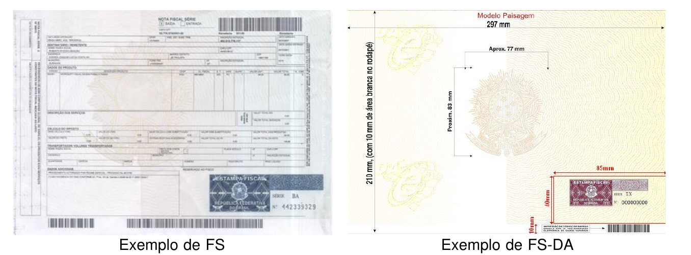
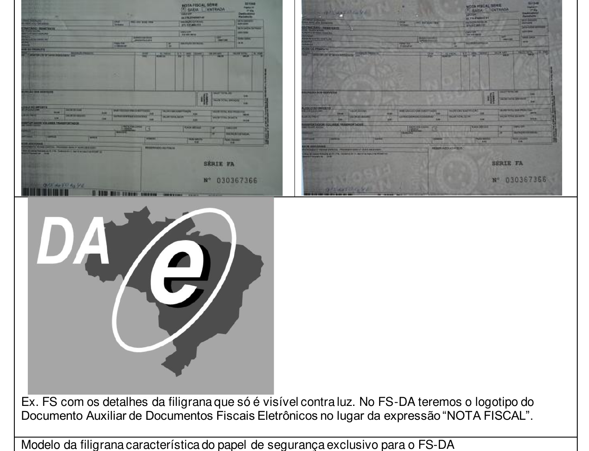
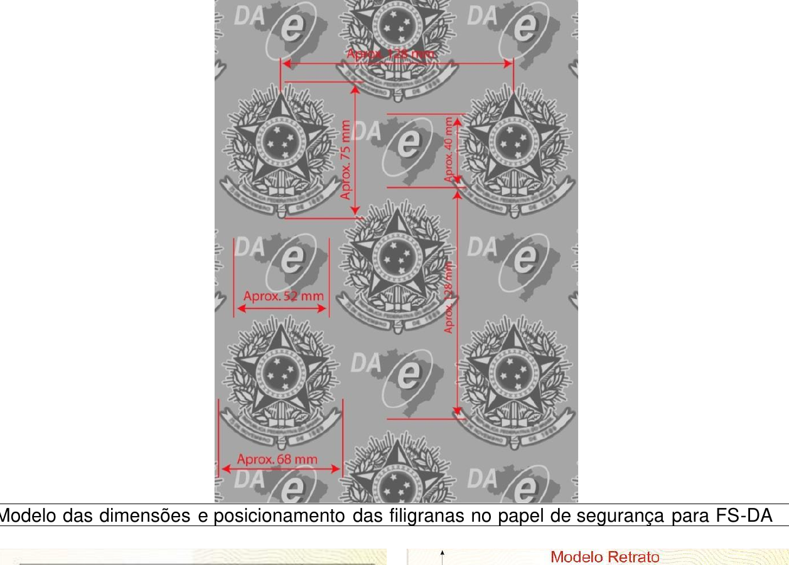
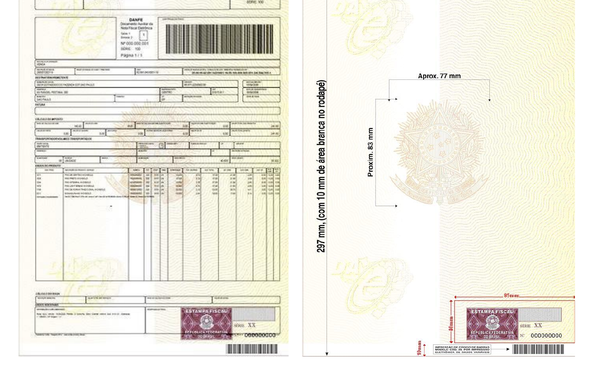

# 2.2. Documento Auxiliar da Nota Fiscal Eletrônica - DANFE

O DANFE é um documento fiscal auxiliar que tem a finalidade de acobertar a circulação da mercadoria e não se confunde com a NF-e da qual é mera representação gráfica, obedecendo ao disposto no Capítulo 3 do Anexo II do MOC 7. A sua validade está condicionada à existência da NF-e que representa devidamente autorizada na SEFAZ de origem.

As folhas soltas, formulário contínuo ou formulário pré-impresso são considerados papel comum e a sua aquisição ou confecção não está sujeito ao controle do fisco como ocorre com o formulário de segurança que é um impresso fiscal com normas rígidas de aquisição, controle e utilização.

## 2.2.1. Formulários de Segurança para Impressão do DANFE

Atualmente existem os seguintes tipos de formulários de segurança:

- **Formulário de Segurança – FS**: disciplinado pelos Convênios ICMS 58/95 e 131/95;
- **Formulário de Segurança para Impressão de Documento Auxiliar de Documento Fiscal Eletrônico - FS-DA**: disciplinado pelo Convênio ICMS 110/08 e Ato COTEPE 35/08.

O uso do formulário de segurança - **FS** será permitido apenas para consumir os estoques existentes, pois sua aquisição para impressão de DANFE não é mais autorizada.

O FS e o FS-DA podem ser fabricados por estabelecimento industrial gráfico previamente credenciado junto à COTEPE/ICMS, porém somente aquele último tem a possibilidade de ser distribuído através de estabelecimento gráfico credenciado como distribuidor junto à UF de interesse, mediante a obtenção de credenciamento, concedido por regime especial.

<!-- p.17 -->

Os formulários de segurança são confeccionados com requisitos de segurança com o objetivo de dificultar falsificação e fraudes. Estes requisitos são adicionados ou por ocasião da fabricação do papel de segurança produzido pelo processo *mould made* ou por ocasião da impressão no caso do FS fabricado com papel dotado de estampa fiscal, com recursos de segurança impressos. Assim, a legislação tributária permite o uso de formulários de segurança que atendam os seguintes requisitos:

- **FS com Estampa Fiscal** – impresso com calcografia com microtexto e imagem latente na área reservado ao fisco, o impresso deverá ter fundo numismático com tinta reagente a produtos químicos combinado com as Armas da República;
- **FS em Papel de Segurança** - com filigrana (marca d’água) produzida pelo processo "mould made", fibras coloridas e luminescentes, papel não fluorescente, microcápsulas de reagente químico e microporos que aumentem a aderência do toner ao papel.

Todos os formulários de segurança terão o número de controle do formulário com numeração sequencial de 000.000.001 a 999.999.999 e seriação de "AA" a "ZZ", impresso no quadro reservado ao fisco.

A identificação do formulário de segurança com calcografia é mais simples pela existência da estampa fiscal localizada no quadro reservado ao fisco e pelo fundo numismático com cor característica associada ao brasão das Armas da República no corpo do formulário.

A diferenciação entre o FS-IA e FS-DA produzidos por calcografia é estabelecida simultaneamente pela cor utilizada no fundo numismático, pela estampa fiscal, pelas Armas da República e pelo logotipo característico de formulário destinado a impressão de documento fiscal eletrônico.

O FS-IA tem o fundo numismático impresso na cor de tonalidade predominante esverdeada combinada com as Armas da República e estampa fiscal na cor azul pantone. O FS-DA tem o fundo numismático impresso na cor de tonalidade predominante Salmão pantone nº 155 combinada com as Armas da República ao lado do logotipo que caracteriza o Documento Auxiliar de Documento Fiscal Eletrônico e estampa fiscal na cor Vinho Pantone, conforme exemplos visualizados na figura abaixo.

*Figura: Exemplo de FS (esquerda) e Exemplo de FS-DA (direita)*

A identificação do formulário de segurança fabricado em papel de segurança não é tão evidente como é o formulário com calcografia, pois a primeira vista é um papel branco facilmente confundido com um papel comum.

A distinção deste papel de segurança deve ser feito pela filigrana (marca d’água) existente no seu corpo; pela seriação composta por duas letras e numeração sequencial de nove números aposta no espaço normalmente reservado ao fisco; pela impressão da identificação do adquirente e pelo códigos de barras impressos no rodapé inferior.

O FS–IA possui filigrana caracterizada com o brasão de Armas da República intercalada com a expressão “NOTA FISCAL”, enquanto que o FS-DA possui filigrana caracterizada pelo brasão das Armas da República intercalada com o logotipo do Documento Auxiliar de Documentos Fiscais <!-- p.18 -->Eletrônicos. Estas filigranas somente se tornam visíveis contra a luz, conformes exemplos e modelos reproduzidos nas figuras abaixo.

*Figura: Ex. FS com os detalhes da filigrana que só é visível contra luz. No FS-DA teremos o logotipo do Documento Auxiliar de Documentos Fiscais Eletrônicos no lugar da expressão “NOTA FISCAL”. Modelo da filigrana característica do papel de segurança exclusivo para o FS-DA*

## 2.2.2. Localização da Estampa Fiscal no FS -DA

A estampa fiscal é impressa na área reservado ao fisco que está localizada no canto inferior direito do formulário de segurança.

Nesta mesma área também é impresso a série e o número de controle do impresso. Assim, o emissor deve tomar os cuidados necessários para que o recibo do canhoto de entrega não utilize o espaço de 40 mm x 85 mm do canto inferior do impresso, deslocando-o para a parte superior do formulário.

<!-- p.19 -->

*Figura: Modelo das dimensões e posicionamento das filigranas no papel de segurança para FS-DA*

*Figura: Ex. de DANFE com recibo deslocado para a parte superior.*

Importante destacar que o FS-DA tem um código de barras com a identificação da sua origem e seu usuário pré-impresso no rodapé inferior, que deve ser preservado, pois será utilizado na fiscalização de trânsito.

<!-- p.20 -->

## 2.2.3. Impressão do DANFE em Contingência com Formulário de Segurança

Quando a modalidade emissão de contingência for baseada no uso de formulário de segurança, o DANFE deve ser impresso no mesmo tipo de formulário de segurança declarado no campo *tpEmis* da NF-e.

Nos casos de contingência com uso de formulário de segurança, a impressão do DANFE em papel comum contraria a legislação e ocasiona graves consequências ao emitente, pelo descumprimento de obrigação acessória, caracterizando ainda a inidoneidade do DANFE para efeito de circulação da mercadoria e de escrituração e aproveitamento do crédito pelo seu destinatário.

O formulário de segurança pode ser utilizado para impressão do DANFE em qualquer modalidade de emissão, contudo, o emissor deverá formalizar a opção pelo uso do formulário de segurança em todas as operações no livro Registro de Documentos Fiscais e Termos de Ocorrência – RUDFTO, modelo 6.

**Impressão do DANFE × Modalidade de emissão da NF-e**

<!-- REVISAR p.20: o quadro cita "Convênio ICMS 58/57" para o FS-IA, enquanto o texto (p.08 e p.16) cita Convênio ICMS 58/95; conferir se é erro da fonte -->

| Impressão do DANFE | Normal | FS-IA | FS-DA | SVC | EPEC |
|---|---|---|---|---|---|
| em papel comum | Regular | Irregular | Irregular | Regular | Regular |
| em FS-IA (Convênio ICMS 58/57) | Regular, requer opção do emissor | Regular | Irregular | Regular, requer opção do emissor | Regular, requer opção do emissor |
| em FS-DA (Convênio ICMS 110/08) | Regular, requer opção do emissor | Irregular | Regular | Regular, requer opção do emissor | Regular, requer opção do emissor |

Legenda: DANFE regular; DANFE irregular; DANFE regular, mas requer opção do emissor.
