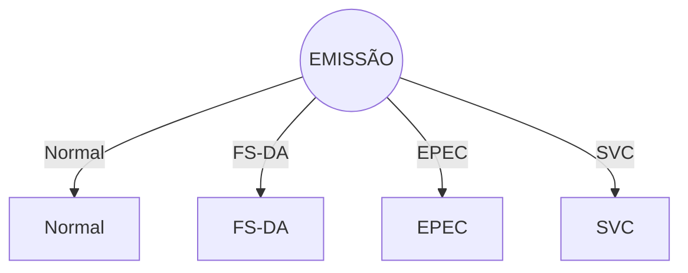

# 2. Contingência da NF-e (modelo 55)

O Sistema da NF-e é baseado no conceito de documento fiscal eletrônico: um arquivo eletrônico com as informações fiscais da operação comercial que tenha a assinatura digital do emissor.

A validade de uma NF-e está condicionada à existência da respectiva autorização de uso concedida pela Secretaria de Fazenda de localização do emissor ou pelo órgão por ela designado para autorizar a NF-e em seu nome, como são os casos da SEFAZ Virtual do Ambiente Nacional, da SEFAZ Virtual do Rio Grande do Sul e das Sefaz Virtuais de Contingência (SVC).

A obtenção da autorização de uso da NF-e é um processo que envolve diversos recursos de infraestrutura, hardware e software. O mau funcionamento ou a indisponibilidade de qualquer um destes recursos pode prejudicar o processo de autorização da NF-e, com reflexos nos negócios do emissor da NF-e, que fica impossibilitado de obter a prévia autorização de uso da NF-e exigida na legislação para a emissão do DANFE para acompanhar a circulação da mercadoria.

A alta disponibilidade é uma das premissas básicas do sistema da NF-e e os sistemas de recepção de NF-e das UF foram construídos para funcionar em regime de 24x7. Contudo, existem diversos outros componentes do sistema que podem apresentar falhas e comprometer a disponibilidade dos serviços, exigindo alternativas de emissão da NF-e em contingência.

<!-- p.06 -->

Atualmente existem as seguintes modalidades de emissão de NF-e:

- **a) Normal** – é o procedimento padrão de emissão da NF-e com transmissão da NF-e para a Secretaria de Fazenda da unidade federada onde o emissor está estabelecido para obter a autorização de uso. O DANFE será impresso em papel comum após o recebimento da autorização de uso da NF-e;
- **b) FS-DA** – Contingência com uso do Formulário de Segurança para impressão de Documento Auxiliar do Documento Fiscal eletrônico – é a alternativa mais simples para a situação em que exista algum impedimento para obtenção da autorização de uso da NF-e, como por exemplo, um problema no acesso à internet ou a indisponibilidade da SEFAZ de origem do emissor. Neste caso, o emissor pode optar pela emissão da NF-e em contingência com a impressão do DANFE em Formulário de Segurança. O envio das NF-e emitidas nesta situação para SEFAZ de origem será realizado quando cessarem os problemas técnicos que impediam a sua transmissão. Cabe ressaltar que a esta modalidade de contingência ainda é possível utilizando-se formulários de segurança para impressor autônomo, nos termos da legislação vigente até 2010, até o final do estoque daqueles formulários;
- **c) EPEC** – Evento Prévio de Emissão em Contingência – é alternativa de emissão de NF-e em contingência com o registro prévio do resumo das NF-e emitidas. O registro prévio das NF-e permite a impressão do DANFE em papel comum. A validade do DANFE está condicionada à posterior transmissão da NF-e para a SEFAZ de Origem;
- **d) SVC** – Sefaz Virtual de Contingência – é alternativa de emissão de NF-e em contingência com transmissão da NF-e para uma das Sefaz Virtuais de Contingência. Nesta modalidade de contingência o DANFE pode ser impresso em papel comum e não existe necessidade de transmissão da NF-e para a SEFAZ de origem quando cessarem os problemas técnicos que impediam a transmissão. A utilização da SVC depende de ativação da SEFAZ de origem, o que significa dizer que a SVC só entra em operação quando a SEFAZ de origem estiver com problemas técnicos que impossibilitam a recepção da NF-e.
