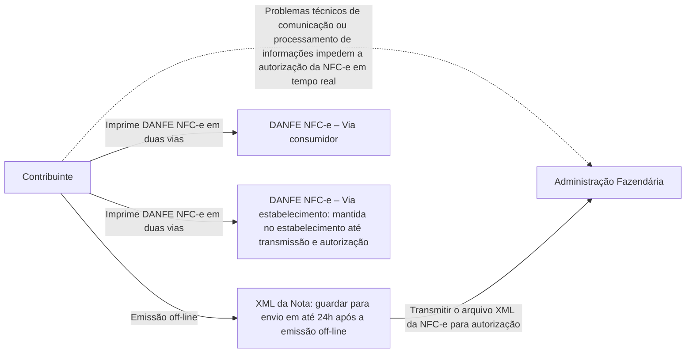

<!-- p.05 -->

# 2. Conceito e Modelo Operacional da Contingência Off-line para NFC-e

O modelo operacional atual da NFC-e prevê a utilização de “Contingência Off-line NFC-e”.

Nesta modalidade, o contribuinte que estiver com problemas técnicos para autorização da NFC-e poderá emiti-la em contingência off-line, imprimir o DANFE NFC-e e depois de superado o problema técnico, transmitir o arquivo XML da NFC-e para autorização. O prazo estabelecido pelo Fisco, atualmente, é o final do primeiro dia útil subsequente contado a partir de sua emissão.

*Figura 1 – Conceito e Modelo Operacional da Contingência Off-line para NFC-e*

<!-- p.06 -->

A possibilidade de uso da contingência off-line para NFC-e é um decisão exclusiva da Unidade Federada, que poderá vir a não autorizar esta modalidade de contingência para todos ou determinados contribuintes emissores de NFC-e. Para tanto, foi definida regra de validação específica no leiaute possibilitando a implementação desta decisão pela UF.

A legislação nacional da NFC-e prevê a possibilidade, inclusive, que, a critério da Unidade Federada, sejam adotadas outras formas de contingência, ou utilização concomitante, como a emissão de cupom fiscal em papel por ECF, ou a geração de Cupom Fiscal Eletrônico por SAT Fiscal.

A contingência off-line é de uso exclusivo como alternativa de contingência de emissão de NFC-e, não sendo aceita esta modalidade de contingência, em nenhuma hipótese, para a NF-e. Para garantia desta premissa foi também inserida regra de validação específica para garantir o cumprimento desta regra.

A decisão pela entrada em contingência, bem como a escolha da alternativa de contingência (dentre as aceitas pela UF) é exclusiva do contribuinte, devendo ser utilizada nas situações em que ocorram problemas técnicos de comunicação ou processamento de informações que impeçam a autorização da NFC-e em tempo real. Não existe exigência de obtenção, pelo contribuinte, de autorização prévia do Fisco para entrada em contingência, tampouco de efetuar qualquer termo de início e término de contingência no livro modelo 6 – RUDFTO.

Todavia, alertamos que as NFC-e devem ser autorizadas, preferencialmente, em tempo real, antes da ocorrência do fato gerador, e que as alternativas de contingência somente devem ser acionadas em situações extremas, que interfiram de forma significativa na atividade operacional do estabelecimento.

Assim, a emissão de NFC-e em contingência off-line deve ser tratada como exceção, sendo que a regra deve ser a emissão com autorização em tempo real.

O Fisco poderá solicitar esclarecimentos, e até mesmo restringir ao contribuinte a utilização da modalidade de contingência off-line, caso seja identificado que o emissor da NFC-e utiliza a contingência em demasia e sem justificativa aceitável, quando comparado a outros contribuintes em situação similar.

É importante ressaltar ainda que a utilização de contingência off-line deve se restringir às situações de efetiva impossibilidade de autorização da NFC-e em tempo real, haja vista que pode vir a representar custos e riscos adicionais ao contribuinte, em especial, pelos seguintes aspectos:

- As NFC-e emitidas em contingência off-line deverão ser posteriormente encaminhadas para autorização, podendo virem a ser rejeitadas, gerando possíveis retrabalhos e problemas junto ao cliente, uma vez que a operação comercial já ocorreu;
- As NFC-e emitidas em contingência off-line estarão disponíveis para consulta pública pelos consumidores no site da SEFAZ ou via consulta QR Code apenas em momento posterior, quando forem autorizadas, havendo risco de reclamações ou denúncias de consumidores por não localizarem a sua NFC-e na consulta realizada imediatamente após a venda;
- Na utilização de contingência off-line, o contribuinte assume o risco de perda da informação das NFC-e emitidas em contingência, até que as mesmas constem da base de dados do Fisco. Na autorização online da NFC-e a informação já está segura na base de dados do Fisco;

O nível de serviço acordado para a NFC-e pelos sistemas dos Estados Autorizadores deve ser inferior a 30 (trinta) segundos, em 85% do tempo.
