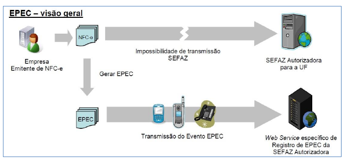
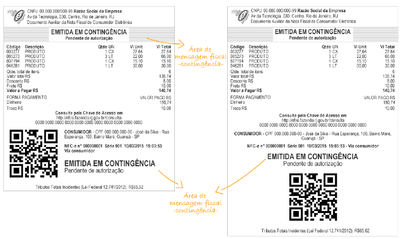
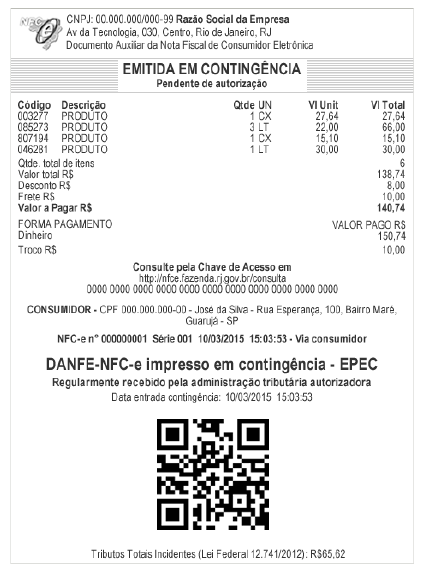

<!-- p.06 -->

# 3. Detalhes Técnicos NFC-e Emitida em Contingência

Ao emitir uma NFC-e em contingência, a primeira decisão é sobre a forma de emissão em contingência dentre as disponíveis para NFC-e (de acordo as alternativas aceitas pela Unidade Federada).

No arquivo eletrônico XML da NFC-e deverá ser indicada a forma de emissão em contingência pelo preenchimento do campo tpEmis (B22) com um dos seguintes conteúdos:

- 1 - Emissão normal (não em contingência);
- 4 - Contingência EPEC (Evento Prévio da Emissão em Contingência);
- 9 - Contingência off-line da NFC-e.

<!-- p.07 -->

*Figura 2 – Evento de Emissão em Contingência, Visão Geral*

Na escolha de contingência off-line da NFC-e (tpEmis = 9) não é necessária a adoção de série específica ou a utilização de papel especial. Todavia, deve ser observado o prazo de envio para autorização da NFC-e até o final do primeiro dia útil subsequente contado a partir de sua emissão em contingência.

Qualquer que seja a alternativa de contingência adotada, a informação de operação em contingência deve ser impressa no DANFE NFC-e.

*Figura 3 - DANFE de uma NFC-e Emitida em Contingência Off-Line*

Além disso, o QR Code impresso no DANFE da NFC-e emitida em contingência conterá a informação da data e hora de emissão do documento fiscal eletrônico. Isto possibilita que na consulta via QR Code, pelo consumidor, a SEFAZ retorne a informação de que se trata de emissão em contingência e o prazo máximo para o documento fiscal eletrônico constar da base de dados do Fisco.

<!-- p.08 -->

Nos casos de contingências 4 e 9 o contribuinte deverá preencher, obrigatoriamente, os campos de Data e Hora da entrada em contingência (dhCont B28) e de Justificativa da entrada em contingência (xJust B29) que, todavia, não serão impressos no DANFE NFC-e.

Outro ponto importante é a recomendação de que se avance um número na sequência da numeração quando da entrada em contingência a fim de evitar que a NFC-e emitida em contingência seja posteriormente rejeitada por duplicidade.

Também cabe alertar que, superado o problema técnico, na transmissão da NFC-e emitida em contingência, deve-se manter a mesma chave de acesso, inclusive com a manutenção do mesmo código numérico original (campo cNF B03).

*Figura 4 - DANFE de uma NFC-e Emitida em Contingência EPEC*
