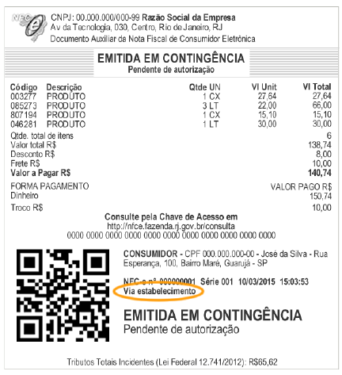

<!-- p.08 -->

# 4. Modelo Operacional Contingência Off-line NFC-e

A contingência off-line para a NFC-e foi pensada como uma forma de garantir ao contribuinte a minimização de risco de impacto operacional pela implantação e utilização da NFC-e no varejo, sem acarretar a perda de controle pelo Fisco.

A operação comercial no varejo, como regra, envolve uma situação crítica em que o consumidor está presente no estabelecimento, escolhe a mercadoria e se dirige ao caixa para pagamento e retirada do produto. Dessa forma, a autorização prévia da NFC-e na frente de caixa exige um tempo de resposta adequado, da ordem de poucos segundos, de forma a evitar reclamações dos consumidores pela demora no atendimento.

Assim, em uma situação de problemas técnicos, seja nos servidores ou rede de comunicação interna do contribuinte, seja no sistema de autorização da SEFAZ, ou ainda no meio de comunicação Internet, <!-- p.09 --> em que o tempo de autorização não se mostre adequado, ou não se consiga a autorização, não podem ocorrer reflexos significativos na operação de frente de caixa.

Nessas situações é indicada a adoção da contingência off-line, em que as NFC-e são geradas, assinadas e os respectivos DANFE NFC-e são impressos sem a autorização prévia da SEFAZ. Posteriormente, superado o problema técnico, até o final do primeiro dia útil seguinte à emissão, as NFC-e emitidas em contingência deverão ser transmitidas para obtenção da autorização de uso.

A seguir detalhamos o preenchimento dos campos específicos da NFC-e no caso de emissão em contingência off-line:

- Mod = 65 (NFC-e);
- dhCont = data e hora de entrada em contingência;
- xJust = preencher com a justificativa da entrada em contingência;
- idDest = 1 (operação interna);
- tpEmis = 9 (contingência off-line);
- finfe = 1 (finalidade de emissão normal);
- indFinal = 1 (indicador de operação com consumidor final);
- indPres = 1 (indicador de presença do consumidor no estabelecimento).

No caso de emissão em contingência deverá constar obrigatoriamente no DANFE NFC-e a mensagem “EMITIDA EM CONTINGÊNCIA”.

O DANFE NFC-e tem por característica não trazer impressas as informações detalhadas dos itens de mercadorias, que serão apresentadas no documento Detalhe da Venda ou no resultado da consulta pública da NFC-e no portal da Secretaria de Fazenda.

No caso de emissão em contingência off-line, é obrigatória a impressão do Detalhe da Venda e do DANFE NFC-e, sendo que, nesta hipótese, deverá ser impressa uma segunda via do DANFE NFC-e que deverá permanecer à disposição do Fisco no estabelecimento até que tenha sido transmitida e autorizada a respectiva NFC-e emitida em contingência. Esta obrigação poderá, a critério da Unidade Federada, ser dispensada.

Esta segunda via deverá estar identificada como “Via do Estabelecimento” conforme modelo constante da figura a seguir. Alternativamente à impressão da segunda via do DANFE NFC-e, quando de emissão em contingência, o contribuinte poderá optar pela guarda eletrônica, em local seguro, do respectivo arquivo XML da NFC-e. Neste caso, o contribuinte deverá possibilitar a impressão do respectivo DANFE NFC-e para apresentação ao fisco quando solicitado.

<!-- p.10 -->

*Figura 5 – Contingência Off-Line, Via do Estabelecimento*

Para poder fazer uso desta opção de guarda eletrônica do arquivo XML emitido em contingência, o contribuinte deverá, previamente, lavrar termo no livro Registro de Utilização de Documentos Fiscais e Termos de Ocorrência - modelo 6, ou formalizar declaração de opção segundo disciplina que vier a ser estabelecida por sua Unidade Federada, assumindo total responsabilidade pela guarda do arquivo e declarando ter ciência que não poderá, posteriormente, alegar problemas técnicos para justificar a eventual perda desta informação eletrônica sob sua posse, assumindo as consequências legais por ventura cabíveis.
