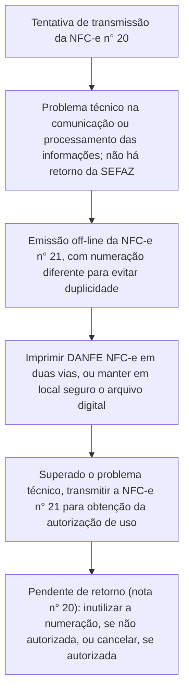

<!-- p.11 -->

# 5. Exemplo Prático

<!-- REVISAR p.11: a legenda original repete "Figura 5" (também usada na Via do Estabelecimento, p.10); numeração mantida como na fonte -->

*Figura 5 – Exemplo Prático de Emissão em Contingência*

**Tentativa de transmissão**

- Há a tentativa de transmissão de uma NFC-e com numeração 20.
- Há um problema técnico na comunicação ou processamento das informações.
- Não há retorno da SEFAZ.

> **Observação:** É vedada a reutilização, em contingência, de número de NFC-e transmitida com tipo de emissão 'Normal'.

**Emissão off-line**

A NFC-e é emitida offline com numeração diferente, n° 21, para evitar a duplicidade da nota. Deve-se imprimir o DANFE-NFCe, em duas vias ou manter em local seguro o arquivo digital, sendo impresso para apresentar ao fisco quando solicitado.

**Observações:**

- Caso na tentativa de transmissão (opção 1) o serviço de comunicação seja retomado, e a NFC-e autorizada, o procedimento correto é cancelar a NFC-e n° 20.
- Caso não haja tentativa de transmissão, a numeração utilizada na emissão off-line pode ser mantida.

**Transmissão**

Superado o problema técnico, a NFC-e n° 21 é transmitida para obtenção da autorização de uso.

Se vier a ser rejeitada, gerar novamente o arquivo com a mesma numeração e série, sanando a irregularidade e transmitir novamente.

Para aquela que ficou pendente de retorno (a nota n° 20 desse exemplo):

<!-- p.12 -->

- inutilizar a numeração, se não autorizada; ou
- cancelar, se autorizada.
