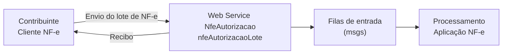

<!-- p.71 -->

# 5.1. Web Service – NfeAutorizacao

**Função:** serviço destinado à recepção de mensagens de lote de NF-e.

**Processo:** assíncrono/síncrono.

**Método:** nfeAutorizacaoLote

**Figura 5-1 – Fluxo do Web Service nfeAutorizacaoLote (Recepção de Lote de NF-e)**

## 5.1.1. Leiaute Mensagem de Entrada

Entrada: Estrutura XML com as notas fiscais enviadas.

**Schema XML: enviNFe_v4.00.xsd**

**Tabela 5-1 – Leiaute Mensagem de Entrada do Web Service nfeAutorizacao**

| # | Campo | Ele | Pai | Tipo | Ocor. | Tam. | Descrição/Observação |
|---|---|---|---|---|---|---|---|
| AP01 | enviNFe | Raiz | - | - | - | - | TAG raiz |
| AP02 | versao | A | AP01 | N | 1-1 | 1-2v2 | Versão do leiaute |
| AP03 | idLote | E | AP01 | N | 1-1 | 1-15 | Identificador de controle do envio do lote. Número sequencial auto incremental, de controle correspondente ao identificador único do lote enviado. A responsabilidade de gerar e controlar esse número é exclusiva do contribuinte. |
| AP03a | indSinc | E | AP01 | N | 1-1 | 1 | 0=Não. 1=Empresa solicita processamento síncrono do Lote de NF-e (sem a geração de Recibo para consulta futura); Nota: O processamento síncrono do Lote corresponde a entrega da resposta do processamento das NF-e do Lote, sem a geração de um Recibo de Lote para consulta futura. A resposta de forma síncrona pela SEFAZ Autorizadora só ocorrerá se: • a empresa solicitar e constar unicamente uma NF-e no Lote; • a SEFAZ Autorizadora implementar o processamento síncrono para a resposta do Lote de NF-e. |
| <!-- p.72 --> AP04 | NFe | G | AP01 | xml | 1-50 | - | Conjunto de NF-e transmitidas (máximo de 50 NF-e), seguindo definição do documento MOC – Anexo I – Leiaute e Regras de Validação da NF-e e da NFC-e. |

O tamanho médio da NF-e é de aproximadamente 10 KB (dependendo da quantidade de itens), necessitando de um dimensionamento correto da rede interna e do canal de Internet das empresas e da SEFAZ.

Para minimizar a necessidade de uma maior infraestrutura de rede, a mensagem de envio de Lote de NF-e poderá ser compactada, a critério da empresa (estima-se que a compactação da mensagem de Lote irá reduzir aproximadamente em 70% o tamanho desta mensagem), por meio das seguintes especificações:

- Nome do Web Service: “nfeAutorizacao”, conforme descrito neste item;
- Nome do Método: NfeAutorizacaoLoteZip;

O novo método tem unicamente o parâmetro “nfeDadosMsgZip”, contendo a mensagem “enviNFe” compactada no padrão GZip, onde o resultado da compactação é convertido para Base64.

A aplicação da SEFAZ irá descompactar a mensagem recebida, seguindo o procedimento normal do tratamento do Lote descompactado. Em caso de falha no processo de descompactação será retornado o erro “416 – Rejeição: Falha na descompactação da área de dados”.

## 5.1.2. Leiaute Mensagem de Retorno

Retorno: Estrutura XML com a mensagem do resultado da transmissão.

**Schema XML: retEnviNFe_v4.00.xsd**

**Tabela 5-2 – Leiaute Mensagem de Retorno do Web Service nfeAutorizacao**

| # | Campo | Ele | Pai | Tipo | Ocor. | Tam. | Descrição/Observação |
|---|---|---|---|---|---|---|---|
| AR01 | retEnviNFe | Raiz | - | - | - | - | TAG raiz da Resposta |
| AR02 | versao | A | AR01 | N | 1-1 | 1-2v2 | Versão do leiaute |
| AR03 | tpAmb | E | AR01 | N | 1-1 | 1 | Identificação do Ambiente: 1=Produção/2= Homologação |
| AR04 | verAplic | E | AR01 | C | 1-1 | 1-20 | Versão do Aplicativo que recebeu o Lote. A versão deve ser iniciada com a sigla da UF nos casos de WS próprio ou a sigla SVAN ou SVRS nos demais casos. |
| AR05 | cStat | E | AR01 | N | 1-1 | 3 | Código do status da resposta (conforme item 4.4.1 do documento MOC – Anexo I – Leiaute NF-e/NFC-e) |
| AR06 | xMotivo | E | AR01 | C | 1-1 | 1-255 | Descrição literal do status da resposta |
| AR06a | cUF | E | AR01 | N | 1-1 | 2 | Código da UF que atendeu a solicitação. |
| AR06b | dhRecbto | E | AR01 | D | 1-1 | | Preenchido com a data e hora do processamento (informado também no caso de rejeição). Formato: “AAAA-MM-DDThh:mm:ssTZD” (UTC – Universal Coordinated Time). |
| AR07 | infRec | CG | AR01 | - | 0-1 | - | Dados do Recibo do Lote (Só é gerado se o Lote for aceito e o processamento for assíncrono) |
| AR08 | nRec | E | AR07 | N | 1-1 | 15 | Número do Recibo gerado pelo Portal da Secretaria de Fazenda Estadual, conforme descrição do item 4.3.4 |
| <!-- p.73 --> AR10 | tMed | E | AR07 | N | 1-1 | Nv1-4 | Tempo médio de resposta do serviço (em segundos) dos últimos 5 minutos, conforme descrição do item 4.3.6 Nota: Caso o tempo médio de resposta fique abaixo de 1 (um) segundo, o tempo será informado como 1 segundo. Arredondar as frações de segundos para cima. |
| AR11 | protNFe | CG | AR01 | - | 0-1 | - | Dados do Protocolo de recebimento da NF-e gerado no caso do processamento síncrono do Lote de NF-e, conforme descrito no item 5.2.2. |

## 5.1.3. Descrição do Processamento do Lote de NF-e

No caso do processamento assíncrono, o processamento do Lote de NF-e recepcionado é realizado pelo Servidor de Processamento de NF-e, que consome as mensagens armazenadas na fila de entrada e faz a validação de forma e das regras de negócios e armazena o resultado do processamento na fila de saída.

## 5.1.4. Geração da Resposta com o Recibo

### 5.1.4.1. Erro no Lote

Caso ocorra algum problema de validação no Lote de NF-e, o aplicativo deverá retornar uma mensagem com as seguintes informações:

- a identificação do ambiente;
- a versão do aplicativo;
- o código e a respectiva mensagem de erro, segundo a estrutura da Tabela 4-7.

### 5.1.4.2. Processamento Assíncrono

No caso de processamento assíncrono do Lote de NF-e, não existindo qualquer problema nas validações acima referidas, o aplicativo poderá gerar um número de recibo e gravar a mensagem, juntamente com o número do recibo e o CNPJ do transmissor. O número do recibo gerado pelo Portal da Secretaria de Fazenda Estadual será a chave de consulta do serviço de consulta ao resultado do processamento do lote.

Após a gravação da mensagem na fila de entrada será retornada uma mensagem de confirmação de recebimento para o transmissor, com as seguintes informações:

- a identificação do ambiente;
- a versão do aplicativo;
- o código 103 e o literal “Lote recebido com Sucesso”;
- o código da UF que atendeu a solicitação;
- o Número do Recibo de Lote de que trata o item 4.3.4, com data, hora local de recebimento da mensagem;
- Tempo Médio de Resposta do serviço de processamento dos lotes nos últimos 5 minutos, tratado no item 4.3.6.

### 5.1.4.3. Processamento Síncrono

No caso de processamento síncrono do Lote de NF-e, as validações da NF-e serão feitas na sequência, sem a geração de um Número de Recibo.

<!-- p.74 -->

## 5.1.5. Regras de Validação

Serão aplicadas as regras de validação genéricas conforme os grupos citados na Tabela 5-3, detalhados na Seção 4.1 do documento Anexo I – Leiaute e Regras de Validação da NF-e e da NFC-e.

**Tabela 5-3 – Regras de Validação do Web Service nfeAutorizacao**

| Grupo | Descrição |
|---|---|
| A | Validação do Certificado de Transmissão (protocolo TLS) |
| B | Validação Inicial da Mensagem no Web Service |
| D | Validação da Área de Dados |
| E | Validação do Certificado Digital de Assinatura |
| F | Validação da Assinatura Digital |

As regras de validação específicas deste WS estão descritas na Seção 4.1 do documento Anexo I – Leiaute e Regras de Validação da NF-e e da NFC-e.

## 5.1.6. Final do Processamento do Lote

A validação da NF-e poderá resultar em:

- Rejeição – a NF-e será descartada, não sendo armazenada no Banco de Dados podendo ser corrigida e novamente transmitida;
- Autorização de uso – a NF-e será armazenada no Banco de Dados;
- Denegação de uso – a NF-e será armazenada no Banco de Dados com esse status nos casos de irregularidade fiscal do emitente.

Ou seja:

| Validação (NF-e) | Validação (Emitente) | Situação da NF-e | Uso como Doc Fiscal | Para o contribuinte | Banco de Dados |
|---|---|---|---|---|---|
| Inválida | Irrelevante | Rejeição | Vedado | Corrigir NF-e | Não gravar |
| Válida | Irregular | Denegação de uso | Vedado | A operação não poderá ser realizada | Gravar |
| Válida | Regular | Autorização de uso | Permitido | A operação está autorizada | Gravar |

A validação da NF-e poderá resultar em (NT 2017.001):

- Rejeição sem avisos – a NF-e será descartada, não sendo armazenada no Banco de Dados podendo ser corrigida e novamente transmitida;
- Rejeição com avisos – a NF-e será descartada, não sendo armazenada no Banco de Dados podendo ser corrigida e novamente transmitida a solucionar a origem do(s) avisos;
- Autorização de uso sem avisos – a NF-e será armazenada no Banco de Dados;
- Autorização de uso com avisos – a NF-e será armazenada no Banco de Dados, e não poderá ser corrigida e novamente transmitida para solucionar a origem do(s) avisos;
- Denegação de uso – caso o emitente ou o destinatário estejam situação irregular de acordo com o Cadastro Centralizado de Contribuintes (CCC), a NF-e será armazenada no Banco de Dados com esse status, independente dos demais resultados de aplicação de regras de validação.

Ou seja:

**Tabela 5-4 – Posíveis Resultados do Web Service nfeAutorizacao**

| Validação (NF-e) | Validação (Emitente ou destinatário) | Situação da NF-e | Uso como Documento Fiscal | Para o contribuinte | Banco de Dados |
|---|---|---|---|---|---|
| Irrelevante | Irregular | Denegação de uso | Vedado | A operação não poderá ser realizada | Gravar |
| Inválida | Ambos regulares | Rejeição com avisos | Vedado | Corrigir NF-e | Não gravar |
| Inválida | Ambos regulares | Rejeição sem avisos | Vedado | Corrigir NF-e | Não gravar |
| <!-- p.75 --> Válida | Ambos regulares | Autorização de uso com avisos | Permitido | A operação está autorizada, a NF-e não poderá ser corrigida | Gravar |
| Válida | Ambos regulares | Autorização de uso sem avisos | Permitido | A operação está autorizada | Gravar |

Para cada NF-e autorizada ou denegada será atribuído o Número de Protocolo da Secretaria de Fazenda, seguindo o disposto no item 4.3.5.

O resultado do processamento do lote será disponibilizado na fila de saída e conterá o resultado da validação de cada NF-e contida no lote.

O resultado do processamento do lote deve ficar disponível na fila de saída por um período mínimo de 24 horas.
