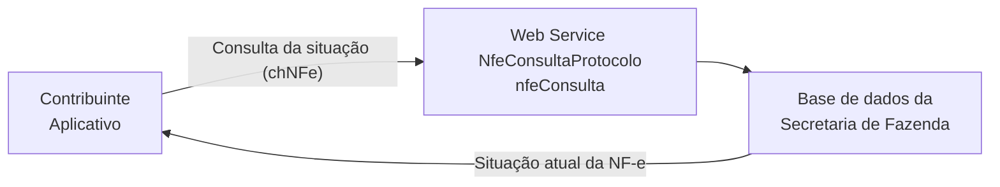

<!-- p.81 -->

# 5.4. Web Service – NfeConsultaProtocolo

**Função:** serviço destinado ao atendimento de solicitações de consulta da situação atual da NF-e na Base de Dados do Portal da Secretaria de Fazenda Estadual.

**Processo:** síncrono.

**Método:** nfeConsulta

**Figura 5-4 – Fluxo do Web Service nfeConsultaProtocolo**

<!-- p.82 -->

## 5.4.1. Leiaute Mensagem de Entrada

Entrada: Estrutura XML contendo a chave de acesso da NF-e.

**Schema XML: consSitNFe_4.00.xsd**

**Tabela 5-13 – Leiaute Mensagem de Entrada do Web Service nfeConsultaProtocolo**

| # | Campo | Ele | Pai | Tipo | Ocor. | Tam. | Descrição/Observação |
|---|---|---|---|---|---|---|---|
| EP01 | consSitNFe | Raiz | - | - | - | - | TAG raiz |
| EP02 | versao | A | EP01 | N | 1-1 | 1-2v2 | Versão do leiaute |
| EP03 | tpAmb | E | EP01 | N | 1-1 | 1 | Identificação do Ambiente: 1=Produção/2=Homologação |
| EP04 | xServ | E | EP01 | C | 1-1 | 9 | Serviço solicitado ‘CONSULTAR’ |
| EP05 | chNFe | E | EP01 | N | 1-1 | 44 | Chave de Acesso da NF-e. |

## 5.4.2. Leiaute Mensagem de Retorno

Retorno: Estrutura XML contendo a mensagem do resultado da consulta de protocolo:

**Schema XML: retConsSitNFe_v4.00.xsd**

**Tabela 5-14 – Leiaute Mensagem de Retorno do Web Service nfeConsultaProtocolo**

| # | Campo | Ele | Pai | Tipo | Ocor. | Tam. | Descrição/Observação |
|---|---|---|---|---|---|---|---|
| ER01 | retConsSitNFe | Raiz | - | - | - | - | TAG raiz da Resposta |
| ER02 | versao | A | ER01 | N | 1-1 | 1-2v2 | Versão do leiaute |
| ER03 | tpAmb | E | ER01 | N | 1-1 | 1 | Identificação do Ambiente: 1=Produção/2=Homologação |
| ER04 | verAplic | E | ER01 | C | 1-1 | 1-20 | Versão do Aplicativo que processou a consulta. A versão deve ser iniciada com a sigla da UF nos casos de WS próprio ou a sigla SVAN ou SVRS nos demais casos. |
| ER05 | cStat | E | ER01 | N | 1-1 | 3 | Código do status da resposta (conforme item 4.4.1 do documento MOC – Anexo I – Leiaute NF-e/NFC-e) |
| ER06 | xMotivo | E | ER01 | C | 1-1 | 1-255 | Descrição literal do status da resposta. |
| ER07 | cUF | E | ER01 | N | 1-1 | 2 | Código da UF que atendeu a solicitação. |
| ER07a | dhRecbto | E | ER01 | D | 1-1 | | Preenchido com a data e hora do processamento. Formato: “AAAA-MM-DDThh:mm:ssTZD” (UTC – Universal Coordinated Time). |
| ER07b | chNFe | E | ER01 | N | 1-1 | 44 | Chave de Acesso da NF-e consultada. |
| ER08 | protNFe | G | ER01 | xml | 0-1 | - | Protocolo de autorização ou denegação de uso do NF-e, conforme descrito no item 5.2.2. • Informar se localizada uma NF-e com cStat = 100-uso autorizado, 150-uso autorizado fora de prazo ou 110-uso denegado. (NT 2012.003) |
| ER09 | retCancNFe | G | ER01 | xml | 0-1 | - | Protocolo de homologação de cancelamento de NF-e (vide item 4.3.2). Informar se localizada uma NF-e com cStat = 101-cancelado ou 151-cancelado fora de prazo. (NT 2012.003) |
| ER10 | procEventoNFe | G | ER01 | xml | 0-N | - | Informação do evento e respectivo Protocolo de registro de Evento |

## 5.4.3. Descrição do Processo de Web Service

Este método será responsável por receber as solicitações referentes à consulta de situação de notas fiscais eletrônicas enviadas para as Secretarias de Fazendas Estaduais. Seu acesso é permitido apenas pela chave única de identificação da nota fiscal.

<!-- p.83 -->

O aplicativo do contribuinte envia a solicitação para o Web Service da Secretaria de Fazenda Estadual. Ao receber a solicitação a aplicação do Portal da Secretaria de Fazenda Estadual processará a solicitação de consulta, validando a Chave de Acesso da NF-e, e retornará mensagem contendo a situação atual da NF-e na Base de Dados.

Na resposta do Web Service de Consulta Situação da Nota Fiscal deverão ser retornados unicamente os Eventos de Cancelamento, Carta de Correção e EPEC, reduzindo o tamanho da mensagem de resposta da SEFAZ Autorizadora e reduzindo também o tempo de resposta para esta consulta. Ainda no processamento da requisição das consultas deste Web Service, será limitado o período de consulta para 180 dias da data de emissão da Nota Fiscal6.

## 5.4.4. Regras de Validação

Serão aplicadas as regras de validação genéricas conforme os grupos citados na Tabela 5-15, detalhados no documento MOC – Anexo I – Leiaute e Regras de Validação da NF-e e da NFC-e.

**Tabela 5-15 – Regras de Genéricas Validação do Web Service nfeConsultaProtocolo**

| Grupo | Descrição |
|---|---|
| A | Validação do Certificado de Transmissão (protocolo TLS) |
| B | Validação Inicial da Mensagem no Web Service |
| D | Validação da Área de Dados |
| E | Validação do Certificado Digital de Assinatura |
| F | Validação da Assinatura Digital |

As regras de validação específicas deste WS podem ser vistas na Tabela 5-16.

**Tabela 5-16 – Regras de Validação Específicas do Web Service nfeConsultaProtocolo**

| # | Regra de Validação | Aplic. | Msg | Efeito | Descrição Erro |
|---|---|---|---|---|---|
| J01 | Tipo do ambiente da NF-e difere do ambiente do Web Service | Obrig. | 252 | Rej. | Rejeição: Ambiente informado diverge do Ambiente de recebimento |
| J02 | UF da Chave de Acesso difere da UF do Web Service | Obrig. | 226 | Rej. | Rejeição: Código da UF do Emitente diverge da UF autorizadora |
| J02a | Chave de Acesso com dígito verificador inválido (NT 2011.004) | Obrig. | 236 | Rej. | Rejeição: Chave de Acesso com dígito verificador inválido |
| J02b | Chave de Acesso inválida (Código UF inválido) (NT 2011.004) | Obrig. | 614 | Rej. | Rejeição: Chave de Acesso inválida (Código UF inválido) |
| J02c | Chave de Acesso inválida (Ano < 06 ou Ano maior que Ano corrente) (NT 2012.003) | Obrig. | 615 | Rej. | Rejeição: Chave de Acesso inválida (Ano menor que 06 ou Ano maior que Ano corrente) |
| J02d | Chave de Acesso inválida (Mês < 1 ou Mês > 12) (NT 2011.004) | Obrig. | 616 | Rej. | Rejeição: Chave de Acesso inválida (Mês menor que 1 ou Mês maior que 12) |
| J02e | Chave de Acesso inválida: • Série = [0-909] e CNPJ zerado ou dígito inválido, ou • Série = [910-969] e CPF zerado ou dígito inválido (NT 2018.001) | Obrig. | 617 | Rej. | Rejeição: Chave de Acesso inválida (CNPJ/CPF zerado ou dígito inválido) |
| J02f | Chave de Acesso inválida (modelo diferente de 55 e 65) (NT 2013.005) | Obrig. | 618 | Rej. | Rejeição: Chave de Acesso inválida (modelo diferente de 55 e 65) |
| J02g | Chave de Acesso inválida (número NF = 0) (NT 2011.004) | Obrig. | 619 | Rej. | Rejeição: Chave de Acesso inválida (número NF = 0) |
| <!-- p.84 --> J02k | Ano-Mês da Chave de Acesso com atraso superior a 6 meses em relação ao Ano-Mês atual Observação: Eventualmente a SEFAZ Autorizadora poderá não implementar esta validação, conforme seu critério. (NT 2015.002) | Obrig. | 526 | Rej. | Rejeição: Consulta a uma Chave de Acesso muito antiga |
| J03 | Acesso BD NFE (Chave: CNPJ/CPF Emit, Modelo, Série, Número): • Se NF-e não existe, acessar BD Evento EPEC Chave: CNPJ/CPF Emitente, Modelo, Série, Nro) • Verificar se EPEC não existe (NT 2014.001) (NT 2018.001) | Obrig. | 217 | Rej. | Rejeição: NF-e não consta na base de dados da SEFAZ |
| J04 | Verificar se campo “Código Numérico” informado na Chave de Acesso é diferente do existente no BD Observação: Opcionalmente, concatenar na mensagem de erro a Chave de Acesso da NF-e existente no BD nas situações de: • CNPJ base do certificado digital de transmissão igual ao CNPJ base do emitente ou do destinatário da NF-e (NT 2010.007); • CNPJ base do certificado digital de transmissão igual ao CNPJ base do transmissor da NF-e (NT 2010.007); • CPF do certificado digital de transmissão igual ao CPF do emitente da NF-e. (NT 2018.001) | Obrig. | 562 | Rej. | Rejeição: Código Numérico informado na Chave de Acesso difere do Código Numérico da NF-e [chNFe:99999999999999999999999999999999999999999999] |
| J05 | Verificar se campo MM (mês) informado na Chave de Acesso é diferente do existente no BD | Obrig. | 561 | Rej. | Rejeição: Mês de Emissão informado na Chave de Acesso difere do Mês de Emissão da NF-e |
| J06 | Chave de Acesso difere da existente em BD (NT 2011.004) (NT 2015.002) | Obrig. | 613 | Rej. | Rejeição: Chave de Acesso difere da existente em BD |

## 5.4.5. Final do Processamento

O processamento do pedido de consulta de status de NF-e pode resultar em uma mensagem de erro ou retornar à situação atual da NF-e consultada.

No caso de localização da NF-e retornar o cStat com os valores “100-Autorizado o Uso”, “101-Cancelamento de NF-e Homologado” ou “110-Uso Denegado”.

6 Eventualmente a SEFAZ Autorizadora poderá manter o modelo anterior, conforme seu critério.
