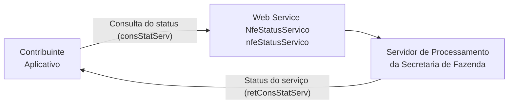

<!-- p.84 -->

# 5.5. Web Service – NfeStatusServico

**Função:** serviço destinado à consulta do status do serviço prestado pelo Portal da Secretaria de Fazenda Estadual.

**Processo:** síncrono.

**Método:** nfeStatusServico

<!-- p.85 -->

**Figura 5-5 – Fluxo do Web Service nfeStatusServico**

## 5.5.1. Leiaute Mensagem de Entrada

Entrada: Estrutura XML para a consulta do status do serviço.

**Schema XML: consStatServ_v4.00.xsd**

**Tabela 5-17 – Leiaute Mensagem de Entrada do Web Service nfeStatusServico**

| # | Campo | Ele | Pai | Tipo | Ocor. | Tam. | Descrição/Observação |
|---|---|---|---|---|---|---|---|
| FP01 | consStatServ | Raiz | - | - | - | - | TAG raiz |
| FP02 | versao | A | FP01 | N | 1-1 | 1-2v2 | Versão do leiaute |
| FP03 | tpAmb | E | FP01 | N | 1-1 | 1 | Identificação do Ambiente: 1=Produção/2=Homologação |
| FP04 | cUF | E | FP01 | N | 1-1 | 2 | Código da UF consultada |
| FP05 | xServ | E | FP01 | C | 1-1 | 6 | Serviço solicitado ‘STATUS’ |

## 5.5.2. Leiaute Mensagem de Retorno

Retorno: Estrutura XML contendo a mensagem do resultado da consulta do status do serviço:

**Schema XML: retConsStatServ_4.00.xsd**

**Tabela 5-18 – Leiaute Mensagem de Retorno do Web Service nfeStatusServico**

| # | Campo | Ele | Pai | Tipo | Ocor. | Tam. | Descrição/Observação |
|---|---|---|---|---|---|---|---|
| FR01 | retConsStatServ | Raiz | - | - | - | - | TAG raiz da Resposta |
| FR02 | versao | A | FR01 | N | 1-1 | 1-2v2 | Versão do leiaute |
| FR03 | tpAmb | E | FR01 | N | 1-1 | 1 | Identificação do Ambiente: 1=Produção/2=Homologação |
| FR04 | verAplic | E | FR01 | C | 1-1 | 1-20 | Versão do Aplicativo que processou a consulta. A versão deve ser iniciada com a sigla da UF nos casos de WS próprio ou a sigla SVAN ou SVRS nos demais casos. |
| FR05 | cStat | E | FR01 | N | 1-1 | 3 | Código do status da resposta (conforme item 4.4.1 do documento MOC – Anexo I – Leiaute NF-e/NFC-e) |
| FR06 | xMotivo | E | FR01 | C | 1-1 | 1-60 | Descrição literal do status da resposta. |
| FR07 | cUF | E | FR01 | N | 1-1 | 2 | Código da UF que atendeu a solicitação |
| FR08 | dhRecbto | E | FR01 | D | 1-1 | - | Preenchido com a data e hora do processamento. Formato: “AAAA-MM-DDThh:mm:ssTZD” (UTC – Universal Coordinated Time). |
| FR09 | tMed | E | FR01 | N | 0-1 | 1-4 | Tempo médio de resposta do serviço (em segundos) dos últimos 5 minutos (item 5.7). |
| <!-- p.86 --> FR10 | dhRetorno | E | FR01 | D | 0-1 | - | Preencher com data e hora previstas para o retorno do Web Service, no formato AAA-MM-DDTHH:MM:SS |
| FR11 | xObs | E | FR01 | C | 0-1 | 1-255 | Informações adicionais para o Contribuinte |

## 5.5.3. Descrição do Processo de Web Service

Este método é responsável por receber as solicitações referentes à consulta do status do serviço do Portal da Secretaria de Fazenda Estadual.

O aplicativo do contribuinte envia a solicitação para o Web Service da Secretaria de Fazenda Estadual.

Ao receber a solicitação a aplicação do Portal da Secretaria de Fazenda Estadual processa a solicitação de consulta, e retorna mensagem contendo a status do serviço.

As empresas que construírem um aplicativo que se mantenha em "loop" permanente de consulta a este Web Service, devem aguardar um tempo mínimo de 3 minutos entre cada consulta, evitando sobrecarregar desnecessariamente os servidores da SEFAZ.

## 5.5.4. Regras de Validação

Serão aplicadas as regras de validação genéricas conforme os grupos citados na Tabela 5-19, detalhados no documento MOC – Anexo I – Leiaute e Regras de Validação da NF-e e da NFC-e.

**Tabela 5-19 – Regras de Validação Genéricas do Web Service nfeStatusServico**

| Grupo | Descrição |
|---|---|
| A | Validação do Certificado de Transmissão (protocolo TLS) |
| B | Validação Inicial da Mensagem no Web Service |
| D | Validação da Área de Dados |

As regras de validação específicas deste WS podem ser vistas na Tabela 5-20.

**Tabela 5-20 – Regras de Validação Específicas do Web Service nfeStatusServico**

| # | Regra de Validação | Aplic. | Msg | Efeito | Descrição Erro |
|---|---|---|---|---|---|
| K01 | Tipo do ambiente da NF-e difere do ambiente do Web Service | Obrig. | 252 | Rej. | Rejeição: Ambiente informado diverge do Ambiente de recebimento |
| K02 | Código da UF consultada difere da UF do Web Service | Obrig. | 289 | Rej. | Rejeição: Código da UF informada diverge da UF solicitada |
| K03 | Verifica se o Servidor de Processamento está Paralisado Momentaneamente | Obrig. | 108 | - | Rejeição: Serviço Paralisado Momentaneamente (curto prazo) |
| K04 | Verifica se o Servidor de Processamento está Paralisado sem Previsão | Obrig. | 109 | - | Rejeição: Serviço Paralisado sem Previsão |

## 5.5.5. Final do Processamento

O processamento do pedido de consulta de status de Serviço pode resultar em uma mensagem de erro ou retornar a situação atual do Servidor de Processamento, códigos de situação “107-Serviço em Operação”, “108-Serviço Paralisado Temporariamente” e “109-Serviço Paralisado sem Previsão”.

A critério da UF o campo xObs pode ser utilizado para fornecer maiores informações ao contribuinte, como por exemplo: “manutenção programada”, “modificação de versão do aplicativo”, “previsão de retorno”, etc.
