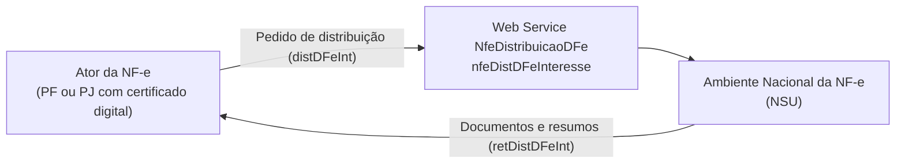
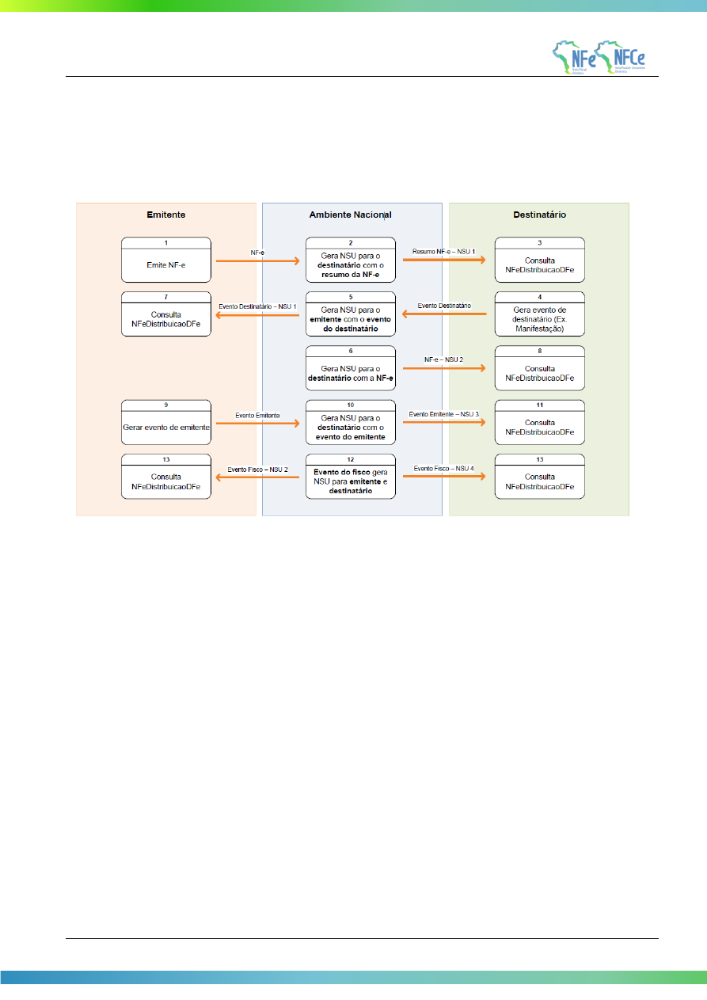

<!-- p.90 -->

# 5.7. Web Service – NfeDistribuicaoDFe

**Função:** Serviço destinado à distribuição de informações resumidas e documentos fiscais eletrônicos de interesse de um ator, seja este uma pessoa física ou jurídica.

**Processo:** síncrono

**Método:** nfeDistDFeInteresse

**Figura 5-7 – Fluxo do Web Service nfeDistribuicaoDFe**

Este serviço permite que um ator da NF-e tenha acesso aos documentos fiscais eletrônicos (DF-e) e informações resumidas que não tenham sido gerados por ele e que sejam de seu interesse. Pode ser <!-- p.91 -->consumido por qualquer ator de NF-e, Pessoa Jurídica ou Pessoa Física, que possua um certificado digital de PJ ou PF. No caso de Pessoa Jurídica, a empresa será autenticada pelo CNPJ base e poderá realizar a consulta com qualquer CNPJ da empresa desde que o CNPJ base consultado seja o mesmo do certificado digital.

Os documentos fiscais eletrônicos e informações resumidas estarão disponíveis para distribuição por até 3 meses após sua recepção pelo Ambiente Nacional da NF-e. A distribuição ocorrerá para os atores que desempenham papéis de emitente, destinatário, transportador e terceiros (informado na tag autXML) conforme a Tabela 5-25.

<!-- REVISAR p.91: a legenda da Tabela 5-25 na fonte cita "Web Service nfeAutorizacao", mas o conteúdo é o da distribuição (nfeDistribuicaoDFe); transcrito literalmente -->

**Tabela 5-25 – Leiaute Mensagem de Entrada do Web Service nfeAutorizacao**

| Documentos | Emitente | Destinatário1 | Transportador2 | Terceiros3 |
|---|---|---|---|---|
| NF-e | Não | Sim | Sim | Sim |
| Evento de Cancelamento | Não | Sim | Sim | Sim |
| Evento de Carta de Correção | Não | Sim | Sim | Sim |
| Eventos de Manifestação do Destinatário | Sim | Não | Não | Sim |
| Eventos da Suframa (Vistoria/Internalização) | Sim | Sim | Não | Sim |
| EPEC | Não | Sim | Sim | Não |
| Eventos de Pedido de Prorrogação de Prazo4 | Não | Sim | Não | Não |
| Eventos do Fisco em Resposta ao Pedido de Prorrogação5 | Sim | Sim | Não | Não |
| Evento de Averbação6 | Sim | Sim | Sim | Sim |
| Resumo de NF-e | Não | Sim | Não | Não |
| Resumo de Eventos CT-e Autorizado/Cancelado | Sim | Sim | Sim | Sim |
| Resumo de Eventos MDF-e Autorizado/Cancelado | Sim | Sim | Sim | Sim |
| Resumo de Eventos de Registro de Passagem | Sim | Sim | Sim | Sim |
| Eventos de Comprovante de Entrega Autorizado/Cancelado propagado do CT-e7 | Sim | Sim | Sim | Sim |

1 Os documentos fiscais e resumos de eventos estarão disponíveis somente se o destinatário se manifestar dando "Ciência da Operação", “Operação não Realizada” ou "Confirmação de Operação" para a NF-e, exceto para o Evento de Cancelamento, que será disponibilizado mesmo sem a manifestação do destinatário. Antes da manifestação ficará disponível para o destinatário somente a estrutura XML de “Resumo de NF-e” e o cancelamento de NF-e.

2 A NF-e estará disponível somente para o transportador identificado no grupo X03.

3 A NF-e estará disponível para terceiros somente cujo CNPJ ou CPF estiver informado na tag autXML.

4 Eventos de Pedido de Prorrogação de Prazo da NT 2015.001: EPP1 e EPP2 (Evento Pedido de Prorrogação 1º e 2º Prazo), ECPP1 e ECPP2 (Evento Cancelamento Pedido de Prorrogação 1º e 2º Prazo).

5 Eventos do Fisco em Resposta ao Pedido de Prorrogação de Prazo da NT 2015.001: EFPP1 e EFPP2 (Evento Fisco Resposta ao Pedido de Prorrogação 1º e 2º Prazo), EFCPP1 e EFCPP2 (Evento Fisco Resposta ao Cancelamento de Prorrogação 1º e 2º Prazo).

6 Os Eventos de Averbação serão distribuídos a partir da implantação da BT 2017.001 v1.0.

7 Os eventos de comprovante de entrega serão distribuídos a partir da implantação do BT 2019.001 v.1.10.

## 5.7.1. Leiaute Mensagem de Entrada

Entrada: Estrutura XML com o pedido de distribuição de DF-e de interesse do ator

**Schema XML: distDFeInt_v9.99.xsd**

**Tabela 5-26 – Leiaute Mensagem de Entrada do Web Service nfeDistribuicaoDFe**

| # | Campo | Ele | Pai | Tipo | Ocor. | Tam. | Descrição/Observação |
|---|---|---|---|---|---|---|---|
| A01 | distDFeInt | Raiz | - | - | - | - | TAG raiz |
| A02 | versao | A | A01 | N | 1-1 | 2v2 | Versão do leiaute |
| A03 | tpAmb | E | A01 | N | 1-1 | 1 | Identificação do Ambiente: 1=Produção /2=Homologação |
| A04 | cUFAutor | E | A01 | N | 0-1 | 2 | Código da UF do Autor |
| A05 | CNPJ | CE | A01 | N | 1-1 | 14 | CNPJ do interessado no DF-e |
| A06 | CPF | CE | A01 | N | 1-1 | 11 | CPF do interessado no DF-e |
| A07 | distNSU | CG | A01 | - | 1-1 | - | Grupo para distribuir DF-e de interesse |
| <!-- p.92 --> A08 | ultNSU | E | A07 | N | 1-1 | 1-15 | Último NSU recebido pelo ator. Caso seja informado com zero, ou com um NSU muito antigo, a consulta retornará unicamente as informações resumidas e documentos fiscais eletrônicos que tenham sido recepcionados pelo Ambiente Nacional nos últimos 3 meses. |
| A09 | consNSU | CG | A01 | - | 1-1 | - | Grupo para consultar um DF-e a partir de um NSU específico |
| A10 | NSU | E | A09 | N | 1-1 | 1-15 | Número Sequencial Único. Geralmente esta consulta será utilizada quando identificado pelo interessado um NSU faltante. O Web Service retornará o documento ou informará que o NSU não existe no Ambiente Nacional. Assim, esta consulta fechará a lacuna do NSU identificado como faltante. |
| A11 | consChNFe | CG | A01 | - | 1-1 | - | Grupo para consultar uma NF-e pela chave de acesso |
| A12 | chNFe | E | A11 | N | 1-1 | 44 | Chave de acesso específica. |

## 5.7.2. Leiaute Mensagem de Retorno

Retorno: Estrutura XML com os documentos de interesse do ator (qtde máxima=50).

**Schema XML: retDistDFeInt _v9.99.xsd**

**Tabela 5-27 – Leiaute Mensagem de Retorno do Web Service nfeDistribuicaoDFe**

| # | Campo | Ele | Pai | Tipo | Ocor. | Tam. | Descrição/Observação |
|---|---|---|---|---|---|---|---|
| B01 | retDistDFeInt | Raiz | - | - | - | - | TAG raiz da Resposta |
| B02 | versao | A | B01 | N | 1-1 | 2v2 | Versão do leiaute |
| B03 | tpAmb | E | B01 | N | 1-1 | 1 | Identificação do Ambiente: 1=Produção/2=Homologação |
| B04 | verAplic | E | B01 | C | 1-1 | 1-20 | Versão do aplicativo que processou a consulta |
| B05 | cStat | E | B01 | N | 1-1 | 3 | Código do status da resposta (conforme item 4.4.1 do documento MOC – Anexo I – Leiaute NF-e/NFC-e) |
| B06 | xMotivo | E | B01 | C | 1-1 | 1-255 | Descrição literal do status da resposta |
| B07 | dhResp | E | B01 | D | 1-1 | | Data e hora da mensagem de Resposta. Formato: “AAAA-MM-DDThh:mm:ssTZD” (UTC – Universal Coordinated Time) |
| B08 | ultNSU | E | B01 | N | 0-1 | 1-15 | Último NSU pesquisado no Ambiente Nacional. Se for o caso, o solicitante pode continuar a consulta a partir deste NSU para obter novos resultados. |
| B09 | maxNSU | E | B01 | N | 0-1 | 1-15 | Maior NSU existente no Ambiente Nacional para o CNPJ/CPF informado |
| B10 | loteDistDFeInt | G | B01 | - | 0-1 | | Conjunto de informações resumidas e documentos fiscais eletrônicos de interesse da pessoa física ou empresa. |
| B11 | docZip | E | B10 | B64 | 1-50 | | Informação resumida ou documento fiscal eletrônico de interesse da ou empresa. O conteúdo desta tag estará compactado no padrão gZip. O tipo do campo é base64Binary. |
| B12 | NSU | A | B11 | N | 1-1 | 1-15 | NSU do document fiscal |
| B13 | schema | A | B11 | C | 1-1 | - | Identificação do Schema XML que será utilizado para validar o XML existente no campo seguinte. Vai identificar o tipo do documento e sua versão. Exemplos: resNFe_v1.00.xsd; procNFe_v3.10.xsd, resEvento_1.00.xsd - procEventoNFe_v1.00.xsd |

## 5.7.3. Mensagem de Retorno Compactada

<!-- p.93 -->

O tamanho médio da NF-e é de aproximadamente 10 KB (dependendo da quantidade de itens), necessitando de um dimensionamento correto da rede interna e do canal de Internet das empresas e do Ambiente Nacional.

Para minimizar necessidades de infraestrutura de rede cada documento contido na mensagem de retorno da solicitação será compactado (tag: docZip). Estima-se que a compactação reduzirá o tamanho da mensagem de retorno em aproximadamente 60%.

A aplicação do Ambiente Nacional irá compactar individualmente cada documento da mensagem de retorno e a aplicação cliente deverá descompactá-lo e seguir o procedimento normal do tratamento do documento descompactado.

O padrão de compactação adotado para o projeto será o Gzip (GNU zip) que é implementado nas plataformas Java e .NET.

## 5.7.4. Descrição do Processo de Distribuição de DF-e de Interesse

Este serviço pode ser consumido por atores que desempenham papel na NF-e de emitente, destinatário, transportador ou terceiro, Pessoa Física ou Jurídica, que possua um certificado digital com, respectivamente, seu CPF ou seu CNPJ.

O Ambiente Nacional gera um número sequencial único (NSU) para cada interessado nos documentos fiscais. Os documentos recuperados deverão conter uma sequência de numeração sem intervalos em sua base de dados.

### 5.7.4.1. Geração do pedido de distribuição

O XML do pedido de distribuição suporta três tipos de consultas que são definidas de acordo com a tag informada no XML. As tags são distNSU, consNSU e consChNFe.

a) distNSU – Distribuição de Conjunto de DF-e a Partir do NSU Informado

A aplicação cliente do WS deve informar o último número sequencial único (ultNSU) que possui. Caso o NSU informado seja menor que o primeiro NSU disponível para distribuição, a aplicação do Ambiente Nacional deverá fornecer os documentos a partir do primeiro disponível para consulta.

b) consNSU – Consulta DF-e Vinculado ao NSU Informado

Este processo de consulta DF-e a partir de um NSU permite que o interessado nos documentos fiscais consulte de maneira pontual um NSU que foi identificado como faltante em sua base de dados.

A aplicação cliente do WS deve informar o número sequencial único (NSU) identificado como faltante em sua base de dados

c) consChNFe – Consulta de NF-e por Chave de Acesso Informada

Este processo de consulta a partir de uma chave de acesso permite que o interessado na NF-e consulte de maneira pontual uma chave de acesso e obtenha o documento relativo à esta chave.

A aplicação cliente do WS deve informar uma chave de acesso válida para recuperar a NF-e.

### 5.7.4.2. CNPJ ou CPF do Interessado no DF-e

Informar o CPF da pessoa física ou CNPJ da empresa para recuperação de DF-e de seu interesse. Este campo possibilita que uma empresa consiga recuperar os DF-e de qualquer um de seus estabelecimentos utilizando somente um certificado digital PJ.

<!-- p.94 -->

### 5.7.4.3. Envio das Informações

O pedido de distribuição será enviado por Web Service, sendo necessário o uso de um certificado digital de PJ ou PF válido.

O WS do Ambiente Nacional é acionado pela aplicação cliente do interessado que deve enviar uma mensagem que atenda os padrões estabelecidos neste manual.

### 5.7.4.4. Processamento da Requisição de Distribuição de Conjunto de DF-e a Partir do NSU Informado (distNSU)

O Web Service deverá gerar lotes com até 50 documentos ao interessado com informações resumidas ou documentos fiscais eletrônicos que tenham o número sequencial único (NSU) superior ao NSU informado.

Caso o NSU informado seja menor que o primeiro NSU disponível para distribuição, a aplicação do Ambiente Nacional deverá fornecer os documentos a partir do primeiro disponível para consulta.

A criação do lote de documentos deverá observar as seguintes regras:

- Ordem crescente de NSU
- O lote poderá conter qualquer tipo de documento válido e seu respectivo NSU
- Quantidade máxima de documentos no lote: 50 documentos

Documentos emitidos pela própria empresa não estarão disponíveis para consulta.

Importante ressaltar que o processo de recepção e sincronização não será realizado em ordem cronológica de emissão ou autorização de uso, uma vez que a geração do NSU dos documentos será organizada por ordem cronológica de recepção pelo Ambiente Nacional.

Não existe necessidade de o Ambiente Nacional estar sincronizado em tempo real com todos os documentos fiscais autorizados. Como a geração do NSU será organizada por ordem de inserção de documentos, a empresa ou pessoa física conseguirá recuperar todos os documentos de seu interesse tão logo estes sejam recebidos pelo Ambiente Nacional da NF-e.

É conveniente manter um controle do primeiro NSU válido para consulta. A resposta do WS do Ambiente Nacional poderá ser:

- Rejeição – com a devolução da mensagem com o motivo da falha informado no cStat;
- Nenhum documento localizado – não existe documentos fiscais para o CNPJ/CPF informado – cStat=”137-Nenhum documento localizado”;
- Documento localizado – com a devolução dos documentos fiscais encontrados – cStat=”138-Documento(s) localizado(s)”.

A empresa deverá aguardar um tempo mínimo de uma hora para efetuar uma nova solicitação de distribuição caso receba a indicação que não existem mais documentos a serem pesquisados na base de dados do Ambiente Nacional. Se o NSU informado (tag:ultNSU) for igual ao maior NSU do Ambiente Nacional (tag:maxNSU), então não existem mais documentos a serem pesquisados no momento.

### 5.7.4.5. Processamento da Requisição de Consulta DF-e Vinculado ao NSU Informado (consNSU)

Considerando que o Ambiente Nacional gera NSU sem lacunas, o processo de distribuição de conjunto de DF-e a partir do NSU informado (tag:distNSU) disponibiliza para o interessado uma <!-- p.95 -->sequência de numeração ordenada de forma ascendente. A identificação de alguma lacuna na base de dados do interessado indica que houve alguma falha no processo de distribuição dos documentos.

Neste caso, o interessado deve consultar pontualmente os NSU identificados como faltantes em sua base de dados através do método nfeDistDFeInteresse do Web Service nfeDistribuicaoDFe informando o NSU desejado no conteúdo da tag consNSU no XML de requisição.

A resposta do WS poderá ser:

- Rejeição – com a devolução da mensagem com o motivo da falha informado no cStat;
- Nenhum documento localizado – indicando que o Ambiente Nacional não gerou o NSU e o interessado deve desconsiderá-lo – cStat=”137-Nenhum documento localizado”;
- Documento localizado – com a devolução do documento fiscal encontrado – cStat=”138-Documento localizado”.

### 5.7.4.6. Processamento da Requisição de Consulta de NF-e por Chave de Acesso Informada (consChNFe)

O processo de consulta por chave de acesso (tag: chNFe) permite ao interessado consultar pontualmente uma NF-e pela chave de acesso. A chave de acesso informada deve ser válida, existir no Ambiente Nacional e estar vinculada ao interessado como destinatário, transportador ou terceiro.

Caso a consulta seja realizada pelo destinatário o Ambiente Nacional irá verificar a existência de sua manifestação (“Ciência da Operação”, “Operação não Realizada” ou “Confirmação de Operação”). Em caso da existência da manifestação do destinatário a NF-e será retornada para o destinatário. Caso contrário, será retornado apenas o resumo da NF-e. Com o resumo o destinatário terá as informações necessárias para realizar a manifestação.

Para transportador e terceiros a NF-e estará disponível integralmente na consulta. Para o emitente a NF-e não será disponibilizada nesta consulta.

Assim como nas demais consultas disponibilizadas pelo Web Service nfeDistribuicaoDFe, a consulta por chave de acesso estará disponível para documentos recebidos pelo Ambiente Nacional nos últimos 90 dias. Após este período não será possível recuperar a NF-e.

A resposta do WS poderá ser:

- Rejeição – com a devolução da mensagem com o motivo da falha informado no cStat;
- Nenhum documento localizado – indicando que o Ambiente Nacional não possui a NF-e consultada – cStat= “137-Nenhum documento localizado”;
- Documento localizado – com a devolução do documento fiscal encontrado – cStat= “138-Documento localizado”.

## 5.7.5. Regras de Validação

Serão aplicadas as regras de validação genéricas conforme os grupos citados na Tabela 5-28, detalhados no documento MOC – Anexo I – Leiaute e Regras de Validação da NF-e e da NFC-e.

**Tabela 5-28 – Regras de Validação Genéricas do Web Service nfeDistribuicaoDFe**

| Grupo | Descrição |
|---|---|
| A | Validação do Certificado de Transmissão (protocolo TLS) |
| B | Validação Inicial da Mensagem no Web Service |
| D | Validação da Área de Dados |

<!-- p.96 -->

As regras de validação específicas deste WS podem ser vistas na Tabela 5-29.

**Tabela 5-29 – Regras de Validação Específicas do Web Service nfeDistribuicaoDFe**

| # | Regra de Validação | Aplic. | Msg | Efeito | Descrição Erro |
|---|---|---|---|---|---|
| H01 | Tipo do ambiente da NF-e difere do ambiente do Web Service | Obrig. | 252 | Rej. | Rejeição: Ambiente informado diverge do Ambiente de recebimento |
| H02 | CNPJ do interessado na distribuição inválido (DV ou zeros) | Obrig. | 489 | Rej. | Rejeição: CNPJ informado inválido (DV ou zeros) |
| H03 | CPF do interessado na distribuição inválido (DV ou zeros) | Obrig. | 490 | Rej. | Rejeição: CPF informado inválido (DV ou zeros) |
| H04 | CNPJ do Certificado Digital utilizado na transmissão não tem o mesmo CNPJ base do CNPJ consultado | Obrig. | 593 | Rej. | Rejeição: CNPJ-Base consultado difere do CNPJ-Base do Certificado Digital |
| H05 | CPF do Certificado Digital utilizado na transmissão diferente do CPF consultado | Obrig. | 472 | Rej. | Rejeição: CPF consultado difere do CPF do Certificado Digital |
| H061 | Número do NSU informado superior ao maior NSU disponível para consulta | Obrig. | 589 | Rej. | Rejeição: Número do NSU informado superior ao maior NSU do Ambiente Nacional |
| H072 | Chave de Acesso com dígito verificador inválido | Obrig. | 236 | Rej. | Rejeição: Chave de Acesso com dígito verificador inválido |
| H082 | Chave de Acesso inválida (Código UF inválido) | Obrig. | 614 | Rej. | Rejeição: Chave de Acesso inválida (Código UF inválido) |
| H092 | Chave de Acesso inválida (Ano < 06 ou Ano maior que Ano) | Obrig. | 615 | Rej. | Rejeição: Chave de Acesso inválida (Ano menor que 06 ou Ano maior que Ano) |
| H102 | Chave de Acesso inválida (Mês =0 ou Mês > 12) | Obrig. | 616 | Rej. | Rejeição: Chave de Acesso inválida (Mês menor que 1 ou Mês maior que 12) |
| H112 | Chave de Acesso inválida: - Série = [0-909] e CNPJ zerado ou dígito inválido, ou - Série = [910-969] e CPF zerado ou dígito inválido | Obrig. | 617 | Rej. | Rejeição: Chave de Acesso inválida (CNPJ zerado ou dígito inválido) |
| H122 | Chave de Acesso inválida (modelo diferente de 55) | Obrig. | 618 | Rej. | Rejeição: Chave de Acesso inválida (CNPJ zerado ou dígito inválido) |
| H132 | Chave de Acesso inválida (número NF = 0) | Obrig. | 619 | Rej. | Rejeição: Chave de Acesso inválida (número NF = 0) |
| H142 | NF-e inexistente para a chave de acesso informada | Obrig. | 217 | Rej. | Rejeição: NF-e inexistente para a chave de acesso informada |
| H152 | Verificar se NF-e está no prazo de download, 90 dias da data de recebimento da NF-e no Ambiente Nacional | Obrig. | 632 | Rej. | Rejeição: Solicitação fora de prazo, a NF-e não está mais disponível para download |
| H162 | Se CNPJ, verificar se o CNPJ do interessado na NF-e tem o mesmo CNPJ-Base informado no pedido. Se CPF, verificar se o CPF é o mesmo do interessado. | Obrig. | 640 | Rej. | Rejeição: CNPJ/CPF do interessado não possui permissão para consultar esta NF-e |
| H172 | A NF-e não deve ser disponibilizada para o emitente da NF-e. Verificar se CNPJ do interessado na NF-e é o emitente. | Obrig. | 641 | Rej. | Rejeição: NF-e indisponível para o emitente |
| H182 | NF-e Cancelada, arquivo NF-e indisponível para download | Obrig. | 653 | Rej. | Rejeição: NF-e Cancelada, arquivo indisponível para download |
| H192 | NF-e Denegada, arquivo NF-e indisponível para download | Obrig. | 654 | Rej. | Rejeição: NF-e Denegada, arquivo indisponível para download |

1 Validação aplicada para os tipos de consulta distNSU e consNSU.

2 Validações aplicadas somente para o tipo de consulta consChNFe.

## 5.7.6. Leiautes Resumidos

Para possibilitar o compartilhamento de informações relevantes para o ator de forma a manter o sigilo da informação, foram criados dois novos leiautes contendo informações resumidas das NF-e e informações resumidas dos eventos.

### 5.7.6.1. Leiaute Resumo da NF-e

Descrição: Estrutura XML gerada pelo Ambiente Nacional com o conjunto de informações resumidas da NF-e. Este documento será distribuído para os destinatários possibilitando sua manifestação na operação acobertada pela Nota Fiscal eletrônica emitida para o seu CNPJ.

<!-- p.97 -->

**Schema XML: resNFe_v1.01.xsd**

**Tabela 5-30 – Leiaute Mensagem de Resumo da NF-e**

| # | Campo | Ele | Pai | Tipo | Ocor. | Tam. | Descrição/Observações |
|---|---|---|---|---|---|---|---|
| C01 | resNFe | G | - | - | - | - | TAG raíz com o conjunto de informações resumidas da NF-e. Este conjunto de informação será gerado quando a NF-e for autorizada ou denegada. |
| C02 | versao | A | C01 | N | 1-1 | 2v2 | Versão do leiaute |
| C03 | chNFe | E | C01 | N | 1-1 | 44 | Chave de acesso da NF-e |
| C04 | CNPJ | CE | C01 | N | 1-1 | 14 | CNPJ do Emitente |
| C05 | CPF | CE | C01 | N | 1-1 | 11 | CPF do Emitente |
| C06 | xNome | E | C01 | C | 1-1 | 3-60 | Razão Social ou Nome do Emitente |
| C07 | IE | E | C01 | N | 1-1 | 0 ou 2-14 | IE do Emitente. Valores válidos: vazio (não contribuinte do ICMS), ISENTO (contribuinte do ICMS ISENTO de Inscrição no Cadastro de Contribuintes) ou IE (Contribuinte do ICMS) |
| C08 | dhEmi | E | C01 | D | 1-1 | | Data de Emissão da NF-e no formato UTC (Universal Coordinated Time): AAAA-MM-DDThh:mm:ssTZD |
| C09 | tpNF | E | C01 | N | 1-1 | 1 | Tipo de Operação da NF-e: 0=Entrada; 1=Saída |
| C10 | vNF | E | C01 | N | 1-1 | 13,2 | Valor Total da NF-e |
| C11 | digVal | E | C01 | C | 1-1 | 28 | Digest Value da NF-e na base de dados do Ambiente |
| C12 | dhRecbto | E | C01 | D | 1-1 | | Data de autorização da NF-e. Formato: “AAAA-MM-DDThh:mm:ssTZD” (UTC – Universal Coordinated Time). |
| C13 | nProt | E | C01 | N | 1-1 | 15 | Número de protocolo da NF-e, conforme item 4.3.5 |
| C14 | cSitNFe | E | C01 | N | 1-1 | 1 | Situação da NF-e: 1=Uso autorizado; 2=Uso denegado; 3=NF-e Cancelada; |

### 5.7.6.2. Leiaute Resumo de Evento de NF-e

Descrição: Estrutura XML gerada pelo Ambiente Nacional com o conjunto de informações resumidas de um evento de NF-e.

**Schema XML: resEvento_ v1.01.xsd**

**Tabela 5-31 – Leiaute Mensagem de Resumo de Evento da NF-e**

| # | Campo | Ele | Pai | Tipo | Ocor. | Tam. | Descrição/Observações |
|---|---|---|---|---|---|---|---|
| D01 | resEvento | Raiz | - | - | - | - | TAG raiz |
| D02 | versao | A | D01 | N | 1-1 | 2v2 | Versão do leiaute |
| D03 | cOrgao | E | D01 | N | 1-1 | 2 | Código do órgão de recepção do Evento. O código 91 para identificar o Ambiente |
| D04 | CNPJ | CE | C01 | N | 1-1 | 14 | CNPJ do Emitente |
| D05 | CPF | CE | C01 | N | 1-1 | 11 | CPF do Emitente |
| D06 | chNFe | E | D01 | N | 1-1 | 44 | Chave de acesso da NF-e |
| D07 | dhEvento | E | D01 | D | 1-1 | | Data e hora do evento no formato AAAA-MM-DDThh:mm:ssTZD (UTC – Universal Coordinated Time) |
| D08 | tpEvento | E | D01 | N | 1-1 | 6 | Código do evento (de acordo com tabelas do item 3.1) |
| D09 | nSeqEvento | E | D01 | N | 1-1 | 1-2 | Número sequencial do evento |
| D10 | xEvento | E | D01 | C | 1-1 | 5-60 | Descrição do evento |
| D11 | dhRecbto | E | D01 | D | 1-1 | | Data de autorização do evento. Formato: “AAAA-MM-DDThh:mm:ssTZD” (UTC – Universal Coordinated Time). |
| D12 | nProt | E | D01 | N | 1-1 | 15 | Número de protocolo do evento, conforme item 4.3.5 |

## 5.7.7. Visão Geral do Modelo de Distribuição

<!-- p.98 -->

O modelo de distribuição de documentos é baseado na geração de um número sequencial único (NSU) para cada CNPJ ou CPF. O fluxo que pode ser visto na Figura 5-8 exemplifica a geração do NSU para o emitente e destinatário da NF-e.

**Figura 5-8 – Visão Geral do Modelo de Distribuição**

A consulta no Web Service nfeDistribuicaoDFe poderá ser realizada a qualquer instante pela empresa ou pessoa física. O Ambiente Nacional disponibilizará para consulta os documentos de interesse de cada ator. Seguem os passos do fluxo exemplificado:

1. O emitente gera e transmite uma NF-e que será autorizada pela Sefaz e compartilhada com o Ambiente Nacional;
2. O Ambiente Nacional gera um NSU para o destinatário do resumo da NF-e e o disponibiliza para consulta;
3. O destinatário consulta o WS nfeDistribuicaoDFe a partir do último NSU recebido e recupera o resumo da NF-e;
4. O destinatário, de posse do resumo da NF-e, gera um evento de NF-e (Ex. evento de manifestação do destinatário);
5. O Ambiente Nacional gera um NSU do evento gerado pelo destinatário para o emitente e o disponibiliza para consulta;
6. Caso seja um evento de manifestação do destinatário diferente do tipo “desconhecimento da operação”, o Ambiente Nacional gera um NSU para o destinatário com a NF-e (liberação do download);
7. O emitente consulta o WS nfeDistribuicaoDFe a partir do último NSU recebido e recupera o evento gerado pelo destinatário;
8. O destinatário consulta o WS nfeDistribuicaoDFe a partir do último NSU recebido e recupera a NF-e;
9. O emitente gera um evento de sua NF-e (ex.: evento de cancelamento de NF-e, caso não exista outro evento que impeça este cancelamento) que será compartilhado pela Sefaz com o Ambiente Nacional;
10. O Ambiente Nacional gera um NSU para o destinatário do evento gerado pelo emitente e o disponibiliza para consulta;
11. O destinatário consulta o WS nfeDistribuicaoDFe a partir do último NSU recebido e recupera o evento gerado pelo emitente;
12. O Ambiente Nacional recebe um evento gerado pelo fisco e gera um NSU para o emitente e outro NSU para o destinatário, disponibilizando-os para consulta;

<!-- p.99 -->
13. Tanto o emitente quanto o destinatário consultam o WS nfeDistribuicaoDFe a partir do último NSU recebido e recuperam o evento gerado pelo fisco;

O fluxo exemplificado resulta nos seguintes NSU para emitente e destinatário:

**NSU Emitente**

| NSU | Documento |
|---|---|
| 1 | Evento do Destinatário |
| 2 | Evento do Fisco |

**NSU Destinatário**

| NSU | Documento |
|---|---|
| 1 | Resumo da NF-e |
| 2 | NF-e |
| 3 | Evento do Emitente |
| 4 | Evento do Fisco |

Este novo modelo permitirá ao emitente a consulta dos eventos manifestados pelos destinatários de suas NF-e. Também será disponibilizado para o destinatário da NF-e qualquer evento gerado pelo emitente. Além disso, os eventos gerados pelo fisco serão disponibilizados tanto para o emitente quanto para o destinatário da NF-e.

O modelo simplifica o processo de download da NF-e uma vez que a partir da manifestação do destinatário o Ambiente Nacional gera automaticamente um NSU referenciando a NF-e e permitindo sua recuperação a partir do WS nfeDistribuicaoDFe.

### 5.7.7.1. Recomendações Para Evitar o Uso Indevido

A análise do comportamento atual das aplicações das empresas (“aplicação cliente”) permite identificar algumas situações de “uso indevido” nos ambientes autorizadores.

Como exemplo maior do mau uso do ambiente, ressalta-se a falta de controle de algumas aplicações que entram em “loop”, consumindo recursos de forma indevida, sobrecarregando principalmente o canal de comunicação com a Internet.

Para este Web Service serão mantidos controles para identificar as situações de uso indevido de sucessivas tentativas de busca de registros já disponibilizados anteriormente.

As novas tentativas serão rejeitadas com o erro “656–Rejeição: Consumo Indevido”.

### 5.7.7.2. Endereços dos Web Services

Os endereços dos Web Services de Distribuição do Ambiente Nacional estão publicados no Portal da NF-e (http://www.nfe.fazenda.gov.br/portal), e no Portal de Homologação (http://hom.nfe.fazenda.gov.br/ portal) no menu “Serviços” / “Relação de Serviços Web”.
